# 校园流浪动物观测关爱系统 · 系统设计说明书

> **版本：** v1.0
> **日期：** 2026-07-07
> **作者：** 宋鑫旺（后端/架构）、胡淦斌（前端/模型）
> **参考：** 需求规格说明书 v1.0

---

## 目录

- [1. 系统体系架构](#1-系统体系架构)
- [2. 系统功能结构](#2-系统功能结构)
- [3. 用例时序图](#3-用例时序图)
- [4. 核心算法设计](#4-核心算法设计)
- [5. 类图详细设计](#5-类图详细设计)
- [6. 接口详细设计](#6-接口详细设计)
- [7. 数据库物理设计](#7-数据库物理设计)
- [8. UI设计与组件树](#8-ui设计与组件树)

---

## 1. 系统体系架构

### 1.1 分层架构设计

本系统采用 **四层架构**（Four-Layer Architecture），自顶向下依次为：表示层 → 业务层 → 数据访问层 → 数据存储层，外加一个横切的 **AI 推理引擎层**（供业务层调用）。

```
┌─────────────────────────────────────────────────────────────────────────┐
│                          表示层 (Presentation Layer)                      │
│                                                                          │
│   ┌─────────────────────────────┐  ┌─────────────────────────────┐      │
│   │    管理端 (Admin Portal)     │  │   公共端 (Public Portal)     │      │
│   │    Vue 3 + Naive UI         │  │    Vue 3 + Naive UI         │      │
│   │    ────────────────          │  │    ────────────────          │      │
│   │    P-01 总览看板             │  │    P-06 实时动态大屏         │      │
│   │    P-02 上传检测             │  │    P-07 动物出没日历         │      │
│   │    P-03 记录管理             │  │    P-08 趣味排行榜           │      │
│   │    P-04 安全提醒管理         │  │    P-09 撸猫指南             │      │
│   │    P-05 数据导出             │  │    P-10 安全提醒公示         │      │
│   │                              │  │         社区分享浏览/上传     │      │
│   │    ⚠ 需登录（JWT Token）     │  │    ✅ 无需登录               │      │
│   └──────────────┬──────────────┘  └──────────────┬──────────────┘      │
│                  │                                │                      │
│                  │  axios HTTP                     │  axios HTTP          │
│                  │  Authorization: Bearer <token>  │  (无鉴权头)           │
│                  └────────────┬───────────────────┘                      │
│                               │                                          │
├───────────────────────────────┼──────────────────────────────────────────┤
│                               ▼                              业务层      │
│  ┌─────────────────────────────────────────────────────────────┐        │
│  │                     FastAPI 后端 (Python 3.12)               │        │
│  │                                                              │        │
│  │  ┌─────────────┐  ┌─────────────┐  ┌─────────────────────┐  │        │
│  │  │ AuthRouter  │  │ AdminRouter │  │   PublicRouter       │  │        │
│  │  │ /api/auth/* │  │ /api/*      │  │   /api/public/*      │  │        │
│  │  │             │  │             │  │                       │  │        │
│  │  │ · POST      │  │ · POST      │  │   · GET /dashboard   │  │        │
│  │  │   /login    │  │   /upload   │  │   · GET /calendar     │  │        │
│  │  │ · POST      │  │ · GET/POST  │  │   · GET /rankings     │  │        │
│  │  │   /logout   │  │   /locations│  │   · GET /guide        │  │        │
│  │  │             │  │ · GET/DEL   │  │   · GET /safety-tips  │  │        │
│  │  │             │  │   /detections│ │   · GET /share-card    │  │        │
│  │  │             │  │ · POST/PUT  │  │   · GET/POST           │  │        │
│  │  │             │  │   /safety-  │  │     /community         │  │        │
│  │  │             │  │   tips      │  │                       │  │        │
│  │  │             │  │ · GET       │  │                       │  │        │
│  │  │             │  │   /reports  │  │                       │  │        │
│  │  │             │  │ · GET       │  │                       │  │        │
│  │  │             │  │   /dashboard│  │                       │  │        │
│  │  └─────────────┘  └─────────────┘  └─────────────────────┘  │        │
│  │                                                              │        │
│  │  ┌──────────────────────────────────────────────────────┐   │        │
│  │  │              中间件层 (Middleware)                    │   │        │
│  │  │  · AuthMiddleware — JWT Token 验证（仅 AdminRouter）  │   │        │
│  │  │  · CORS — 允许前端跨域                                │   │        │
│  │  │  · FileSizeLimit — 单文件 ≤ 10MB                      │   │        │
│  │  └──────────────────────────────────────────────────────┘   │        │
│  │                                                              │        │
│  │  ┌──────────────────────────────────────────────────────┐   │        │
│  │  │              业务服务层 (Service Layer)               │   │        │
│  │  │                                                       │   │        │
│  │  │  DetectionService  LocationService  SafetyTipService  │   │        │
│  │  │  · upload()        · list()        · list()           │   │        │
│  │  │  · detect()        · create()      · create()         │   │        │
│  │  │  · annotate()      · update()      · publish()        │   │        │
│  │  │  · save()          · delete()      · archive()        │   │        │
│  │  │                    · get_by_id()   · auto_generate()   │   │        │
│  │  │                                                       │   │        │
│  │  │  ReportService     ShareCardService  CommunityService  │   │        │
│  │  │  · weekly()        · generate()      · upload()        │   │        │
│  │  │  · monthly()       · render_html()   · list()          │   │        │
│  │  │  · export_csv()                       · get_card()     │   │        │
│  │  │  · export_json()                                       │   │        │
│  │  └───────────────────────┬──────────────────────────────┘   │        │
│  │                          │                                   │        │
│  │                          │ 调用                              │        │
│  └──────────────────────────┼───────────────────────────────────┘        │
│                             │                                            │
├─────────────────────────────┼────────────────────────────────────────────┤
│                             ▼                          AI推理引擎层       │
│  ┌──────────────────────────────────────────────────────────────┐       │
│  │                   YOLOv8 检测引擎                              │       │
│  │                                                                │       │
│  │  ┌─────────────────┐    ┌──────────────────┐                  │       │
│  │  │ YOLO Model       │    │ Image Processor   │                  │       │
│  │  │ · best.pt (~10MB)│    │ · OpenCV 读取图片  │                  │       │
│  │  │ · 37 品种分类    │    │ · 绘制检测框      │                  │       │
│  │  │ · model(img)     │    │ · 生成 base64     │                  │       │
│  │  │   → [{breed,     │    │   annotated image │                  │       │
│  │  │      conf, box}] │    │                    │                  │       │
│  │  └─────────────────┘    └──────────────────┘                  │       │
│  └──────────────────────────────────────────────────────────────┘       │
│                             │                                            │
│                             │ SQL (sqlite3)                              │
├─────────────────────────────┼────────────────────────────────────────────┤
│                             ▼                         数据存储层          │
│  ┌──────────────────────────────────────────────────────────────┐       │
│  │                     SQLite 3 数据库                           │       │
│  │                     campus_animals.db                         │       │
│  │                                                               │       │
│  │  ┌──────────┐  ┌──────────┐  ┌──────────┐  ┌──────────┐    │       │
│  │  │  user    │  │ location │  │detection │  │safety_tip│    │       │
│  │  │  表      │  │   表     │  │   表     │  │   表     │    │       │
│  │  └──────────┘  └──────────┘  └──────────┘  └──────────┘    │       │
│  │  ┌──────────┐  ┌──────────────────────────┐                  │       │
│  │  │community │  │  uploads/  (文件系统)     │                  │       │
│  │  │ _share表 │  │  上传图片 + 标注图存储    │                  │       │
│  │  └──────────┘  └──────────────────────────┘                  │       │
│  └──────────────────────────────────────────────────────────────┘       │
│                                                                          │
│  ┌──────────────────────────────────────────────────────────────┐       │
│  │                    外部静态资源                                │       │
│  │  · breed_info.json — 37品种知识库（中文名、emoji、习性）      │       │
│  │  · best.pt — YOLOv8模型权重文件                               │       │
│  └──────────────────────────────────────────────────────────────┘       │
└─────────────────────────────────────────────────────────────────────────┘
```

**层间调用规则（严格单向）：**

```
表示层 ──HTTP──► 业务层 ──函数调用──► AI推理引擎层
                   │
                   └──SQL──► 数据存储层

违规：表示层不直接访问数据库，不直接调用 YOLO 模型
      业务层不返回 HTML，只返回 JSON
      AI推理引擎层不访问数据库
```

---

### 1.2 技术选型决策记录

| 层级 | 选型 | 版本 | 理由 | 替代方案（为何不用） |
|:----|:----|:----|:-----|:-----|
| AI模型 | **YOLOv8n** | ≥8.0 | 一张图多目标检测+品种分类同步完成；nano版轻量（~3M参数），CPU可跑。SRS已详细论证YOLO不可替代 | ResNet（只能分类不能定位）、YOLOv5（旧版）、YOLOv8x（太重） |
| 后端框架 | **FastAPI** | ≥0.100 | ①Python与YOLO同语言无跨语言调用开销 ②自动生成Swagger文档方便独立测试 ③async支持 ④类型提示+Pydantic校验 | Flask（无async、无自动文档）、Django（太重，ORM学习成本高） |
| 前端框架 | **Vue 3** | ≥3.3 | ① Composition API逻辑复用方便 ②响应式数据绑定适合大屏实时刷新 ③AI代码生成覆盖率高 | React（学习曲线陡）、Svelte（生态小） |
| UI组件库 | **Naive UI** | ≥2.34 | ①Vue 3原生支持 ②Tree-shaking按需引入 ③组件丰富（表格/日历/上传/消息提示） | Element Plus（Vue 3版不够成熟）、Ant Design Vue（包体积大） |
| 图表库 | **ECharts** | ≥5.4 | ①大屏可视化效果丰富 ②支持地图/柱状图/折线图/饼图 ③中文文档完善 | Chart.js（功能简单）、D3.js（学习曲线太陡） |
| HTTP客户端 | **axios** | ≥1.5 | 拦截器方便统一处理JWT和错误 | fetch（无拦截器机制） |
| 前端路由 | **vue-router** | ≥4.2 | Vue 3官方路由方案 | — |
| 数据库 | **SQLite 3** | Python内置 | ①零配置零服务 ②单文件存储方便打包演示 ③Python内置无需pip | MySQL/PostgreSQL（需要安装服务，小学期过度设计） |
| 模型权重 | **best.pt** | — | YOLOv8n在Oxford Pets上训练50轮产出 | — |
| 品种知识库 | **breed_info.json** | 静态文件 | 37品种中文名/emoji/习性/趣味知识，随项目分发 | 数据库存储（查询低频，JSON足够；放数据库反而多一次查询） |
| ASGI服务器 | **uvicorn** | ≥0.23 | FastAPI官方推荐 | gunicorn（不支持async） |
| 密码哈希 | **SHA-256** | — | Python内置hashlib，小学期规模足够 | bcrypt（需要额外pip包，小学期过度） |
| 图像处理 | **OpenCV** | ≥4.8 | 读取图片、绘制YOLO检测框、格式转换 | PIL（绘制框不方便） |
| 模板引擎 | **Jinja2** | ≥3.1 | 分享卡片HTML渲染、报表HTML生成 | — |

---

### 1.3 部署架构（开发/演示环境）

```
┌──────────────────────────────────────────────────────────┐
│                    演示笔记本 (Windows 11)                 │
│                                                          │
│  ┌─────────────────────┐  ┌─────────────────────────┐   │
│  │  FastAPI 后端        │  │  Vue 3 前端 (dev server) │   │
│  │  uvicorn main:app   │  │  npm run dev             │   │
│  │  ─────────────────   │  │  ────────────────        │   │
│  │  http://localhost    │  │  http://localhost        │   │
│  │  :8000              │  │  :5173                   │   │
│  │                     │  │                          │   │
│  │  · Swagger UI       │  │  · Vite HMR 热更新       │   │
│  │    :8000/docs       │  │  · 代理 /api → :8000    │   │
│  │  · YOLO 模型加载    │  │                          │   │
│  │  · SQLite 读写      │  │                          │   │
│  └─────────┬───────────┘  └──────────────────────────┘   │
│            │                                              │
│            └──── 本地回环 (127.0.0.1) ────┘              │
│                                                          │
│  文件系统:                                                │
│  ├── campus_animals.db  (SQLite 数据库文件)              │
│  ├── best.pt            (YOLO 模型权重)                  │
│  ├── breed_info.json    (品种知识库)                     │
│  └── uploads/           (上传图片目录，需 gitignore)      │
└──────────────────────────────────────────────────────────┘
```

**启动顺序：**

```bash
# 1. 启动后端（先启动，前端才能代理过来）
cd backend
python main.py
# → FastAPI 在 http://localhost:8000 就绪
# → Swagger 文档在 http://localhost:8000/docs

# 2. 启动前端（另开终端）
cd frontend
npm run dev
# → Vite 在 http://localhost:5173 就绪
# → /api/* 请求自动代理到 :8000
```

**前端代理配置（vite.config.js）：**
```javascript
export default defineConfig({
  server: {
    proxy: {
      '/api': 'http://localhost:8000'  // 开发时所有 /api 请求 → 后端
    }
  }
})
```

---

### 1.4 开发分工映射

| 人员 | 负责层 | 关键文件范围 | 独立测试方式 |
|:----|:------|:------------|:-----------|
| **宋鑫旺** | 业务层 + AI引擎 + 数据层 | `backend/` 下所有 `.py` 文件、`best.pt`、`breed_info.json` | Swagger UI (`:8000/docs`) 逐接口测试 |
| **胡淦斌** | 表示层（前端全量） | `frontend/` 下所有 `.vue` `.js` `.ts` 文件 | mock 数据开发，每页独立测试 |
| **共同** | 接口契约 | 本文档 **第6章 接口详细设计** | 接口定义 = 双方的开发合同 |

**仓库目录结构（设计目标）：**

```
yolo-campus/
├── backend/                    # 宋鑫旺负责
│   ├── main.py                 # FastAPI 入口 + 路由注册
│   ├── config.py               # 配置常量（数据库路径、模型路径等）
│   ├── auth.py                 # JWT 鉴权中间件
│   ├── models/                 # Pydantic 数据模型
│   │   ├── request.py          #   请求体模型
│   │   └── response.py         #   响应体模型
│   ├── routers/                # 路由处理器
│   │   ├── auth_router.py      #   /api/auth/*
│   │   ├── admin_router.py     #   /api/* （需鉴权）
│   │   └── public_router.py    #   /api/public/*
│   ├── services/               # 业务逻辑层
│   │   ├── detection_service.py
│   │   ├── location_service.py
│   │   ├── safety_tip_service.py
│   │   ├── report_service.py
│   │   ├── share_card_service.py
│   │   └── community_service.py
│   ├── db.py                   # 数据库连接 + 初始化
│   └── yolo_engine.py          # YOLO 模型加载 + 推理封装
│
├── frontend/                   # 胡淦斌负责
│   ├── src/
│   │   ├── App.vue             # 根组件 + 路由出口
│   │   ├── router/
│   │   │   └── index.js        # 路由配置（管理员路由 + 公共路由）
│   │   ├── api/
│   │   │   ├── index.js        # axios 实例 + 拦截器
│   │   │   ├── admin.js        # 管理员端 API 调用函数
│   │   │   ├── public.js       # 公共端 API 调用函数
│   │   │   └── mock.js         # 🧪 开发期 mock 数据
│   │   ├── stores/             # Pinia 状态管理
│   │   │   ├── auth.js         #   登录状态
│   │   │   └── detection.js    #   检测结果暂存
│   │   ├── views/              # 页面级组件（10个）
│   │   │   ├── admin/
│   │   │   │   ├── Dashboard.vue        # P-01
│   │   │   │   ├── UploadDetect.vue     # P-02
│   │   │   │   ├── RecordList.vue       # P-03
│   │   │   │   ├── SafetyTipMgmt.vue    # P-04
│   │   │   │   └── DataExport.vue       # P-05
│   │   │   └── public/
│   │   │       ├── LiveScreen.vue       # P-06
│   │   │       ├── Calendar.vue         # P-07
│   │   │       ├── Rankings.vue         # P-08
│   │   │       ├── CatGuide.vue         # P-09
│   │   │       ├── SafetyNotice.vue     # P-10
│   │   │       └── Community.vue        # 社区分享
│   │   └── components/         # 可复用组件
│   │       ├── StatCard.vue            # 统计卡片
│   │       ├── LocationBadge.vue       # 地点标签
│   │       ├── DetectionResult.vue     # 检测结果展示
│   │       ├── TrendChart.vue          # ECharts 趋势图
│   │       ├── ShareCard.vue           # 分享卡片
│   │       └── AnimalEmoji.vue         # 品种 emoji 图标
│   ├── vite.config.js
│   └── package.json
│
├── best.pt                     # YOLOv8 模型权重
├── breed_info.json             # 品种知识库
└── docs/
    ├── 需求规格说明书/
    └── 系统设计说明书/
        └── 系统设计说明书.md   ← 本文件
```

> **设计原则：** `backend/` 和 `frontend/` 是两个完全独立的目录。除了共享本文档第6章的接口定义外，没有任何文件交叉。两人的 git commit 不会产生任何冲突。

---

## 2. 系统功能结构

### 2.1 功能层次分解图

```
校园流浪动物观测关爱系统
│
├── 1. 管理端子系统（需登录）──────────── 宋鑫旺(后端) + 胡淦斌(前端)
│   ├── 1.1 身份认证
│   │   ├── 1.1.1 管理员登录
│   │   └── 1.1.2 管理员登出
│   │
│   ├── 1.2 图片检测
│   │   ├── 1.2.1 选择拍摄地点
│   │   ├── 1.2.2 拖拽/点击上传图片（JPG/PNG ≤10MB）
│   │   ├── 1.2.3 YOLO自动检测品种与数量
│   │   ├── 1.2.4 并排展示原图 + 标注图 + 结果列表
│   │   └── 1.2.5 保存检测记录到数据库
│   │
│   ├── 1.3 检测记录管理
│   │   ├── 1.3.1 按地点/品种/日期筛选
│   │   ├── 1.3.2 分页列表展示
│   │   ├── 1.3.3 单条记录详情（原图 + 标注图 + JSON）
│   │   └── 1.3.4 删除检测记录
│   │
│   ├── 1.4 地点管理
│   │   ├── 1.4.1 地点列表查看
│   │   ├── 1.4.2 新增地点（名称 + 描述）
│   │   ├── 1.4.3 编辑地点信息
│   │   └── 1.4.4 删除地点
│   │
│   ├── 1.5 安全提醒管理
│   │   ├── 1.5.1 系统自动生成建议（基于近7天检测量）
│   │   ├── 1.5.2 手动新建/编辑提醒
│   │   ├── 1.5.3 发布提醒（draft → published）
│   │   └── 1.5.4 下架提醒（→ archived）
│   │
│   ├── 1.6 报表导出
│   │   ├── 1.6.1 周报生成（选择周范围）
│   │   ├── 1.6.2 月报生成（选择月份）
│   │   ├── 1.6.3 CSV 格式下载
│   │   └── 1.6.4 JSON 格式下载
│   │
│   └── 1.7 管理端总览看板
│       ├── 1.7.1 4个统计卡片
│       ├── 1.7.2 各地点动物出现次数排行（横向柱状图）
│       ├── 1.7.3 品种出现次数 TOP5
│       └── 1.7.4 近14天检测趋势折线图
│
├── 2. 公共端子系

统（无需登录）──────────── 宋鑫旺(后端) + 胡淦斌(前端)
│   ├── 2.1 实时动态大屏
│   │   ├── 2.1.1 全局统计卡片
│   │   ├── 2.1.2 各地点状态卡片（活跃/休息/无记录）
│   │   ├── 2.1.3 近14天检测趋势折线图
│   │   ├── 2.1.4 底部安全提醒滚动条
│   │   └── 2.1.5 30秒自动刷新
│   │
│   ├── 2.2 动物出没日历
│   │   ├── 2.2.1 按月渲染日历网格
│   │   ├── 2.2.2 每天显示品种图标 + 地点名
│   │   ├── 2.2.3 上下月切换
│   │   └── 2.2.4 点击日期查看当天详情
│   │
│   ├── 2.3 趣味排行榜
│   │   ├── 2.3.1 出镜之王（最高频品种）
│   │   ├── 2.3.2 最佳宅猫（最固定单一地点品种）
│   │   ├── 2.3.3 独行侠（最低频品种）
│   │   ├── 2.3.4 最热闹地点（检测量占比最高）
│   │   └── 2.3.5 最佳观测时间（最密集时段）
│   │
│   ├── 2.4 撸猫指南
│   │   ├── 2.4.1 每个地点一张卡片（按出没率排序）
│   │   ├── 2.4.2 星级评分（★1-5，基于出没率）
│   │   ├── 2.4.3 主要住户品种列表
│   │   ├── 2.4.4 最佳观测时段
│   │   └── 2.4.5 实用小贴士
│   │
│   ├── 2.5 安全提醒公示
│   │   ├── 2.5.1 仅展示已发布提醒
│   │   ├── 2.5.2 地点名 + 标题 + 正文
│   │   └── 2.5.3 显示数据依据 + 发布时间
│   │
│   └── 2.6 社区分享
│       ├── 2.6.1 浏览他人分享（瀑布流/卡片列表）
│       ├── 2.6.2 上传校园动物照片
│       ├── 2.6.3 可选 YOLO 识别品种
│       └── 2.6.4 品种小资料卡片展示
│
└── 3. 支撑服务层
    ├── 3.1 YOLOv8 推理引擎
    ├── 3.2 品种知识库查询
    ├── 3.3 文件存储管理
    └── 3.4 JWT 身份认证
```

### 2.2 模块职责与归属

| 模块编号 | 模块名称 | 一句话职责 | 后端归属 | 前端归属 | 关键接口数 |
|:---:|:---------|:---------|:------:|:------:|:--------:|
| M1 | 身份认证 | 管理员登录/登出，JWT Token签发与验证 | 宋鑫旺 | 胡淦斌 | 1 |
| M2 | 图片检测 | 上传图片→YOLO检测→返回品种+位置+置信度→保存记录 | 宋鑫旺 | 胡淦斌 | 1 |
| M3 | 检测记录管理 | 按条件分页查询、详情查看、删除 | 宋鑫旺 | 胡淦斌 | 3 |
| M4 | 地点管理 | 拍摄点位的CRUD | 宋鑫旺 | 胡淦斌 | 2 |
| M5 | 安全提醒管理 | 自动生成建议+手动编辑+发布/下架 | 宋鑫旺 | 胡淦斌 | 3 |
| M6 | 报表导出 | 周报/月报统计聚合+CSV/JSON下载 | 宋鑫旺 | 胡淦斌 | 2 |
| M7 | 管理端总览 | 全局统计聚合查询 | 宋鑫旺 | 胡淦斌 | 1 |
| M8 | 实时大屏 | 各地点活跃状态+趋势+自动刷新 | 宋鑫旺 | 胡淦斌 | 1 |
| M9 | 出没日历 | 按月聚合每天品种+地点 | 宋鑫旺 | 胡淦斌 | 2 |
| M10 | 趣味排行榜 | 5个维度的聚合统计查询 | 宋鑫旺 | 胡淦斌 | 1 |
| M11 | 撸猫指南 | 按地点聚合出没率+观测建议 | 宋鑫旺 | 胡淦斌 | 1 |
| M12 | 安全提醒公示 | 查询已发布提醒 | 宋鑫旺 | 胡淦斌 | 1 |
| M13 | 分享卡片 | 检测结果→可视化图片渲染 | 宋鑫旺 | 胡淦斌 | 1 |
| M14 | 社区分享 | 学生上传+浏览社区内容（独立于检测数据线） | 宋鑫旺 | 胡淦斌 | 2 |

> **分工原则：** 每个模块的后端和前端分别由一人独立完成。两人通过本文档第6章的接口定义解耦——后端负责"接口返回什么"，前端负责"接口数据怎么展示"。

---

## 3. 用例时序图

> **阅读指南：** 时序图是前后端联调的精确剧本。每一条箭头 = 一次 HTTP 请求或函数调用。前端看此图知道"调哪个接口、传什么参数、接什么响应"；后端看此图知道"路由收到请求后依次调用哪些 service 方法、查哪些 SQL"。

---

### 3.1 管理员端时序图（7张）

#### 3.1.1 管理员登录（US-00）

```
前端(Vue3)              FastAPI后端              SQLite数据库
 │                         │                        │
 │ ① POST /api/auth/login  │                        │
 │   {username, password}   │                        │
 │────────────────────────►│                        │
 │                         │ ② SELECT * FROM user   │
 │                         │   WHERE username=?      │
 │                         │───────────────────────►│
 │                         │◄── {id, password_hash}─│
 │                         │                        │
 │                         │ ③ hashlib.sha256(       │
 │                         │   password) ==          │
 │                         │   password_hash ?       │
 │                         │                        │
 │                         │ ④ 生成 JWT Token:       │
 │                         │   jwt.encode({          │
 │                         │     user_id, username,  │
 │                         │     exp: now+24h        │
 │                         │   }, SECRET_KEY)        │
 │                         │                        │
 │ ⑤ {token, username}    │                        │
 │◄────────────────────────│                        │
 │                         │                        │
 │ ⑥ 前端: localStorage    │                        │
 │   .setItem("token",    │                        │
 │    token)               │                        │
 │   跳转 /admin/dashboard │                        │
```

**说明：**
- JWT Token 有效期 24 小时，存储在浏览器 localStorage 中
- 后续所有管理端请求在 Header 中携带 `Authorization: Bearer <token>`
- 后端 AuthMiddleware 拦截 `/api/*`（除 `/api/auth/*` 和 `/api/public/*`），验证 token
- 密码使用 SHA-256 哈希比对，不存明文也不传输明文密码（验证只在服务端做）

---

#### 3.1.2 上传图片检测（US-01, US-02）

```
前端(Vue3)             FastAPI 后端              YOLO引擎           SQLite
 │                         │                        │                  │
 │ ① 选择地点 + 拖拽图片   │                        │                  │
 │                         │                        │                  │
 │ ② POST /api/upload      │                        │                  │
 │   multipart/form-data    │                        │                  │
 │   {file, location_id}    │                        │                  │
 │   Header: Bearer <token> │                        │                  │
 │────────────────────────►│                        │                  │
 │                         │ ③ AuthMiddleware        │                  │
 │                         │   验证 JWT → user_id    │                  │
 │                         │                         │                  │
 │                         │ ④ 文件校验:              │                  │
 │                         │   · 扩展名 ∈ {jpg,png}  │                  │
 │                         │   · 大小 ≤ 10MB         │                  │
 │                         │   · 保存 uploads/        │                  │
 │                         │     {uuid}.jpg           │                  │
 │                         │                         │                  │
 │                         │ ⑤ yolo_engine.detect(   │                  │
 │                         │     image_path)          │                  │
 │                         │────────────────────────►│                  │
 │                         │                         │ ⑥ model(img)     │
 │                         │◄── [{breed, confidence,─│                  │
 │                         │      box_x1,y1,x2,y2}]   │                  │
 │                         │                         │                  │
 │                         │ ⑦ 生成标注图:             │                  │
 │                         │   cv2.rectangle() 画框   │                  │
 │                         │   cv2.putText() 写标签   │                  │
 │                         │   保存 annotated_{uuid}  │                  │
 │                         │                         │                  │
 │ ⑧ {image_url,           │                         │                  │
 │    annotated_url,        │                         │                  │
 │    animals: [{           │                         │                  │
 │      breed_cn, breed_en, │                         │                  │
 │      confidence,         │                         │                  │
 │      box: {x1,y1,x2,y2}  │                         │                  │
 │    }],                   │                         │                  │
 │    total: N              │                         │                  │
 │   }                      │                         │                  │
 │◄────────────────────────│                         │                  │
 │                         │                         │                  │
 │ ⑨ 前端并排展示:          │                         │                  │
 │   左: 原图               │                         │                  │
 │   右: 标注图              │                         │                  │
 │   底部: 结果列表 + [保存] │                         │                  │
 │                         │                         │                  │
 │ ⑩ POST /api/detections   │                         │                  │
 │   {location_id,           │                         │                  │
 │    image_path,            │                         │                  │
 │    detect_time,           │                         │                  │
 │    result_json,           │                         │                  │
 │    total_animals}         │                         │                  │
 │────────────────────────►│                         │                  │
 │                         │ ⑪ INSERT INTO detection │                  │
 │                         │───────────────────────────────────────────►│
 │ ⑫ {id, created_at}      │◄──────────────────────────────────────────│
 │◄────────────────────────│                         │                  │
```

**说明：**
- 步骤②-⑧ 是"检测预览"阶段，结果先不存库，管理员可以放弃
- 步骤⑩-⑫ 是"确认保存"阶段，管理员点击"保存记录"后才写入 detection 表
- 这种两步设计允许管理员上传→看到结果不满意→重新上传，不产生脏数据
- `result_json` 存储完整 JSON 字符串，格式见第7章数据字典

---

#### 3.1.3 查看检测记录（US-03）

```
前端(Vue3)                FastAPI 后端              SQLite
 │                           │                        │
 │ ① GET /api/detections     │                        │
 │   ?location_id=1          │                        │
 │   &breed=橘猫             │                        │
 │   &date_from=2026-07-01   │                        │
 │   &date_to=2026-07-07     │                        │
 │   &page=1                 │                        │
 │   &page_size=15           │                        │
 │──────────────────────────►│                        │
 │                           │ ② 构建动态 SQL:         │
 │                           │   SELECT d.*, l.name   │
 │                           │   FROM detection d     │
 │                           │   JOIN location l      │
 │                           │     ON d.location_id=  │
 │                           │        l.id            │
 │                           │   WHERE 1=1            │
 │                           │   [AND location_id=?]  │
 │                           │   [AND result_json     │
 │                           │    LIKE '%breed%']     │
 │                           │   [AND detect_time     │
 │                           │    BETWEEN ? AND ?]    │
 │                           │   ORDER BY created_at  │
 │                           │   DESC                 │
 │                           │   LIMIT 15 OFFSET 0    │
 │                           │───────────────────────►│
 │                           │◄── [{id, location_name,│
 │                           │     image_path,         │
 │                           │     detect_time,        │
 │                           │     total_animals,      │
 │                           │     result_json}, ...]──│
 │                           │                        │
 │                           │ ③ COUNT(*) 总数         │
 │                           │───────────────────────►│
 │                           │◄── {total: 47}─────────│
 │                           │                        │
 │ ④ {items: [...], total,   │                        │
 │    page, page_size}       │                        │
 │◄──────────────────────────│                        │
 │                           │                        │
 │ ⑤ 点击某条记录详情         │                        │
 │──────────────────────────►│                        │
 │                           │                        │
 │ ⑥ GET /api/detections/156 │                        │
 │──────────────────────────►│                        │
 │                           │ ⑦ SELECT * FROM        │
 │                           │   detection WHERE id=? │
 │                           │───────────────────────►│
 │                           │◄── {单条完整记录}──────│
 │                           │                        │
 │ ⑧ {完整详情 + 原图URL      │                        │
 │     + 标注图URL}           │                        │
 │◄──────────────────────────│                        │
 │                           │                        │
 │ ⑨ 详情面板: 原图 | 标注图  │                        │
 │              | 完整JSON   │                        │
```

**说明：**
- 筛选参数全部可选：不加参数 = 全量查询（仅分页）
- `breed` 筛选用 `result_json LIKE '%breed%'` 模糊匹配（简单方案，SQLite 的 JSON 函数也可用 `json_extract`，但嵌套数组场景 LIKE 更直观）
- 列表页返回精简信息（品种摘要 = 解析 result_json 取 breed 列表去重拼接），详情页返回完整 JSON
- 分页默认每页 15 条

---

#### 3.1.4 管理安全提醒（US-04, US-05）

```
前端(Vue3)                FastAPI 后端                        SQLite
 │                           │                                  │
 │ ① 进入安全提醒管理页       │                                  │
 │──────────────────────────►│                                  │
 │                           │                                  │
 │ ② GET /api/safety-tips     │                                  │
 │    (管理端,含draft+         │                                  │
 │     published+archived)    │                                  │
 │──────────────────────────►│                                  │
 │                           │ ③ SELECT * FROM safety_tip       │
 │                           │   ORDER BY created_at DESC       │
 │                           │─────────────────────────────────►│
 │                           │◄── [{id, location_name, title,───│
 │                           │     content, status, created_at}]│
 │ ④ 返回提醒列表             │                                  │
 │◄──────────────────────────│                                  │
 │                           │                                  │
 │ ⑤ [自动生成建议区域]       │                                  │
 │──────────────────────────►│                                  │
 │                           │                                  │
 │ ⑥ GET /api/safety-tips/    │                                  │
 │    suggestions             │                                  │
 │──────────────────────────►│                                  │
 │                           │ ⑦ 遍历每个地点:                   │
 │                           │   SELECT COUNT(*)                │
 │                           │   FROM detection                 │
 │                           │   WHERE location_id = ?          │
 │                           │     AND detect_time >=           │
 │                           │     date('now','-7 days')        │
 │                           │─────────────────────────────────►│
 │                           │◄── 各地点近7天检测量────────────│
 │                           │                                  │
 │                           │ ⑧ safety_tip_service             │
 │                           │   .auto_generate(count):         │
 │                           │   ≥20 → "频繁出没,请注意避让"    │
 │                           │   ≥10 → "请留意周围"             │
 │                           │   ≥5  → "偶有出没,请保持关注"    │
 │                           │   <5  → 不生成                   │
 │                           │                                  │
 │ ⑨ [{location_name, count, │                                  │
 │     suggestion_text,       │                                  │
 │     data_basis}]           │                                  │
 │◄──────────────────────────│                                  │
 │                           │                                  │
 │ ⑩ 管理员点击"采纳"         │                                  │
 │──────────────────────────►│                                  │
 │                           │                                  │
 │ ⑪ POST /api/safety-tips    │                                  │
 │   {location_id, title,      │                                  │
 │    content, status:"draft"} │                                  │
 │──────────────────────────►│                                  │
 │                           │ ⑫ INSERT INTO safety_tip         │
 │                           │─────────────────────────────────►│
 │ ⑬ {id, ...}               │◄────────────────────────────────│
 │◄──────────────────────────│                                  │
 │                           │                                  │
 │ ⑭ 管理员点击"发布"         │                                  │
 │──────────────────────────►│                                  │
 │                           │                                  │
 │ ⑮ PUT /api/safety-tips/3   │                                  │
 │    /status                 │                                  │
 │   {status: "published"}    │                                  │
 │──────────────────────────►│                                  │
 │                           │ ⑯ UPDATE safety_tip              │
 │                           │    SET status='published',       │
 │                           │        published_at=NOW()        │
 │                           │    WHERE id=3;                   │
 │                           │─────────────────────────────────►│
 │                           │                                  │
 │                           │ ⑰ UPDATE location                │
 │                           │    SET safety_tip = content      │
 │                           │    WHERE id = location_id        │
 │                           │─────────────────────────────────►│
 │ ⑱ {status: "published"}   │◄────────────────────────────────│
 │◄──────────────────────────│                                  │
```

**说明：**
- 自动生成建议是幂等的——可重复调用，结果基于最新数据
- 每条建议标注数据来源（"近7天检测23次"），管理员可核实
- 发布时同步更新 `location.safety_tip` 字段（冗余缓存，大屏查询时无需 JOIN）
- 下架（PUT status=archived）后,`location.safety_tip` 清零

---

#### 3.1.5 报表导出（US-06）

```
前端(Vue3)                FastAPI 后端                    SQLite
 │                           │                              │
 │ ① 选择"周报" + 时间范围   │                              │
 │──────────────────────────►│                              │
 │                           │                              │
 │ ② GET /api/reports/weekly │                              │
 │   ?start=2026-07-01       │                              │
 │   &end=2026-07-07         │                              │
 │   &format=csv             │                              │
 │──────────────────────────►│                              │
 │                           │ ③ report_service.weekly():   │
 │                           │                              │
 │                           │ ④ 总检测数:                  │
 │                           │   SELECT COUNT(*)             │
 │                           │   FROM detection              │
 │                           │   WHERE detect_time           │
 │                           │   BETWEEN ? AND ?            │
 │                           │─────────────────────────────►│
 │                           │◄── 47 ─────────────────────│
 │                           │                              │
 │                           │ ⑤ 有动物记录数:               │
 │                           │   WHERE total_animals > 0     │
 │                           │─────────────────────────────►│
 │                           │◄── 32 ─────────────────────│
 │                           │                              │
 │                           │ ⑥ 覆盖地点数:                 │
 │                           │   COUNT(DISTINCT location_id) │
 │                           │─────────────────────────────►│
 │                           │◄── 5 ──────────────────────│
 │                           │                              │
 │                           │ ⑦ 品种TOP5:                  │
 │                           │   解析 result_json 聚合       │
 │                           │   （Python 内存中统计）       │
 │                           │                              │
 │                           │ ⑧ 最活跃地点:                 │
 │                           │   SELECT l.name, COUNT(*)     │
 │                           │   FROM detection d            │
 │                           │   JOIN location l ON ...      │
 │                           │   GROUP BY d.location_id      │
 │                           │   ORDER BY COUNT(*) DESC      │
 │                           │─────────────────────────────►│
 │                           │◄── [{name, count},...]──────│
 │                           │                              │
 │                           │ ⑨ 组装 CSV:                   │
 │                           │   指标,数值\n                 │
 │                           │   总检测数,47\n               │
 │                           │   ...                        │
 │                           │                              │
 │ ⑩ 返回 CSV 文件下载        │                              │
 │   Content-Type: text/csv   │                              │
 │   Content-Disposition:     │                              │
 │     attachment;            │                              │
 │     filename=周报_0701     │                              │
 │             _0707.csv      │                              │
 │◄──────────────────────────│                              │
```

**说明：**
- 周报和月报是同一个 `/api/reports/weekly` 和 `/api/reports/monthly` 端点
- 月报逻辑相同，时间范围扩大为一个月
- `format` 参数支持 `csv` 和 `json`，后端根据参数组装不同的响应格式
- CSV 列：`指标,数值`，JSON 格式：`[{name, value}, ...]`

---

#### 3.1.6 管理端总览看板（US-07）

时序图见 SRS 2.3 节时序图3。SDS 补充后端实现细节：

**后端 service 层方法签名：**

```python
# dashboard_service.py

def get_dashboard_data() -> DashboardResponse:
    """管理端总览看板 —— 执行5个查询后组装返回"""
    
    # Q1: 总检测数
    total = db.execute("SELECT COUNT(*) FROM detection").fetchone()[0]
    
    # Q2: 有动物记录数
    with_animals = db.execute(
        "SELECT COUNT(*) FROM detection WHERE total_animals > 0"
    ).fetchone()[0]
    
    # Q3: 覆盖地点数
    locations = db.execute(
        "SELECT COUNT(DISTINCT location_id) FROM detection"
    ).fetchone()[0]
    
    # Q4: 已发布提醒数
    published_tips = db.execute(
        "SELECT COUNT(*) FROM safety_tip WHERE status='published'"
    ).fetchone()[0]
    
    # Q5: 近14天趋势
    trend = db.execute("""
        SELECT date(detect_time) as day, COUNT(*) as count
        FROM detection
        WHERE detect_time >= date('now', '-14 days')
        GROUP BY day ORDER BY day
    """).fetchall()
    
    # 地点排行（横向柱状图数据）
    location_ranking = db.execute("""
        SELECT l.name, COUNT(*) as cnt
        FROM detection d JOIN location l ON d.location_id = l.id
        GROUP BY d.location_id ORDER BY cnt DESC
    """).fetchall()
    
    # 品种TOP5（解析 result_json 在 Python 中聚合）
    # → 见第4章 4.3 节排行榜聚合算法
    
    return DashboardResponse(
        stats=Stats(total=total, with_animals=with_animals, ...),
        location_ranking=location_ranking,
        breed_top5=breed_top5,
        trend_14d=trend
    )
```

---

#### 3.1.7 地点管理（辅助用例）

```
前端(Vue3)                FastAPI 后端              SQLite
 │                           │                        │
 │ ① GET /api/locations      │                        │
 │──────────────────────────►│                        │
 │                           │ ② SELECT * FROM        │
 │                           │   location             │
 │                           │   ORDER BY id          │
 │                           │───────────────────────►│
 │                           │◄── [{id, name,         │
 │                           │     description,       │
 │                           │     safety_tip}, ...]──│
 │ ③ [{id, name, ...}]       │                        │
 │◄──────────────────────────│                        │
 │                           │                        │
 │ ④ POST /api/locations     │                        │
 │   {name, description}     │                        │
 │──────────────────────────►│                        │
 │                           │ ⑤ INSERT INTO location │
 │                           │   (name, description)  │
 │                           │───────────────────────►│
 │ ⑥ {id, name, ...}         │◄──────────────────────│
 │◄──────────────────────────│                        │
```

**说明：**
- 地点 CRUD 为标准 REST 操作
- DELETE 前检查是否有关联 detection 记录，有则返回 409 Conflict 提示

---

### 3.2 学生/游客端时序图（7张）

#### 3.2.1 实时动态大屏（US-08）

```
前端(Vue3)                  FastAPI 后端                    SQLite
 │                             │                              │
 │ ① 打开首页（无需登录）      │                              │
 │────────────────────────────►│                              │
 │                             │                              │
 │ ② GET /api/public/dashboard │                              │
 │────────────────────────────►│                              │
 │                             │ ③ dashboard_service          │
 │                             │   .get_public():             │
 │                             │                              │
 │                             │ ④ 总检测数:                  │
 │                             │   SELECT COUNT(*)             │
 │                             │   FROM detection             │
 │                             │─────────────────────────────►│
 │                             │                              │
 │                             │ ⑤ 各地点状态（核心逻辑）:     │
 │                             │   FOR each location:         │
 │                             │   SELECT MAX(detect_time)    │
 │                             │     AS last_detect_time,     │
 │                             │     result_json              │
 │                             │   FROM detection             │
 │                             │   WHERE location_id = ?      │
 │                             │     AND detect_time >=        │
 │                             │     date('now','-1 day')     │
 │                             │─────────────────────────────►│
 │                             │                              │
 │                             │ ⑥ 判定活跃状态:              │
 │                             │   last_detect_time:          │
 │                             │   最近2h内   → 🟢 活跃中     │
 │                             │   2h-24h内   → 🟡 休息中     │
 │                             │   >24h/无记录 → ⚪ 无记录    │
 │                             │                              │
 │                             │ ⑦ 近14天趋势 (同管理端)      │
 │                             │                              │
 │ ⑧ {stats: {...},            │                              │
 │    location_status: [{      │                              │
 │      name, emoji, status,   │                              │
 │      recent_breeds: [...],  │                              │
 │      last_detect_time       │                              │
 │    }],                       │                              │
 │    trend_14d: [...],        │                              │
 │    safety_tips: [...]}      │                              │
 │◄────────────────────────────│                              │
 │                             │                              │
 │ ⑨ 前端: setInterval(        │                              │
 │      fetchData, 30000)      │                              │
 │   每30秒自动刷新             │                              │
```

**说明：**
- 活跃判定依赖 `detect_time` 字段（拍摄/检测时间），而非 `created_at`（系统记录时间）
- 每 30 秒自动刷新用前端 `setInterval`，后端无需 WebSocket —— 小学期场景足够
- 底部安全提醒滚动条仅展示 `status='published'` 的提醒，按发布时间倒序

---

#### 3.2.2 动物出没日历（US-09）

```
前端(Vue3)                  FastAPI 后端              SQLite
 │                             │                        │
 │ ① 打开日历页，默认当月      │                        │
 │────────────────────────────►│                        │
 │                             │                        │
 │ ② GET /api/public/calendar  │                        │
 │   ?month=2026-07            │                        │
 │────────────────────────────►│                        │
 │                             │ ③ SELECT                │
 │                             │   date(detect_time)     │
 │                             │     AS day,             │
 │                             │   d.location_id,        │
 │                             │   l.name AS loc_name,   │
 │                             │   d.result_json         │
 │                             │ FROM detection d        │
 │                             │ JOIN location l         │
 │                             │   ON d.location_id=l.id │
 │                             │ WHERE strftime(         │
 │                             │   '%Y-%m',detect_time)  │
 │                             │   = '2026-07'           │
 │                             │ ORDER BY day            │
 │                             │────────────────────────►│
 │                             │◄── [{day, location_id,──│
 │                             │     loc_name,            │
 │                             │     result_json}, ...]──│
 │                             │                         │
 │                             │ ④ 后端构建结构:          │
 │                             │   31天 × [{location,    │
 │                             │   breeds[]}]            │
 │                             │   解析 result_json      │
 │                             │   提取品种名去重         │
 │                             │                         │
 │ ⑤ {month, days: [{         │                         │
 │    date, has_animals,       │                         │
 │    locations: [{            │                         │
 │      name,                  │                         │
 │      breeds: ["橘猫","三花"]│                         │
 │    }]                       │                         │
 │  }]}                        │                         │
 │◄────────────────────────────│                         │
 │                             │                         │
 │ ⑥ 前端渲染 7×5 日历网格     │                         │
 │   有动物的格子显示品种图标   │                         │
 │                             │                         │
 │ ⑦ 点击某天                  │                         │
 │────────────────────────────►│                         │
 │                             │                         │
 │ ⑧ GET /api/public/          │                         │
 │    detections?date=2026-07-11│                        │
 │────────────────────────────►│                         │
 │                             │ ⑨ SELECT * FROM         │
 │                             │   detection             │
 │                             │   WHERE date(detect_    │
 │                             │    time) = ?            │
 │                             │────────────────────────►│
 │                             │◄── [{详情列表}]────────│
 │ ⑩ 弹出详情面板              │                         │
 │◄────────────────────────────│                         │
```

**说明：**
- 日历页的 `/api/public/calendar` 返回整个月的聚合数据（轻量），点击某天后才按日期查详情
- 品种名从 `result_json` 中提取并去重——同一天同一地点可能有多条记录，品种不要重复显示
- `has_animals` 布尔值让前端快速判断格子是否为空

---

#### 3.2.3 趣味排行榜（US-10）

```
前端(Vue3)                  FastAPI 后端                 SQLite
 │                             │                           │
 │ ① GET /api/public/rankings  │                           │
 │────────────────────────────►│                           │
 │                             │ ② 出镜之王:               │
 │                             │   解析 result_json        │
 │                             │   按 breed 聚合计数       │
 │                             │   → Python 内存聚合       │
 │                             │                            │
 │                             │ ③ 最佳宅猫:               │
 │                             │   按品种+地点分组，        │
 │                             │   找单一地点占比最高的      │
 │                             │   → Python 内存聚合       │
 │                             │                            │
 │                             │ ④ 独行侠:                 │
 │                             │   出现次数最少的品种        │
 │                             │                            │
 │                             │ ⑤ 最热闹地点:             │
 │                             │   SELECT l.name,          │
 │                             │     COUNT(*) as cnt       │
 │                             │   FROM detection d        │
 │                             │   JOIN location l ...     │
 │                             │   GROUP BY d.location_id  │
 │                             │   ORDER BY cnt DESC       │
 │                             │   LIMIT 1                 │
 │                             │──────────────────────────►│
 │                             │                            │
 │                             │ ⑥ 最佳观测时间:           │
 │                             │   按小时聚合检测数          │
 │                             │   → Python 内存聚合       │
 │                             │                            │
 │ ⑦ {most_seen: {            │                            │
 │      breed, count,          │                            │
 │      percentage},           │                            │
 │    homebody: {              │                            │
 │      breed, location,       │                            │
 │      percentage},           │                            │
 │    rare: {breed, count},    │                            │
 │    busiest_place: {         │                            │
 │      name, count,           │                            │
 │      percentage},           │                            │
 │    best_time: {             │                            │
 │      hour_range,            │                            │
 │      avg_count}}            │                            │
 │◄────────────────────────────│                            │
```

**说明：**
- 排行榜的5个榜单在一个请求中全部返回，前端一次性渲染
- 品种聚合的核心逻辑是解析 `result_json` 字段——这无法用纯 SQL 完成（SQLite 的 JSON 函数对嵌套数组支持有限），采用 Python 内存聚合方案（详见第4章 4.3 节）
- 所有数据保证从数据库真实查询，不硬编码

---

#### 3.2.4 撸猫指南（US-11）

```
前端(Vue3)                  FastAPI 后端                 SQLite
 │                             │                           │
 │ ① GET /api/public/guide     │                           │
 │────────────────────────────►│                           │
 │                             │ ② FOR each location:      │
 │                             │                           │
 │                             │ a. 出没率 =                │
 │                             │   有动物的记录数/总检测数   │
 │                             │   SELECT                  │
 │                             │     COUNT(*) AS total,     │
 │                             │     SUM(CASE WHEN         │
 │                             │       total_animals>0     │
 │                             │       THEN 1 ELSE 0 END) │
 │                             │       AS with_animals     │
 │                             │   FROM detection          │
 │                             │   WHERE location_id=?     │
 │                             │──────────────────────────►│
 │                             │                           │
 │                             │ b. 主要住户品种:           │
 │                             │   解析 result_json 聚合   │
 │                             │   取 TOP3                 │
 │                             │                           │
 │                             │ c. 最佳观测时段:           │
 │                             │   按小时聚合 detect_time   │
 │                             │   找数量最多的时段          │
 │                             │                           │
 │                             │ d. 星级映射:               │
 │                             │   ≥80% → ★5  ≥60% → ★4   │
 │                             │   ≥40% → ★3  ≥20% → ★2   │
 │                             │   <20% → ★1               │
 │                             │                           │
 │                             │ e. 生成文字描述+小贴士     │
 │                             │   （基于模板+数据填充）    │
 │                             │                           │
 │ ③ {locations: [{            │                           │
 │    name, emoji,              │                           │
 │    rating: 5,                │                           │
 │    appearance_rate: 0.85,    │                           │
 │    main_breeds: [            │                           │
 │      {breed_cn, count}],     │                           │
 │    best_time: {              │                           │
 │      start: "12:00",         │                           │
 │      end: "13:00"},          │                           │
 │    pattern_desc: "几乎每天   │                           │
 │      都会出现",              │                           │
 │    tip: "带根火腿肠..."      │                           │
 │  }]}                         │                           │
 │◄────────────────────────────│                           │
```

**说明：**
- 每个地点的卡片数据按出没率降序排列
- `pattern_desc` 和 `tip` 是模板+数据生成的：后端根据出没率范围选择文字模板，填入数据后返回
- 星级、出没率、品种列表、最佳时间全部基于 detection 表真实计算

---

#### 3.2.5 安全提醒公示（US-12）

```
前端(Vue3)                    FastAPI 后端              SQLite
 │                               │                        │
 │ ① GET /api/public/safety-tips │                        │
 │──────────────────────────────►│                        │
 │                               │ ② SELECT               │
 │                               │   s.*, l.name,          │
 │                               │   l.safety_tip          │
 │                               │ FROM safety_tip s       │
 │                               │ JOIN location l         │
 │                               │   ON s.location_id=l.id │
 │                               │ WHERE s.status=         │
 │                               │   'published'           │
 │                               │ ORDER BY                │
 │                               │   s.published_at DESC   │
 │                               │────────────────────────►│
 │ ③ [{id, location_name,        │◄──────────────────────│
 │    title, content,            │                        │
 │    data_basis,                │                        │
 │    published_at}]             │                        │
 │◄──────────────────────────────│                        │
```

**说明：**
- 最简单的查询——仅过滤 `status='published'`，无需鉴权
- `data_basis` 在创建提醒时存储（如"近7天检测23次"），避免展示时重复查询

---

#### 3.2.6 生成分享卡片（US-13）

```
前端(Vue3)                FastAPI 后端            Jinja2模板
 │                           │                      │
 │ ① 在检测详情页点击          │                      │
 │   "生成分享卡片"           │                      │
 │──────────────────────────►│                      │
 │                           │                      │
 │ ② GET /api/public/         │                      │
 │    share-card/156          │                      │
 │──────────────────────────►│                      │
 │                           │ ③ SELECT * FROM       │
 │                           │   detection           │
 │                           │   WHERE id=156        │
 │                           │                      │
 │                           │ ④ 解析 result_json    │
 │                           │   获取 breed + conf   │
 │                           │                      │
 │                           │ ⑤ 查询 breed_info.json│
 │                           │   获取中文名 + emoji  │
 │                           │                      │
 │                           │ ⑥ Jinja2 渲染:        │
 │                           │   template.render(    │
 │                           │     breed, emoji,     │
 │                           │     location,         │
 │                           │     time, confidence) │
 │                           │─────────────────────►│
 │                           │◄── HTML 字符串───────│
 │                           │                      │
 │ ⑦ 返回 HTML 页面           │                      │
 │   （可直接截图分享）        │                      │
 │◄──────────────────────────│                      │
```

**说明：**
- 分享卡片返回一个完整的 HTML 页面，用户可以在浏览器中打开、截图保存
- 也可扩展为后端用 `playwright`/`html2image` 渲染成图片返回（小学期可选——HTML 已足够演示）

---

#### 3.2.7 上传社区分享（US-14）

```
前端(Vue3)            FastAPI 后端           YOLO引擎       SQLite
 │                       │                      │         (community_share)
 │ ① 填写照片+描述+昵称   │                      │              │
 │   勾选"AI识别品种"     │                      │              │
 │──────────────────────►│                      │              │
 │                       │                      │              │
 │ ② POST /api/public/    │                      │              │
 │    community            │                      │              │
 │   multipart/form-data   │                      │              │
 │   {image, location_id,  │                      │              │
 │    description,         │                      │              │
 │    nickname,            │                      │              │
 │    auto_detect: true}   │                      │              │
 │──────────────────────►│                      │              │
 │                       │ ③ 保存图片到          │              │
 │                       │   uploads/community/  │              │
 │                       │                      │              │
 │                       │ ④ if auto_detect:     │              │
 │                       │     yolo_engine       │              │
 │                       │     .detect(img_path) │              │
 │                       │─────────────────────►│              │
 │                       │◄── [{breed, conf}]───│              │
 │                       │                      │              │
 │                       │ ⑤ 查询 breed_info.json│             │
 │                       │   匹配品种 → {name_cn,│              │
 │                       │     emoji, size,      │              │
 │                       │     temperament,      │              │
 │                       │     fun_fact}         │              │
 │                       │                      │              │
 │                       │ ⑥ INSERT INTO         │              │
 │                       │   community_share     │              │
 │                       │   (image_path,        │              │
 │                       │    location_id,       │              │
 │                       │    description,       │              │
 │                       │    nickname,          │              │
 │                       │    breed)             │              │
 │                       │─────────────────────────────────────►│
 │                       │◄── {id} ─────────────────────────────│
 │                       │                      │              │
 │ ⑦ {id, image_url,      │                      │              │
 │    breed,               │                      │              │
 │    breed_card: {        │  ← 品种小资料卡       │              │
 │      name_cn, emoji,    │                      │              │
 │      size, temperament, │                      │              │
 │      fun_fact}          │                      │              │
 │   }                     │                      │              │
 │◄──────────────────────│                      │              │
 │                       │                      │              │
 │ ⑧ 浏览社区分享          │                      │              │
 │──────────────────────►│                      │              │
 │                       │                      │              │
 │ ⑨ GET /api/public/      │                      │              │
 │    community?page=1      │                      │              │
 │──────────────────────►│                      │              │
 │                       │ ⑩ SELECT * FROM       │              │
 │                       │   community_share     │              │
 │                       │   ORDER BY created_at │              │
 │                       │   DESC                │              │
 │                       │   LIMIT ? OFFSET ?    │              │
 │                       │─────────────────────────────────────►│
 │                       │◄── [{分页列表}] ────────────────────│
 │ ⑪ 返回分页列表          │                      │              │
 │◄──────────────────────│                      │              │
```

**说明（重要设计决策）：**
- 社区分享数据存入 `community_share` 表，**不入 `detection` 表**——两条数据线完全隔离
- YOLO 识别为**可选功能**：`auto_detect=false` 时跳过步骤④⑤，`breed` 字段为 NULL
- 品种小资料卡数据来自 `breed_info.json`（静态文件），不查数据库
- 学生无需登录即可上传和浏览社区分享
- 管理员报表（周报/月报/排行榜/总览）只读 `detection` 表，不受社区分享数据影响

---

## 4. 核心算法设计

### 4.1 YOLO 检测流程

#### 4.1.1 算法流程图

```
                    ┌──────────┐
                    │  开始     │
                    └────┬─────┘
                         │
                         ▼
              ┌─────────────────────┐
              │ 接收图片文件 +       │
              │ location_id         │
              └──────────┬──────────┘
                         │
                         ▼
              ┌─────────────────────┐
              │ 文件校验             │
              │ · 扩展名 .jpg/.png? │
              │ · 大小 ≤ 10MB?      │
              └──────────┬──────────┘
                         │
                    ┌────┴────┐
                    │ 校验通过? │
                    └────┬────┘
                         │
              ┌──────────┤
              │ 否       │ 是
              ▼          ▼
    ┌──────────────┐  ┌──────────────────┐
    │ 返回 400     │  │ 保存到 uploads/   │
    │ 错误信息      │  │ {uuid}.jpg        │
    └──────────────┘  └────────┬─────────┘
                               │
                               ▼
                    ┌─────────────────────┐
                    │ OpenCV 读取图片      │
                    │ cv2.imread(path)    │
                    └──────────┬──────────┘
                               │
                               ▼
                    ┌─────────────────────┐
                    │ YOLOv8 推理          │
                    │ results = model(    │
                    │   image_path)       │
                    └──────────┬──────────┘
                               │
                               ▼
                    ┌─────────────────────┐
                    │ 解析检测结果          │
                    │ FOR each box:       │
                    │   提取 breed, conf, │
                    │   x1,y1,x2,y2       │
                    │   中文名映射          │
                    └──────────┬──────────┘
                               │
                               ▼
                    ┌─────────────────────┐
                    │ 绘制标注图            │
                    │ · cv2.rectangle()   │
                    │ · cv2.putText()     │
                    │ · 保存 annotated_    │
                    │   {uuid}.jpg        │
                    └──────────┬──────────┘
                               │
                               ▼
                    ┌─────────────────────┐
                    │ 组装响应 JSON         │
                    │ {image_url,          │
                    │  annotated_url,      │
                    │  animals: [...],     │
                    │  total: N}           │
                    └──────────┬──────────┘
                               │
                               ▼
                    ┌─────────────────────┐
                    │ 返回给前端预览        │
                    │ （不存入数据库）      │
                    └──────────┬──────────┘
                               │
                               ▼
                    ┌─────────────────────┐
                    │ 管理员确认保存？      │
                    └──────────┬──────────┘
                               │
                    ┌──────────┤
                    │ 否       │ 是
                    ▼          ▼
          ┌──────────┐  ┌──────────────────┐
          │ 结束      │  │ INSERT INTO       │
          │（不产生   │  │ detection(...)    │
          │ 脏数据）  │  │ → 返回 {id,       │
          │           │  │   created_at}     │
          └──────────┘  └────────┬─────────┘
                                 │
                                 ▼
                          ┌──────────┐
                          │  结束     │
                          └──────────┘
```

#### 4.1.2 伪码

```python
# yolo_engine.py

# 全局单例 —— 启动时加载一次，常驻内存
MODEL: YOLO = None
BREED_CN: dict = {}

def init_model(model_path: str) -> None:
    """应用启动时调用，加载 YOLO 模型"""
    global MODEL, BREED_CN
    MODEL = YOLO(model_path)
    BREED_CN = {
        "Abyssinian": "阿比西尼亚猫",
        "american_bulldog": "美国斗牛犬",
        "american_pit_bull_terrier": "美国比特犬",
        "basset_hound": "巴吉度猎犬",
        "beagle": "比格犬",
        "Bengal": "孟加拉豹猫",
        "Birman": "伯曼猫",
        "Bombay": "孟买猫",
        "boxer": "拳师犬",
        "British_Shorthair": "英国短毛猫",
        "chihuahua": "吉娃娃",
        "Egyptian_Mau": "埃及猫",
        "english_cocker_spaniel": "英国可卡犬",
        "english_setter": "英国雪达犬",
        "german_shorthaired": "德国短毛指示犬",
        "great_pyrenees": "大白熊犬",
        "havanese": "哈瓦那犬",
        "japanese_chin": "日本狆",
        "keeshond": "荷兰毛狮犬",
        "leonberger": "兰伯格犬",
        "Maine_Coon": "缅因猫",
        "miniature_pinscher": "迷你品犬",
        "newfoundland": "纽芬兰犬",
        "Persian": "波斯猫",
        "pomeranian": "博美犬",
        "pug": "巴哥犬",
        "Ragdoll": "布偶猫",
        "Russian_Blue": "俄罗斯蓝猫",
        "saint_bernard": "圣伯纳犬",
        "samoyed": "萨摩耶",
        "scottish_terrier": "苏格兰梗",
        "shiba_inu": "柴犬",
        "Siamese": "暹罗猫",
        "Sphynx": "斯芬克斯猫",
        "staffordshire_bull_terrier": "斯塔福郡斗牛梗",
        "wheaten_terrier": "软毛麦色梗",
        "yorkshire_terrier": "约克夏梗",
    }

def detect(image_path: str) -> list[dict]:
    """
    对单张图片执行 YOLO 检测
    
    输入: image_path  -- 图片文件的绝对路径
    输出: [{breed_cn, breed_en, confidence,
            box: {x1, y1, x2, y2}}, ...]
    """
    results = MODEL(image_path)
    result = results[0]
    
    if result.boxes is None:
        return []
    
    animals = []
    for box, cls_id, conf in zip(
        result.boxes.xyxy, result.boxes.cls, result.boxes.conf
    ):
        breed_en = MODEL.names[int(cls_id)]
        breed_cn = BREED_CN.get(breed_en, breed_en)
        
        animals.append({
            "breed_cn": breed_cn,
            "breed_en": breed_en.replace("_", " ").title(),
            "confidence": round(float(conf), 4),
            "box": {
                "x1": round(float(box[0]), 1),
                "y1": round(float(box[1]), 1),
                "x2": round(float(box[2]), 1),
                "y2": round(float(box[3]), 1),
            }
        })
    
    return animals


def annotate_image(image_path: str, animals: list[dict]) -> str:
    """
    在图片上绘制检测框和标签
    
    输入: image_path  -- 原始图片路径
          animals     -- detect() 的返回值
    输出: annotated_image_path
    """
    img = cv2.imread(image_path)
    
    for animal in animals:
        box = animal["box"]
        label = f"{animal['breed_cn']} {animal['confidence']:.0%}"
        
        cv2.rectangle(
            img,
            (int(box["x1"]), int(box["y1"])),
            (int(box["x2"]), int(box["y2"])),
            color=(0, 255, 0), thickness=2
        )
        cv2.putText(
            img, label,
            (int(box["x1"]), int(box["y1"]) - 10),
            cv2.FONT_HERSHEY_SIMPLEX,
            fontScale=0.6, color=(0, 255, 0), thickness=2
        )
    
    out_dir = UPLOAD_DIR / "annotated"
    out_dir.mkdir(exist_ok=True)
    out_path = out_dir / f"annotated_{Path(image_path).name}"
    cv2.imwrite(str(out_path), img)
    return str(out_path)
```

---

### 4.2 安全提醒自动生成算法

#### 4.2.1 算法流程图

```
                    ┌──────────┐
                    │  开始     │
                    └────┬─────┘
                         │
                         ▼
              ┌─────────────────────┐
              │ 获取所有地点列表      │
              │ SELECT * FROM        │
              │ location             │
              └──────────┬──────────┘
                         │
                         ▼
              ┌─────────────────────┐
              │ FOR each location:   │◄──────────────────────┐
              └──────────┬──────────┘                       │
                         │                                   │
                         ▼                                   │
              ┌─────────────────────┐                       │
              │ 统计近7天检测量       │                       │
              │ SELECT COUNT(*)      │                       │
              │ FROM detection       │                       │
              │ WHERE location_id=?  │                       │
              │   AND detect_time >= │                       │
              │   date('now','-7d')  │                       │
              └──────────┬──────────┘                       │
                         │                                   │
                         ▼                                   │
              ┌─────────────────────┐                       │
              │ 根据阈值判定:         │                       │
              │  count ≥ 20?  ──►   │                       │
              │   "频繁出没,请注意避让"│                      │
              │  20>count≥10? ──►   │                       │
              │   "请留意周围"       │                       │
              │  10>count≥5?  ──►   │                       │
              │   "偶有出没,请保持关注"│                      │
              │  count < 5? ──►     │                       │
              │   不生成（跳过）      │                       │
              └──────────┬──────────┘                       │
                         │                                   │
                    ┌────┴────┐                              │
                    │ 需要生成? │                              │
                    └────┬────┘                              │
                         │                                   │
              ┌──────────┤                                   │
              │ 否       │ 是                                │
              │          ▼                                   │
              │  ┌─────────────────────┐                    │
              │  │ 生成建议对象:         │                    │
              │  │ {location_name,      │                    │
              │  │  count,              │                    │
              │  │  suggestion_text,    │                    │
              │  │  data_basis:         │                    │
              │  │  "近7天检测N次"}     │                    │
              │  └──────────┬──────────┘                    │
              │             │                                │
              │             ▼                                │
              │  ┌─────────────────────┐                    │
              │  │ 加入建议列表          │                    │
              │  └──────────┬──────────┘                    │
              │             │                                │
              └─────────────┼────────────────────────────────┘
                            │ (返回循环顶部)
                            │
              ┌─────────────┘
              │ (所有地点遍历完成)
              ▼
    ┌─────────────────────┐
    │ 返回建议列表          │
    │ 按 count 降序排列     │
    └──────────┬──────────┘
               │
               ▼
        ┌──────────┐
        │  结束     │
        └──────────┘
```

#### 4.2.2 伪码

```python
# safety_tip_service.py

THRESHOLDS = [
    (20, "频繁出没，请注意避让"),
    (10, "请留意周围"),
    (5,  "偶有出没，请保持关注"),
]

def auto_generate_suggestions() -> list[dict]:
    """
    遍历所有地点，基于近7天检测量生成安全提醒建议
    仅返回 count ≥ 5 的地点建议，按 count 降序排列
    """
    locations = db.execute("SELECT id, name FROM location").fetchall()
    suggestions = []
    
    for loc in locations:
        count = db.execute("""
            SELECT COUNT(*) FROM detection
            WHERE location_id = ?
              AND detect_time >= date('now', '-7 days')
        """, (loc["id"],)).fetchone()[0]
        
        for threshold, text in THRESHOLDS:
            if count >= threshold:
                suggestions.append({
                    "location_id": loc["id"],
                    "location_name": loc["name"],
                    "count": count,
                    "suggestion_text": text,
                    "data_basis": f"近7天检测{count}次"
                })
                break  # 取最高阈值匹配
    
    suggestions.sort(key=lambda s: s["count"], reverse=True)
    return suggestions
```

---

### 4.3 排行榜聚合算法

#### 4.3.1 核心挑战

品种信息嵌套在 `result_json` 的 JSON 数组中，无法用纯 SQL 聚合。策略：SQL 取所有记录 → Python 内存中解析 JSON → 展平 → 聚合统计。

#### 4.3.2 伪码

```python
# report_service.py (排行榜部分)

def compute_rankings() -> dict:
    """基于 detection 表计算5个趣味排行榜"""
    
    rows = db.execute("""
        SELECT d.result_json, d.detect_time, d.location_id, l.name
        FROM detection d
        JOIN location l ON d.location_id = l.id
        WHERE d.total_animals > 0
    """).fetchall()
    
    # 展平 —— 每条记录可能含多个品种
    breed_records = []
    for row in rows:
        animals = json.loads(row["result_json"])
        hour_str = row["detect_time"]  # "2026-07-06T12:30:00"
        hour = int(hour_str[11:13]) if len(hour_str) >= 13 else 0
        for animal in animals:
            breed_records.append({
                "breed": animal["breed"],
                "location": row["name"],
                "hour": hour
            })
    
    if not breed_records:
        return empty_rankings()
    
    total = len(breed_records)
    
    # ① 出镜之王 —— 频率最高的品种
    breed_counts = Counter(r["breed"] for r in breed_records)
    most_seen_breed, most_seen_count = breed_counts.most_common(1)[0]
    
    # ② 最佳宅猫 —— 单一地点集中度最高的品种
    breed_location = Counter(
        (r["breed"], r["location"]) for r in breed_records
    )
    breed_concentration = {}
    for breed in set(r["breed"] for r in breed_records):
        breed_total = breed_counts[breed]
        max_spot = max(
            (loc, count) for (b, loc), count in breed_location.items()
            if b == breed
        )
        breed_concentration[breed] = {
            "location": max_spot[0],
            "percentage": max_spot[1] / breed_total
        }
    homebody = max(breed_concentration.items(),
                   key=lambda x: x[1]["percentage"])
    
    # ③ 独行侠 —— 出现次数最少的品种
    rare_breed, rare_count = breed_counts.most_common()[-1]
    
    # ④ 最热闹地点
    location_counts = Counter(r["location"] for r in breed_records)
    busiest_place, busiest_count = location_counts.most_common(1)[0]
    
    # ⑤ 最佳观测时间 —— 2小时滑动窗口
    hour_counts = Counter(r["hour"] for r in breed_records)
    best_start = max(range(0, 23),
        key=lambda h: hour_counts.get(h, 0) + hour_counts.get(h+1, 0))
    
    return {
        "most_seen": {
            "breed": most_seen_breed,
            "count": most_seen_count,
            "percentage": round(most_seen_count / total, 2)
        },
        "homebody": {
            "breed": homebody[0],
            "location": homebody[1]["location"],
            "percentage": round(homebody[1]["percentage"], 2)
        },
        "rare": {"breed": rare_breed, "count": rare_count},
        "busiest_place": {
            "name": busiest_place,
            "count": busiest_count,
            "percentage": round(busiest_count / total, 2)
        },
        "best_time": {
            "hour_range": f"{best_start:02d}:00 - {best_start+2:02d}:00",
            "avg_count": round(
                (hour_counts.get(best_start, 0) +
                 hour_counts.get(best_start+1, 0)) / 2, 1
            )
        }
    }
```

---

### 4.4 分享卡片渲染算法

#### 4.4.1 流程图

```
                    ┌──────────┐
                    │  开始     │
                    └────┬─────┘
                         │
                         ▼
              ┌─────────────────────┐
              │ 接收 detection_id    │
              └──────────┬──────────┘
                         │
                         ▼
              ┌─────────────────────┐
              │ SELECT * FROM        │
              │ detection WHERE id=?│
              │ (若不存在 → 404)     │
              └──────────┬──────────┘
                         │
                         ▼
              ┌─────────────────────┐
              │ 解析 result_json     │
              │ 提取 breed + conf   │
              └──────────┬──────────┘
                         │
                         ▼
              ┌─────────────────────┐
              │ 查询 breed_info.json │
              │ 获取: name_cn, emoji │
              │       fun_fact       │
              └──────────┬──────────┘
                         │
                         ▼
              ┌─────────────────────┐
              │ Jinja2 模板渲染      │
              │ 参数: breed, emoji,  │
              │  location, time, conf│
              └──────────┬──────────┘
                         │
                         ▼
              ┌─────────────────────┐
              │ 返回 HTML 字符串      │
              │ (Content-Type:       │
              │  text/html)          │
              └──────────┬──────────┘
                         │
                         ▼
                    ┌──────────┐
                    │  结束     │
                    └──────────┘
```

#### 4.4.2 伪码

```python
# share_card_service.py

# breed_info.json 缓存（启动时加载）
_breed_info_cache: dict = None

def get_breed_info(breed_key: str) -> dict:
    """查询品种知识库（从缓存中获取）"""
    global _breed_info_cache
    if _breed_info_cache is None:
        with open(BREED_INFO_PATH, "r", encoding="utf-8") as f:
            _breed_info_cache = json.load(f)
    return _breed_info_cache.get(breed_key, {})


def generate_card(detection_id: int) -> str:
    """根据检测记录生成分享卡片 HTML"""
    detection = db.execute(
        "SELECT d.*, l.name AS location_name "
        "FROM detection d JOIN location l ON d.location_id = l.id "
        "WHERE d.id = ?",
        (detection_id,)
    ).fetchone()
    
    if not detection:
        raise HTTPException(status_code=404, detail="记录不存在")
    
    animals = json.loads(detection["result_json"])
    
    # 为每个品种附加知识库信息
    for a in animals:
        info = get_breed_info(a["breed"])
        a["name_cn"] = info.get("name_cn", a["breed"])
        a["emoji"] = info.get("emoji", "🐾")
        a["fun_fact"] = info.get("fun_fact", "")
    
    template = jinja_env.get_template("share_card.html")
    return template.render(
        animals=animals,
        location_name=detection["location_name"],
        detect_time=detection["detect_time"],
        total=detection["total_animals"]
    )
```

---

## 5. 类图详细设计

> **本章是后端开发（宋鑫旺）的施工图纸。** 每个类对应一个 `.py` 文件（或文件中的一个 section），方法签名精确到参数类型和返回值类型。对着本章写代码，不需要额外思考。

### 5.1 完整类图

```mermaid
classDiagram
    direction TB

    class User {
        +int id
        +str username
        +str password_hash
        +str role
        +datetime created_at
        --
        +verify_password(password) bool
        +to_dict() dict
    }

    class Location {
        +int id
        +str name
        +str description
        +str safety_tip
        +datetime created_at
        --
        +to_dict() dict
    }

    class Detection {
        +int id
        +int location_id
        +int user_id
        +str image_path
        +str detect_time
        +str result_json
        +int total_animals
        +datetime created_at
        --
        +get_animals() list~AnimalResult~
        +to_dict() dict
    }

    class AnimalResult {
        +str breed_en
        +str breed_cn
        +float confidence
        +Box box
        --
        +to_dict() dict
    }

    class Box {
        +float x1
        +float y1
        +float x2
        +float y2
    }

    class SafetyTip {
        +int id
        +int location_id
        +str title
        +str content
        +str status
        +datetime created_at
        +datetime published_at
        --
        +is_published() bool
        +to_dict() dict
    }

    class CommunityShare {
        +int id
        +int location_id
        +str image_path
        +str description
        +str nickname
        +str breed
        +datetime created_at
        --
        +to_dict() dict
    }

    class DetectionService {
        +upload(file, location_id, user_id) Detection
        +detect(image_path) list~AnimalResult~
        +annotate(image_path, animals) str
        +save(location_id, user_id, image_path, detect_time, animals) Detection
        +get_list(filters, page, page_size) PaginatedResult
        +get_by_id(id) Detection
        +delete(id) bool
    }

    class LocationService {
        +get_all() list~Location~
        +get_by_id(id) Location
        +create(name, description) Location
        +update(id, data) Location
        +delete(id) bool
    }

    class SafetyTipService {
        +get_all() list~SafetyTip~
        +get_published() list~SafetyTip~
        +create(location_id, title, content) SafetyTip
        +update(id, data) SafetyTip
        +publish(id) SafetyTip
        +archive(id) SafetyTip
        +auto_generate() list~Suggestion~
    }

    class DashboardService {
        +get_admin_dashboard() AdminDashboard
        +get_public_dashboard() PublicDashboard
    }

    class ReportService {
        +generate_weekly(start, end) ReportData
        +generate_monthly(year, month) ReportData
        +export_csv(data) str
        +export_json(data) str
    }

    class ShareCardService {
        +generate(detection_id) str
    }

    class CommunityService {
        +upload(image, location_id, desc, nickname, auto_detect) CommunityShare
        +get_list(page, page_size) PaginatedResult
        +get_by_id(id) CommunityShare
    }

    class YoloEngine {
        -YOLO model
        -dict breed_cn
        --
        +init(model_path) None
        +detect(image_path) list~AnimalResult~
        +annotate(image_path, animals) str
    }

    class AuthService {
        +login(username, password) TokenPair
        +verify_token(token) UserInfo
        +hash_password(password) str
    }

    Detection "1" --> "0..*" AnimalResult : 包含
    AnimalResult "1" --> "1" Box : 嵌套
    DetectionService ..> YoloEngine : 依赖
    DetectionService ..> Detection : 创建/读取
    LocationService ..> Location : CRUD
    SafetyTipService ..> SafetyTip : CRUD
    SafetyTipService ..> Detection : 读取(统计)
    DashboardService ..> Detection : 读取(聚合)
    DashboardService ..> Location : 读取
    ReportService ..> Detection : 读取(统计)
    ShareCardService ..> Detection : 读取
    CommunityService ..> CommunityShare : CRUD
    CommunityService ..> YoloEngine : 依赖(可选)
```



### 5.2 类详解 —— 每个类的字段、方法、依赖清单

#### 5.2.1 实体类（Pydantic Models / Database Rows）

**User** — `backend/models/user.py`

| 属性/方法 | 类型 | 说明 |
|:---------|:----|:-----|
| id | int | 主键，自增 |
| username | str | 唯一，非空 |
| password_hash | str | SHA-256 哈希（64位hex） |
| role | str | 默认 "admin" |
| created_at | datetime | 创建时间 |
| verify_password(raw: str) | bool | `hashlib.sha256(raw.encode()).hexdigest() == self.password_hash` |
| to_dict() | dict | 返回 `{id, username, role, created_at}`（不含 password_hash） |

**Location** — `backend/models/location.py`

| 属性/方法 | 类型 | 说明 |
|:---------|:----|:-----|
| id | int | 主键，自增 |
| name | str | 非空，地点名称 |
| description | str\|None | 地点描述 |
| safety_tip | str\|None | 当前生效安全提醒（冗余缓存） |
| created_at | datetime | 创建时间 |
| to_dict() | dict | 全部字段 |

**Detection** — `backend/models/detection.py`

| 属性/方法 | 类型 | 说明 |
|:---------|:----|:-----|
| id | int | 主键，自增 |
| location_id | int | FK → location.id |
| user_id | int | FK → user.id |
| image_path | str | 上传图片路径 |
| detect_time | str | ISO 8601 格式时间 |
| result_json | str | JSON字符串，内含 `[{breed, confidence, box}]` |
| total_animals | int | 检测到的动物总数 |
| created_at | datetime | 记录创建时间 |
| get_animals() | list[AnimalResult] | `json.loads(self.result_json)` → 解析为对象列表 |
| to_dict() | dict | 含 location_name（JOIN查询时填充） |

**AnimalResult** — `backend/models/detection.py`（值对象，不独立存表）

| 属性 | 类型 | 说明 |
|:----|:----|:-----|
| breed_en | str | 英文品种名 |
| breed_cn | str | 中文品种名 |
| confidence | float | 置信度 0.0-1.0 |
| box | Box | 边界框坐标 |
| to_dict() | dict | 全部字段 |

**Box** — `backend/models/detection.py`（值对象）

| 属性 | 类型 | 说明 |
|:----|:----|:-----|
| x1 | float | 左上角 X |
| y1 | float | 左上角 Y |
| x2 | float | 右下角 X |
| y2 | float | 右下角 Y |

**SafetyTip** — `backend/models/safety_tip.py`

| 属性/方法 | 类型 | 说明 |
|:---------|:----|:-----|
| id | int | 主键 |
| location_id | int | FK → location.id |
| title | str | 提醒标题 |
| content | str | 提醒正文 |
| status | str | "draft" / "published" / "archived" |
| created_at | datetime | 创建时间 |
| published_at | datetime\|None | 发布时间（草稿为None） |
| is_published() | bool | `self.status == "published"` |
| to_dict() | dict | 全部字段 |

**CommunityShare** — `backend/models/community_share.py`

| 属性/方法 | 类型 | 说明 |
|:---------|:----|:-----|
| id | int | 主键 |
| location_id | int\|None | FK → location.id（可选） |
| image_path | str | 图片路径 |
| description | str\|None | 用户描述 |
| nickname | str\|None | 用户昵称 |
| breed | str\|None | YOLO识别品种名（可选） |
| created_at | datetime | 上传时间 |
| to_dict() | dict | 全部字段 |

#### 5.2.2 服务类（Service Layer）

每个 Service 对应 `backend/services/` 目录下的一个 `.py` 文件。Service 之间不互相调用（保持单一依赖方向）。

**DetectionService** — `backend/services/detection_service.py`

| 方法 | 参数 | 返回 | 说明 |
|:----|:-----|:----|:-----|
| upload | file: UploadFile, location_id: int, user_id: int | Detection | 上传图片+校验+调YOLO+保存记录，完整流程 |
| detect | image_path: str | list[AnimalResult] | 仅调用YOLO，不存库 |
| annotate | image_path: str, animals: list[AnimalResult] | str (路径) | 在图片上画框+标签 |
| save | location_id, user_id, image_path, detect_time, animals | Detection | 仅存库，不调YOLO |
| get_list | filters: DetectionFilter, page: int, page_size: int | PaginatedResult | 分页+筛选查询 |
| get_by_id | id: int | Detection | 单条查询（含JOIN location） |
| delete | id: int | bool | 删记录+删图片文件 |

**依赖：** YoloEngine, db (sqlite3)

**DetectionFilter** — Pydantic 模型（请求参数）:
```python
class DetectionFilter(BaseModel):
    location_id: Optional[int] = None
    breed: Optional[str] = None
    date_from: Optional[str] = None  # "2026-07-01"
    date_to: Optional[str] = None
```

**LocationService** — `backend/services/location_service.py`

| 方法 | 参数 | 返回 |
|:----|:-----|:----|
| get_all | — | list[Location] |
| get_by_id | id: int | Location |
| create | name: str, description: str\|None | Location |
| update | id: int, data: LocationUpdate | Location |
| delete | id: int | bool (关联检测记录时抛409) |

**SafetyTipService** — `backend/services/safety_tip_service.py`

| 方法 | 参数 | 返回 |
|:----|:-----|:----|
| get_all | — | list[SafetyTip]（含location_name） |
| get_published | — | list[SafetyTip] |
| create | location_id, title, content | SafetyTip |
| update | id, data | SafetyTip |
| publish | id | SafetyTip（更新status+published_at+location.safety_tip） |
| archive | id | SafetyTip（更新status，清location.safety_tip） |
| auto_generate | — | list[Suggestion]（基于近7天检测量） |

**Suggestion** — 值对象:
```python
class Suggestion(BaseModel):
    location_id: int
    location_name: str
    count: int
    suggestion_text: str
    data_basis: str  # "近7天检测23次"
```

**DashboardService** — `backend/services/dashboard_service.py`

| 方法 | 参数 | 返回 |
|:----|:-----|:----|
| get_admin_dashboard | — | AdminDashboard |
| get_public_dashboard | — | PublicDashboard |

**AdminDashboard** — Pydantic 模型:
```python
class AdminDashboard(BaseModel):
    stats: Stats
    location_ranking: list[LocationRank]
    breed_top5: list[BreedRank]
    trend_14d: list[TrendPoint]

class Stats(BaseModel):
    total_detections: int
    with_animals: int
    locations_covered: int
    published_tips: int

class LocationRank(BaseModel):
    name: str
    count: int

class BreedRank(BaseModel):
    breed: str
    count: int

class TrendPoint(BaseModel):
    day: str   # "2026-07-01"
    count: int
```

**PublicDashboard** — Pydantic 模型:
```python
class PublicDashboard(BaseModel):
    stats: Stats
    location_status: list[LocationStatus]
    trend_14d: list[TrendPoint]
    safety_tips: list[SafetyTipBrief]

class LocationStatus(BaseModel):
    name: str
    emoji: str          # 来自 breed_info.json 或硬编码
    status: str         # "active" / "resting" / "no_record"
    recent_breeds: list[str]
    last_detect_time: Optional[str]
```

**ReportService** — `backend/services/report_service.py`

| 方法 | 参数 | 返回 |
|:----|:-----|:----|
| generate_weekly | start: str, end: str | ReportData |
| generate_monthly | year: int, month: int | ReportData |
| export_csv | data: ReportData | str |
| export_json | data: ReportData | str |

**ShareCardService** — `backend/services/share_card_service.py`

| 方法 | 参数 | 返回 |
|:----|:-----|:----|
| generate | detection_id: int | str (HTML) |

**CommunityService** — `backend/services/community_service.py`

| 方法 | 参数 | 返回 |
|:----|:-----|:----|
| upload | image, location_id, description, nickname, auto_detect | CommunityShare |
| get_list | page: int, page_size: int | PaginatedResult |
| get_by_id | id: int | CommunityShare |

**YoloEngine** — `backend/yolo_engine.py`

| 方法 | 参数 | 返回 | 说明 |
|:----|:-----|:----|:-----|
| init | model_path: str | None | 启动时调用，加载best.pt |
| detect | image_path: str | list[AnimalResult] | YOLO推理+结果解析 |
| annotate | image_path: str, animals: list[AnimalResult] | str | OpenCV画框，返回标注图路径 |

**AuthService** — `backend/auth.py`

| 方法 | 参数 | 返回 |
|:----|:-----|:----|
| login | username: str, password: str | TokenPair（JWT access_token） |
| verify_token | token: str | UserInfo（解析出的user_id+username） |
| hash_password | password: str | str（SHA-256 hex） |

### 5.3 类 → 文件映射表

这是后端项目的精确文件结构。**宋鑫旺按此表建文件，每个类一个文件（或一组紧密相关的值对象放同一文件）。**

```
backend/
├── main.py                        # FastAPI 入口，注册路由，调用 init_model()
├── config.py                      # 配置常量
│   · DATABASE_PATH                     "campus_animals.db"
│   · MODEL_PATH                        "best.pt"
│   · BREED_INFO_PATH                   "breed_info.json"
│   · UPLOAD_DIR                        "uploads/"
│   · JWT_SECRET_KEY                    随机生成
│   · JWT_EXPIRE_HOURS                  24
│   · MAX_FILE_SIZE_MB                  10
│
├── auth.py                        # AuthService + AuthMiddleware
│   · class AuthService
│   · class AuthMiddleware (FastAPI middleware)
│
├── db.py                          # 数据库连接 + 表初始化
│   · get_db() → sqlite3.Connection
│   · init_db() → 执行建表SQL
│
├── yolo_engine.py                 # YOLO 模型封装
│   · class YoloEngine
│   · BREED_CN dict（37品种中英文映射）
│
├── models/                        # Pydantic数据模型
│   ├── __init__.py
│   ├── user.py                    #   class User
│   ├── location.py                #   class Location
│   ├── detection.py               #   class Detection, AnimalResult, Box
│   ├── safety_tip.py              #   class SafetyTip
│   ├── community_share.py         #   class CommunityShare
│   ├── request.py                 #   所有请求体 Pydantic 模型
│   │   · LoginRequest, UploadRequest, DetectionFilter,
│   │   · LocationCreate, LocationUpdate,
│   │   · SafetyTipCreate, SafetyTipUpdate, SafetyTipStatusUpdate,
│   │   · CommunityUploadRequest
│   └── response.py                #   所有响应体 Pydantic 模型
│       · TokenResponse, DetectionResponse, DetectionListResponse,
│       · AdminDashboard, PublicDashboard, Stats, LocationStatus,
│       · ReportData, RankingData, CalendarResponse, GuideResponse,
│       · Suggestion, CommunityListResponse, PaginatedResult
│
├── routers/                       # 路由处理器（Controller层）
│   ├── __init__.py
│   ├── auth_router.py             #   POST /api/auth/login
│   ├── admin_router.py            #   所有 /api/* （需鉴权）
│   └── public_router.py           #   所有 /api/public/*
│
└── services/                      # 业务逻辑层
    ├── __init__.py
    ├── detection_service.py       #   class DetectionService
    ├── location_service.py        #   class LocationService
    ├── safety_tip_service.py      #   class SafetyTipService
    ├── dashboard_service.py       #   class DashboardService
    ├── report_service.py          #   class ReportService
    ├── share_card_service.py      #   class ShareCardService
    └── community_service.py       #   class CommunityService
```

> **编码约定：**
> - Router 只做参数校验+调用 Service+返回响应。不写业务逻辑。
> - Service 只做业务逻辑+调用 DB。不碰 HTTP 对象（Request/Response）。
> - Model 只定义数据结构。不含方法逻辑（除 `to_dict()` 和简单校验）。
> - 任何 `.py` 文件不超过 200 行。超过则拆。

---

## 6. 接口详细设计

> **本章是前后端分工的"合同"。**
> - 前端（胡淦斌）：按本章定义写 `api/*.js` 和 mock 数据，不关心后端实现
> - 后端（宋鑫旺）：按本章定义写 router + service，不关心前端展示
> - 两人独立开发、独立测试（前端用 mock，后端用 Swagger），最后一天改一行 baseURL 联调

### 6.1 接口总览

#### 6.1.1 鉴权接口（无需 Token）

| # | 方法 | 路径 | 说明 | 请求体 |
|:--|:---:|:-----|:-----|:------|
| A1 | POST | `/api/auth/login` | 管理员登录 | `{username, password}` |

#### 6.1.2 管理端接口（需 Token，Header: `Authorization: Bearer <token>`）

| # | 方法 | 路径 | 说明 |
|:--|:---:|:-----|:-----|
| B1 | POST | `/api/upload` | 上传图片+YOLO检测（预览，不存库） |
| B2 | POST | `/api/detections` | 保存检测记录到数据库 |
| B3 | GET | `/api/detections` | 检测记录列表（分页+筛选） |
| B4 | GET | `/api/detections/{id}` | 单条检测记录详情 |
| B5 | DELETE | `/api/detections/{id}` | 删除检测记录 |
| B6 | GET | `/api/locations` | 地点列表 |
| B7 | POST | `/api/locations` | 新增地点 |
| B8 | PUT | `/api/locations/{id}` | 编辑地点 |
| B9 | DELETE | `/api/locations/{id}` | 删除地点 |
| B10 | GET | `/api/safety-tips` | 安全提醒列表（全部状态） |
| B11 | POST | `/api/safety-tips` | 新建安全提醒 |
| B12 | PUT | `/api/safety-tips/{id}` | 编辑安全提醒 |
| B13 | PUT | `/api/safety-tips/{id}/status` | 发布/下架提醒 |
| B14 | GET | `/api/safety-tips/suggestions` | 获取自动生成建议 |
| B15 | GET | `/api/dashboard` | 管理端总览看板 |
| B16 | GET | `/api/reports/weekly` | 周报导出 |
| B17 | GET | `/api/reports/monthly` | 月报导出 |

#### 6.1.3 公共端接口（无需 Token）

| # | 方法 | 路径 | 说明 |
|:--|:---:|:-----|:-----|
| C1 | GET | `/api/public/dashboard` | 实时动态大屏数据 |
| C2 | GET | `/api/public/calendar` | 出没日历数据 |
| C3 | GET | `/api/public/detections` | 按日期查检测详情 |
| C4 | GET | `/api/public/rankings` | 趣味排行榜 |
| C5 | GET | `/api/public/guide` | 撸猫指南 |
| C6 | GET | `/api/public/safety-tips` | 已发布安全提醒 |
| C7 | GET | `/api/public/share-card/{detection_id}` | 生成分享卡片 |
| C8 | POST | `/api/public/community` | 上传社区分享 |
| C9 | GET | `/api/public/community` | 浏览社区分享列表 |

### 6.2 每个接口的完整契约

> 以下使用 TypeScript 风格的类型标注。`?` 表示可选字段。

---

#### A1. POST /api/auth/login

**请求：**
```typescript
// Content-Type: application/json
{
  username: string;    // 必填
  password: string;    // 必填，明文（传输用HTTPS/本地）
}
```

**成功响应 (200)：**
```typescript
{
  token: string;       // JWT Token，24小时有效
  username: string;
  role: string;        // "admin"
}
```

**失败响应：**
| 状态码 | body | 说明 |
|:------|:-----|:-----|
| 401 | `{detail: "用户名或密码错误"}` | 用户名不存在或密码不匹配 |
| 422 | `{detail: [{loc, msg, type}]}` | Pydantic 校验失败 |

**前端注意：**
- 登录成功后 `localStorage.setItem("token", data.token)`
- 之后所有管理端请求 Header: `Authorization: Bearer ${token}`

---

#### B1. POST /api/upload

**请求：**
```
// Content-Type: multipart/form-data
file: File              // 必填，图片文件（jpg/png，≤10MB）
location_id: number     // 必填，地点ID
```

**成功响应 (200)：**
```typescript
{
  image_url: string;          // 原图访问URL，如 "/uploads/abc123.jpg"
  annotated_url: string;      // 标注图访问URL，如 "/uploads/annotated/annotated_abc123.jpg"
  animals: Array<{
    breed_cn: string;         // "橘猫" / "三花" 等中文名
    breed_en: string;         // "Bengal" 等英文名
    confidence: number;       // 0.0-1.0，如 0.9621
    box: {
      x1: number;             // 左上角X
      y1: number;             // 左上角Y
      x2: number;             // 右下角X
      y2: number;             // 右下角Y
    };
  }>;
  total: number;              // 检测到的动物总数
}
```

**失败响应：**
| 状态码 | body | 说明 |
|:------|:-----|:-----|
| 400 | `{detail: "仅支持 JPG/PNG 格式"}` | 文件类型不对 |
| 400 | `{detail: "文件大小超过 10MB 限制"}` | 文件太大 |
| 401 | `{detail: "未登录或Token过期"}` | Token缺失或失效 |
| 422 | `{detail: [...]}` | file/location_id缺失 |

> **重要设计：此接口不存库！** 仅返回检测预览。管理员确认后才调 B2 保存。

---

#### B2. POST /api/detections

**请求：**
```typescript
// Content-Type: application/json
// Header: Authorization: Bearer <token>
{
  location_id: number;
  image_path: string;        // B1返回的 image_url
  detect_time: string;       // ISO 8601，如 "2026-07-07T14:30:00"
  result_json: string;       // JSON.stringify(animals)
  total_animals: number;
}
```

**成功响应 (201)：**
```typescript
{
  id: number;
  created_at: string;        // ISO 8601
}
```

---

#### B3. GET /api/detections

**请求：**
```
// Query Parameters（全部可选）
?location_id=1
&breed=橘猫
&date_from=2026-07-01
&date_to=2026-07-07
&page=1              // 默认 1
&page_size=15         // 默认 15，最大 50
```

**成功响应 (200)：**
```typescript
{
  items: Array<{
    id: number;
    location_name: string;   // JOIN location 获取
    image_url: string;
    detect_time: string;
    total_animals: number;
    breed_summary: string;   // 品种摘要，如 "橘猫, 三花"（去重拼接）
  }>;
  total: number;             // 总记录数（用于分页）
  page: number;
  page_size: number;
}
```

---

#### B4. GET /api/detections/{id}

**成功响应 (200)：**
```typescript
{
  id: number;
  location_name: string;
  image_url: string;
  annotated_url: string;     // 如果标注图存在
  detect_time: string;
  result_json: string;       // 完整JSON字符串，前端自行JSON.parse
  total_animals: number;
  animals: Array<{           // 后端解析好直接给（方便前端）
    breed_cn: string;
    breed_en: string;
    confidence: number;
    box: { x1, y1, x2, y2 };
  }>;
  created_at: string;
}
```

**失败响应：**
| 状态码 | body |
|:------|:-----|
| 404 | `{detail: "检测记录不存在"}` |

---

#### B5. DELETE /api/detections/{id}

**请求：**
```
// Header: Authorization: Bearer <token>
DELETE /api/detections/156
```

**成功响应 (200)：**
```typescript
{ ok: true }
```

**失败响应：**
| 状态码 | body | 说明 |
|:------|:-----|:-----|
| 404 | `{detail: "检测记录不存在"}` | |
| 401 | `{detail: "未登录或Token过期"}` | |

**副作用：** 删除数据库记录 + 删除 `uploads/` 下的原始图片和标注图文件。

---

#### B6. GET /api/locations

**请求：**
```
GET /api/locations
// Header: Authorization: Bearer <token>
```

**成功响应 (200)：**
```typescript
{
  items: Array<{
    id: number;
    name: string;
    description: string | null;
    safety_tip: string | null;
    created_at: string;
  }>;
}
```

---

#### B7. POST /api/locations

**请求：**
```typescript
// Header: Authorization: Bearer <token>
{
  name: string;              // 必填
  description?: string;      // 可选
}
```

**成功响应 (201)：**
```typescript
{
  id: number;
  name: string;
  description: string | null;
  safety_tip: null;
  created_at: string;
}
```

**失败响应：**
| 状态码 | body |
|:------|:-----|
| 400 | `{detail: "地点名称已存在"}` |

---

#### B8. PUT /api/locations/{id}

**请求：**
```typescript
// Header: Authorization: Bearer <token>
{
  name?: string;
  description?: string;
}
// 至少传一个字段
```

**成功响应 (200)：** 同 B7 格式

**失败响应：**
| 状态码 | body |
|:------|:-----|
| 404 | `{detail: "地点不存在"}` |

---

#### B9. DELETE /api/locations/{id}

**请求：**
```
DELETE /api/locations/3
// Header: Authorization: Bearer <token>
```

**成功响应 (200)：** `{ ok: true }`

**失败响应：**
| 状态码 | body | 说明 |
|:------|:-----|:-----|
| 409 | `{detail: "该地点有关联的检测记录，无法删除"}` | 有 detection 外键引用 |
| 404 | `{detail: "地点不存在"}` | |

---

#### B12. PUT /api/safety-tips/{id}

**请求：**
```typescript
// Header: Authorization: Bearer <token>
{
  title?: string;
  content?: string;
}
// 至少传一个字段
```

**成功响应 (200)：**
```typescript
{
  id: number;
  title: string;
  content: string;
  status: string;
  updated_at: string;
}
```

**说明：** 此接口仅修改标题和内容。状态变更走 B13。

---

#### B10. GET /api/safety-tips

**成功响应 (200)：**
```typescript
{
  items: Array<{
    id: number;
    location_id: number;
    location_name: string;   // JOIN location
    title: string;
    content: string;
    status: "draft" | "published" | "archived";
    created_at: string;
    published_at: string | null;
  }>;
}
```

---

#### B11. POST /api/safety-tips

**请求：**
```typescript
{
  location_id: number;
  title: string;       // 必填
  content: string;     // 必填
  status?: string;     // 默认 "draft"
}
```

**成功响应 (201)：**
```typescript
{
  id: number;
  location_id: number;
  title: string;
  content: string;
  status: string;
  created_at: string;
}
```

---

#### B13. PUT /api/safety-tips/{id}/status

**请求：**
```typescript
{
  status: "published" | "archived";
}
```

**成功响应 (200)：**
```typescript
{
  id: number;
  status: string;
  published_at: string | null;  // 发布时设为当前时间，下架时不变
}
```

**副作用（后端自动执行）：**
- `status = "published"` → `UPDATE location SET safety_tip = 该提醒的content WHERE id = location_id`
- `status = "archived"` → `UPDATE location SET safety_tip = NULL WHERE id = location_id`

---

#### B14. GET /api/safety-tips/suggestions

**成功响应 (200)：**
```typescript
{
  suggestions: Array<{
    location_id: number;
    location_name: string;
    count: number;              // 近7天检测量
    suggestion_text: string;    // 建议文案
    data_basis: string;         // "近7天检测23次"
  }>;
}
```

**说明：** 此接口幂等，可重复调用。仅返回 count ≥ 5 的地点建议。按 count 降序排列。

---

#### B15. GET /api/dashboard

**成功响应 (200)：**
```typescript
{
  stats: {
    total_detections: number;    // 总检测数
    with_animals: number;        // 有动物记录数
    locations_covered: number;   // 覆盖地点数
    published_tips: number;      // 已发布提醒数
  };
  location_ranking: Array<{
    name: string;
    count: number;
  }>;
  breed_top5: Array<{
    breed: string;               // 品种中文名
    count: number;
  }>;
  trend_14d: Array<{
    day: string;                 // "2026-07-01"
    count: number;
  }>;
}
```

---

#### B16. GET /api/reports/weekly

**请求：**
```
?start=2026-07-01
&end=2026-07-07
&format=csv          // "csv" | "json"，默认 "json"
```

**成功响应 (200, format=json)：**
```typescript
{
  type: "weekly";
  period: { start: string; end: string; };
  data: Array<{
    metric: string;              // 指标名，如 "总检测数"
    value: number | string;      // 指标值
  }>;
}
```

**成功响应 (200, format=csv)：**
```
Content-Type: text/csv; charset=utf-8
Content-Disposition: attachment; filename="周报_0701_0707.csv"

指标,数值
总检测数,47
有动物记录数,32
覆盖地点数,5
最常见品种,橘猫(18次)
最活跃地点,食堂(23次)
```

---

#### B17. GET /api/reports/monthly

**请求：**
```
?year=2026
&month=7
&format=json
```

**说明：** 请求参数和响应格式与 B16 周报相同，区别在于时间范围覆盖一整月。CSV 文件名格式：`月报_2026年7月.csv`。

---

#### C1. GET /api/public/dashboard

**成功响应 (200)：**
```typescript
{
  stats: {
    total_detections: number;
    with_animals: number;
    locations_covered: number;
    breed_count: number;         // 出现过的品种数
  };
  location_status: Array<{
    id: number;
    name: string;
    emoji: string;               // 地点emoji，如 "🏪"（前端硬编码或后端返回）
    status: "active" | "resting" | "no_record";
    //   active:  最近2h内有检测
    //   resting: 最近2-24h内有检测
    //   no_record: >24h 无检测
    recent_breeds: string[];     // 最近品种名（去重）
    last_detect_time: string | null;
  }>;
  trend_14d: Array<{ day: string; count: number; }>;
  safety_tips: Array<{
    location_name: string;
    content: string;             // 安全提醒内容
  }>;
}
```

**前端实现指南：** 打开页面时调一次，然后 `setInterval(() => fetchDashboard(), 30000)` 每30秒刷新一次。

---

#### C2. GET /api/public/calendar

**请求：**
```
?month=2026-07          // 必填，YYYY-MM 格式
```

**成功响应 (200)：**
```typescript
{
  month: string;               // "2026-07"
  days: Array<{
    date: string;              // "2026-07-01"
    has_animals: boolean;
    locations: Array<{
      name: string;            // 地点名
      breeds: string[];        // 品种中文名（去重），如 ["橘猫", "三花"]
    }>;
  }>;
}
```

**说明：** 返回当月所有日期（28/29/30/31天），前端按周渲染日历网格。无动物的日期 `locations: []`，`has_animals: false`。

---

#### C3. GET /api/public/detections

**请求：**
```
?date=2026-07-11          // 必填，YYYY-MM-DD 格式
```

**成功响应 (200)：**
```typescript
{
  items: Array<{
    id: number;
    location_name: string;
    image_url: string;
    annotated_url: string;
    detect_time: string;
    total_animals: number;
    animals: Array<{
      breed_cn: string;
      breed_en: string;
      confidence: number;
    }>;
  }>;
}
```

**说明：** 日历页点击某天 → 弹出该天所有检测记录。仅需当天汇总信息，不需要完整 JSON。

---

#### C6. GET /api/public/safety-tips

**成功响应 (200)：**
```typescript
{
  items: Array<{
    id: number;
    location_name: string;
    title: string;
    content: string;
    published_at: string;
  }>;
}
```

**说明：** 仅返回 `status='published'` 的提醒，按 `published_at` 倒序。

---

#### C7. GET /api/public/share-card/{detection_id}

**请求：**
```
GET /api/public/share-card/156
```

**成功响应 (200)：**
```
Content-Type: text/html; charset=utf-8

（返回完整的 HTML 页面，可直接在浏览器中打开和截图分享）
```

**说明：**
- 后端用 Jinja2 渲染 share_card.html 模板
- 模板接收：`{animals, location_name, detect_time, total}`
- 品种 emoji 和中文名从 breed_info.json 查

---

#### C4. GET /api/public/rankings

**成功响应 (200)：**
```typescript
{
  most_seen: {
    breed: string;             // 品种中文名
    count: number;
    percentage: number;        // 0.0-1.0，如 0.62
  };
  homebody: {
    breed: string;
    location: string;
    percentage: number;        // 该品种在该地点的占比
  };
  rare: {
    breed: string;
    count: number;
  };
  busiest_place: {
    name: string;
    count: number;
    percentage: number;
  };
  best_time: {
    hour_range: string;        // 如 "12:00 - 14:00"
    avg_count: number;         // 平均每小时检测数
  };
}
```

---

#### C5. GET /api/public/guide

**成功响应 (200)：**
```typescript
{
  locations: Array<{
    name: string;
    emoji: string;             // 地点emoji
    rating: number;            // 1-5 星级（基于出没率）
    appearance_rate: number;   // 0.0-1.0，出没率
    main_breeds: Array<{
      breed_cn: string;
      count: number;
    }>;                        // 主要住户品种 TOP3
    best_time: {
      start: string;           // "12:00"
      end: string;             // "13:00"
    };
    pattern_desc: string;      // 出现规律描述
    tip: string;               // 实用小贴士
  }>;
}
```

**说明：** 按 `appearance_rate` 降序排列。

---

#### C8. POST /api/public/community

**请求：**
```
// Content-Type: multipart/form-data
image: File             // 必填，jpg/png，≤10MB
location_id?: number    // 可选
description?: string    // 可选
nickname?: string       // 可选
auto_detect?: boolean   // 可选，默认 false。true则调用YOLO识别
```

**成功响应 (201)：**
```typescript
{
  id: number;
  image_url: string;
  location_name: string | null;
  description: string | null;
  nickname: string | null;
  breed: string | null;          // auto_detect=true时有值
  breed_card: {                  // auto_detect=true且匹配到品种时有值
    name_cn: string;             // 中文名
    emoji: string;               // 品种emoji
    size: string;                // 体型
    temperament: string;         // 性格
    fun_fact: string;            // 趣味小知识
  } | null;
  created_at: string;
}
```

---

#### C9. GET /api/public/community

**请求：**
```
?page=1
&page_size=12
```

**成功响应 (200)：**
```typescript
{
  items: Array<{
    id: number;
    image_url: string;
    location_name: string | null;
    description: string | null;
    nickname: string | null;
    breed: string | null;
    created_at: string;
  }>;
  total: number;
  page: number;
  page_size: number;
}
```

---

### 6.3 鉴权方案

```
┌─────────────────────────────────────────────────────────────┐
│                    JWT Token 鉴权流程                         │
│                                                              │
│  登录时:                                                      │
│  POST /api/auth/login {username, password}                   │
│  → 后端验证密码 → jwt.encode({user_id, username, exp})       │
│  → 返回 {token}                                              │
│                                                              │
│  后续请求:                                                    │
│  Header: Authorization: Bearer <token>                       │
│  → AuthMiddleware 拦截 /api/*（白名单除外）                    │
│  → jwt.decode(token) → 提取 user_id → request.state.user_id  │
│  → 过期/无效 → 返回 401                                      │
│                                                              │
│  白名单（不走AuthMiddleware）:                                 │
│  · /api/auth/*      (登录)                                   │
│  · /api/public/*    (公共展示)                                │
│  · /docs             (Swagger)                                │
│  · /openapi.json     (Swagger spec)                           │
│  · /uploads/*        (静态文件)                               │
└─────────────────────────────────────────────────────────────┘
```

**JWT Payload 结构：**
```json
{
  "user_id": 1,
  "username": "admin",
  "exp": 1751378400
}
```

**实现代码骨架：**
```python
# auth.py

SECRET_KEY = os.environ.get("JWT_SECRET", secrets.token_hex(32))
ALGORITHM = "HS256"
EXPIRE_HOURS = 24

def create_token(user_id: int, username: str) -> str:
    payload = {
        "user_id": user_id,
        "username": username,
        "exp": datetime.utcnow() + timedelta(hours=EXPIRE_HOURS)
    }
    return jwt.encode(payload, SECRET_KEY, algorithm=ALGORITHM)

def verify_token(token: str) -> dict:
    try:
        return jwt.decode(token, SECRET_KEY, algorithms=[ALGORITHM])
    except jwt.ExpiredSignatureError:
        raise HTTPException(401, "Token已过期")
    except jwt.InvalidTokenError:
        raise HTTPException(401, "Token无效")
```

### 6.4 文件上传方案

```
上传流程:
  前端 formData { file, location_id } 
  → POST /api/upload (multipart/form-data)
  → 后端:
      1. 校验扩展名: file.filename.endswith(('.jpg','.jpeg','.png'))
      2. 校验大小:   file.size <= 10 * 1024 * 1024
      3. 生成唯一文件名: uuid.uuid4().hex + 原扩展名
      4. 保存到: uploads/{uuid}.jpg
      5. 调用 YOLO 检测
      6. 生成标注图: uploads/annotated/annotated_{uuid}.jpg
      7. 返回 image_url + annotated_url

静态文件挂载:
  app.mount("/uploads", StaticFiles(directory="uploads"))
  → 前端访问: http://localhost:8000/uploads/abc123.jpg

目录结构（自动创建）:
  uploads/
  ├── abc123.jpg              # 原始上传图
  ├── def456.jpg
  └── annotated/
      ├── annotated_abc123.jpg  # 标注图
      └── annotated_def456.jpg
```

### 6.5 前后端 mock 切换方案（给胡淦斌）

```javascript
// frontend/src/api/index.js

import axios from 'axios';

// 🔧 开发时切换：注释/取消注释下面这行
const USE_MOCK = true;  // true=用mock数据, false=连真实后端

const apiClient = axios.create({
  baseURL: USE_MOCK ? '' : 'http://localhost:8000',
  timeout: 30000,
});

// 管理端请求自动带Token
apiClient.interceptors.request.use(config => {
  const token = localStorage.getItem('token');
  if (token) {
    config.headers.Authorization = `Bearer ${token}`;
  }
  return config;
});

// 401时自动跳转登录
apiClient.interceptors.response.use(
  res => res,
  err => {
    if (err.response?.status === 401) {
      localStorage.removeItem('token');
      window.location.href = '/login';
    }
    return Promise.reject(err);
  }
);

export default apiClient;
```

```javascript
// frontend/src/api/mock.js

// 🧪 开发期 mock 数据（前后端独立开发的基础）
// 联调时不需要改这里，只需把 USE_MOCK 改 false

export const mockDashboard = {
  stats: { total_detections: 156, with_animals: 89,
           locations_covered: 5, published_tips: 3 },
  location_ranking: [
    { name: "食堂", count: 47 },
    { name: "宿舍", count: 28 },
    { name: "图书馆", count: 15 },
    { name: "操场", count: 10 },
    { name: "花园", count: 4 },
  ],
  breed_top5: [
    { breed: "橘猫", count: 32 },
    { breed: "三花", count: 22 },
    { breed: "黄狗", count: 12 },
    { breed: "奶牛猫", count: 8 },
    { breed: "布偶猫", count: 5 },
  ],
  trend_14d: [
    { day: "2026-07-01", count: 5 }, { day: "2026-07-02", count: 3 },
    { day: "2026-07-03", count: 7 }, { day: "2026-07-04", count: 4 },
    { day: "2026-07-05", count: 6 }, { day: "2026-07-06", count: 8 },
    { day: "2026-07-07", count: 5 },
  ],
};

// ... 其他 mock 数据按接口定义的结构填充
// 每个接口一个mock函数，返回 Promise.resolve(data)
```

---

## 7. 数据库物理设计

### 7.1 完整建表 SQL（含索引与约束）

```sql
-- ============================================================
-- 校园流浪动物观测关爱系统 · 数据库建表脚本
-- 数据库: SQLite 3
-- 文件: campus_animals.db
-- 执行: python db.py → init_db()
-- ============================================================

-- 启用外键约束（SQLite默认关闭！）
PRAGMA foreign_keys = ON;

-- ----------------------------------------------------------
-- 表1: user（管理员用户表）
-- ----------------------------------------------------------
CREATE TABLE IF NOT EXISTS user (
    id              INTEGER PRIMARY KEY AUTOINCREMENT,
    username        TEXT    NOT NULL UNIQUE,
    password_hash   TEXT    NOT NULL,        -- SHA-256 hex (64 chars)
    role            TEXT    NOT NULL DEFAULT 'admin',
    created_at      TEXT    NOT NULL DEFAULT (datetime('now', 'localtime'))
);

-- 初始管理员账号（密码: admin123）
-- SHA-256("admin123") = 240be518fabd2724ddb6f04eeb1da5967448d7e831c08c8fa822809f74c720a9
INSERT OR IGNORE INTO user (username, password_hash)
VALUES ('admin', '240be518fabd2724ddb6f04eeb1da5967448d7e831c08c8fa822809f74c720a9');

-- ----------------------------------------------------------
-- 表2: location（地点表）
-- ----------------------------------------------------------
CREATE TABLE IF NOT EXISTS location (
    id              INTEGER PRIMARY KEY AUTOINCREMENT,
    name            TEXT    NOT NULL,        -- 地点名称
    description     TEXT,                    -- 地点描述
    safety_tip      TEXT,                    -- 当前生效的安全提醒（冗余缓存）
    created_at      TEXT    NOT NULL DEFAULT (datetime('now', 'localtime'))
);

-- 预置5个校园地点
INSERT OR IGNORE INTO location (name, description) VALUES
    ('食堂', '校园食堂及周边区域，中午人流量大'),
    ('宿舍', '学生宿舍楼周边，傍晚较为安静'),
    ('图书馆', '图书馆前后绿化带'),
    ('操场', '田径场及周边健身区域'),
    ('花园', '校园中心花园及小树林');

-- ----------------------------------------------------------
-- 表3: detection（检测记录表 —— 核心表）
-- ----------------------------------------------------------
CREATE TABLE IF NOT EXISTS detection (
    id              INTEGER PRIMARY KEY AUTOINCREMENT,
    location_id     INTEGER NOT NULL,
    user_id         INTEGER NOT NULL,
    image_path      TEXT    NOT NULL,        -- 上传图片路径
    detect_time     TEXT    NOT NULL,        -- ISO 8601 拍摄/检测时间
    result_json     TEXT    NOT NULL,        -- YOLO检测结果JSON
    total_animals   INTEGER NOT NULL DEFAULT 0,
    created_at      TEXT    NOT NULL DEFAULT (datetime('now', 'localtime')),
    FOREIGN KEY (location_id) REFERENCES location(id),
    FOREIGN KEY (user_id)     REFERENCES user(id)
);

-- 索引：加速常见查询
CREATE INDEX IF NOT EXISTS idx_detection_location
    ON detection(location_id);
CREATE INDEX IF NOT EXISTS idx_detection_time
    ON detection(detect_time);
CREATE INDEX IF NOT EXISTS idx_detection_location_time
    ON detection(location_id, detect_time);
CREATE INDEX IF NOT EXISTS idx_detection_animals
    ON detection(total_animals);    -- 加速 WHERE total_animals > 0

-- ----------------------------------------------------------
-- 表4: safety_tip（安全提醒表）
-- ----------------------------------------------------------
CREATE TABLE IF NOT EXISTS safety_tip (
    id              INTEGER PRIMARY KEY AUTOINCREMENT,
    location_id     INTEGER NOT NULL,
    title           TEXT    NOT NULL,
    content         TEXT    NOT NULL,
    status          TEXT    NOT NULL DEFAULT 'draft',
                    -- CHECK(status IN ('draft','published','archived'))
                    -- SQLite checked constraint via application layer
    created_at      TEXT    NOT NULL DEFAULT (datetime('now', 'localtime')),
    published_at    TEXT,                    -- 发布时间（draft时为NULL）
    FOREIGN KEY (location_id) REFERENCES location(id)
);

CREATE INDEX IF NOT EXISTS idx_safety_tip_status
    ON safety_tip(status);
CREATE INDEX IF NOT EXISTS idx_safety_tip_location
    ON safety_tip(location_id);

-- ----------------------------------------------------------
-- 表5: community_share（社区分享表 —— 独立于detection数据线）
-- ----------------------------------------------------------
CREATE TABLE IF NOT EXISTS community_share (
    id              INTEGER PRIMARY KEY AUTOINCREMENT,
    location_id     INTEGER,                -- 可选，允许不选地点
    image_path      TEXT    NOT NULL,
    description     TEXT,                    -- 用户自行填写的描述
    nickname        TEXT,                    -- 用户昵称（匿名也可）
    breed           TEXT,                    -- YOLO识别品种名（可选）
    created_at      TEXT    NOT NULL DEFAULT (datetime('now', 'localtime')),
    FOREIGN KEY (location_id) REFERENCES location(id)
);

CREATE INDEX IF NOT EXISTS idx_community_time
    ON community_share(created_at DESC);
```

### 7.2 索引策略说明

| 表 | 索引名 | 字段 | 用途 |
|:--|:------|:----|:-----|
| detection | `idx_detection_location` | location_id | 按地点筛选检测记录 |
| detection | `idx_detection_time` | detect_time | 按日期范围筛选、趋势图聚合 |
| detection | `idx_detection_location_time` | (location_id, detect_time) | 安全提醒自动生成——查某地点近7天检测量 |
| detection | `idx_detection_animals` | total_animals | 过滤"有动物"的记录 |
| safety_tip | `idx_safety_tip_status` | status | 公共端只查 published |
| safety_tip | `idx_safety_tip_location` | location_id | 按地点查提醒 |
| community_share | `idx_community_time` | created_at DESC | 社区分享按时间倒序分页 |

> **设计原则：** SQLite 单表百万级以下无需过度索引。上述索引覆盖了所有 API 接口的 WHERE / JOIN / ORDER BY 条件，不多不少。

### 7.3 数据初始化脚本

```python
# db.py

import sqlite3
from pathlib import Path

DB_PATH = Path(__file__).parent / "campus_animals.db"
SCHEMA_SQL = Path(__file__).parent / "schema.sql"

def get_db() -> sqlite3.Connection:
    """获取数据库连接（每个请求一个连接）"""
    conn = sqlite3.connect(str(DB_PATH))
    conn.row_factory = sqlite3.Row     # 让查询结果支持 dict 风格访问
    conn.execute("PRAGMA foreign_keys = ON")
    return conn

def init_db() -> None:
    """应用启动时调用，创建表 + 预置数据"""
    if not DB_PATH.exists():
        conn = sqlite3.connect(str(DB_PATH))
        conn.executescript(SCHEMA_SQL.read_text(encoding="utf-8"))
        conn.commit()
        conn.close()
        print(f"✅ 数据库已初始化: {DB_PATH}")
    else:
        print(f"📂 数据库已存在: {DB_PATH}")
```

---

## 8. UI设计与组件树

> **本章是前端开发（胡淦斌）的施工图纸。** 章节8.2的组件树定义了每个 `.vue` 文件的职责和嵌套关系，8.3的数据流定义了状态管理的结构。

### 8.1 页面路由结构

```javascript
// frontend/src/router/index.js

const routes = [
  // ============ 公共端（无需登录）============
  {
    path: '/',
    name: 'public-live',
    component: () => import('@/views/public/LiveScreen.vue'),
    meta: { title: '实时动态大屏' }
  },
  {
    path: '/calendar',
    name: 'public-calendar',
    component: () => import('@/views/public/Calendar.vue'),
    meta: { title: '动物出没日历' }
  },
  {
    path: '/rankings',
    name: 'public-rankings',
    component: () => import('@/views/public/Rankings.vue'),
    meta: { title: '趣味排行榜' }
  },
  {
    path: '/guide',
    name: 'public-guide',
    component: () => import('@/views/public/CatGuide.vue'),
    meta: { title: '撸猫指南' }
  },
  {
    path: '/safety',
    name: 'public-safety',
    component: () => import('@/views/public/SafetyNotice.vue'),
    meta: { title: '安全提醒' }
  },
  {
    path: '/community',
    name: 'public-community',
    component: () => import('@/views/public/Community.vue'),
    meta: { title: '社区分享' }
  },

  // ============ 管理端（需登录）============
  {
    path: '/login',
    name: 'admin-login',
    component: () => import('@/views/admin/Login.vue'),
    meta: { title: '管理员登录' }
  },
  {
    path: '/admin',
    component: () => import('@/views/admin/AdminLayout.vue'),
    meta: { requiresAuth: true },
    children: [
      {
        path: '',
        redirect: '/admin/dashboard'
      },
      {
        path: 'dashboard',
        name: 'admin-dashboard',
        component: () => import('@/views/admin/Dashboard.vue'),
        meta: { title: '管理端总览' }
      },
      {
        path: 'upload',
        name: 'admin-upload',
        component: () => import('@/views/admin/UploadDetect.vue'),
        meta: { title: '上传检测' }
      },
      {
        path: 'records',
        name: 'admin-records',
        component: () => import('@/views/admin/RecordList.vue'),
        meta: { title: '检测记录管理' }
      },
      {
        path: 'safety-tips',
        name: 'admin-safety-tips',
        component: () => import('@/views/admin/SafetyTipMgmt.vue'),
        meta: { title: '安全提醒管理' }
      },
      {
        path: 'export',
        name: 'admin-export',
        component: () => import('@/views/admin/DataExport.vue'),
        meta: { title: '数据导出' }
      },
    ]
  },
];

// 路由守卫: 管理端页面未登录 → 跳转 /login
router.beforeEach((to, from, next) => {
  if (to.meta.requiresAuth && !localStorage.getItem('token')) {
    next('/login');
  } else {
    next();
  }
});
```

### 8.2 组件树（每个页面拆成哪些Vue组件）

```
App.vue
├── <router-view />  ── 根据路由渲染以下页面之一:

┌── views/public/LiveScreen.vue (P-06 实时动态大屏)
│   ├── StatCard.vue           ×4  (顶部统计卡片)
│   ├── LocationStatusCard.vue ×5  (地点状态卡片)
│   ├── TrendChart.vue         ×1  (ECharts 近14天折线图)
│   └── SafetyTicker.vue       ×1  (底部安全提醒滚动条)
│
├── views/public/Calendar.vue (P-07 出没日历)
│   ├── MonthSwitcher.vue      ×1  (上月/下月切换)
│   ├── CalendarGrid.vue       ×1  (7×5 日历网格)
│   └── DayDetailModal.vue     ×1  (点击日期 → 弹出详情)
│
├── views/public/Rankings.vue (P-08 趣味排行榜)
│   ├── RankCard.vue           ×5  (每个榜单一张卡片)
│   └── AnimalEmoji.vue        ×N  (品种emoji图标)
│
├── views/public/CatGuide.vue (P-09 撸猫指南)
│   ├── GuideCard.vue          ×N  (每个地点一张指南卡片)
│   │   ├── StarRating.vue     (星级评分)
│   │   └── BreedTag.vue       (品种标签)
│   └── AnimalEmoji.vue
│
├── views/public/SafetyNotice.vue (P-10 安全提醒公示)
│   └── SafetyTipCard.vue      ×N  (每则提醒一张卡片)
│
├── views/public/Community.vue (社区分享)
│   ├── CommunityUpload.vue    ×1  (上传区域)
│   └── CommunityCard.vue      ×N  (分享卡片瀑布流)
│       └── BreedInfoCard.vue  (品种小资料卡)
│
├── views/admin/Login.vue      (登录页，独立，无Layout)
│
├── views/admin/AdminLayout.vue (管理端布局壳)
│   ├── AdminSidebar.vue       ×1  (左侧导航菜单)
│   └── <router-view />  ── 以下子页面:
│
│   ├── views/admin/Dashboard.vue (P-01 管理端总览)
│   │   ├── StatCard.vue           ×4
│   │   ├── HorizontalBarChart.vue ×1  (ECharts 地点排行)
│   │   ├── Top5List.vue           ×1  (品种TOP5)
│   │   └── TrendChart.vue         ×1  (近14天趋势)
│   │
│   ├── views/admin/UploadDetect.vue (P-02 上传检测)
│   │   ├── LocationPicker.vue     ×1  (选择地点)
│   │   ├── ImageUploader.vue      ×1  (拖拽/点击上传)
│   │   └── DetectionResult.vue    ×1  (检测结果展示)
│   │       ├── ImageCompare.vue   (原图 | 标注图 并排)
│   │       └── ResultList.vue     (品种+置信度列表)
│   │
│   ├── views/admin/RecordList.vue (P-03 记录管理)
│   │   ├── FilterBar.vue          ×1  (筛选条件)
│   │   ├── DataTable.vue          ×1  (分页表格)
│   │   └── RecordDetail.vue       ×1  (记录详情面板)
│   │
│   ├── views/admin/SafetyTipMgmt.vue (P-04 安全提醒管理)
│   │   ├── SuggestionPanel.vue    ×1  (自动建议区域)
│   │   ├── TipEditor.vue          ×1  (新建/编辑表单)
│   │   └── TipList.vue            ×1  (提醒列表)
│   │
│   └── views/admin/DataExport.vue (P-05 数据导出)
│       ├── DateRangePicker.vue    ×1  (时间范围选择)
│       └── ExportPreview.vue      ×1  (预览+下载按钮)
│
└── components/     (通用可复用组件)
    ├── StatCard.vue          统计数字卡片
    ├── TrendChart.vue        趋势折线图 (ECharts封装)
    ├── DetectionResult.vue   检测结果展示（品种+框坐标+置信度）
    ├── AnimalEmoji.vue       根据品种名显示对应emoji
    ├── LocationBadge.vue     地点标签
    ├── ShareCard.vue         分享卡片渲染
    └── SafetyTicker.vue      底部滚动安全提醒条
```

### 8.3 数据流（状态管理）

本系统状态管理相对简单，**不引入 Pinia/Vuex 重方案**。采用以下策略：

```
数据流分级:

┌─────────────────────────────────────────────────────────┐
│ Level 1: 组件内状态 (ref/reactive)                       │
│   适用范围: 表单输入、UI开关、当前页数据                  │
│   示例: uploadDetect.vue 中的 selectedLocation,            │
│         uploadResult, isUploading                        │
├─────────────────────────────────────────────────────────┤
│ Level 2: 全局状态 (provide/inject 或 简单共享模块)        │
│   适用范围: 登录状态（token, username）                   │
│   实现: stores/auth.js (一个 reactive 单例)              │
├─────────────────────────────────────────────────────────┤
│ Level 3: 服务端状态 (API 请求 → 组件本地存储)             │
│   策略: 每次进入页面重新请求（不做前端缓存）              │
│   优点: 数据始终最新，无缓存一致性问题                    │
└─────────────────────────────────────────────────────────┘
```

**唯一全局状态：认证信息**

```javascript
// frontend/src/stores/auth.js

import { reactive } from 'vue';

export const authStore = reactive({
  token: localStorage.getItem('token') || null,
  username: localStorage.getItem('username') || null,

  get isLoggedIn() {
    return !!this.token;
  },

  login(token, username) {
    this.token = token;
    this.username = username;
    localStorage.setItem('token', token);
    localStorage.setItem('username', username);
  },

  logout() {
    this.token = null;
    this.username = null;
    localStorage.removeItem('token');
    localStorage.removeItem('username');
  }
});
```

**页面级数据获取模式（每个页面遵循）：**

```javascript
// 以 LiveScreen.vue 为例

<script setup>
import { ref, onMounted, onUnmounted } from 'vue';
import { getPublicDashboard } from '@/api/public';  // 或 mock

const dashboardData = ref(null);
const loading = ref(true);
let timer = null;

async function fetchData() {
  try {
    dashboardData.value = await getPublicDashboard();
  } catch (e) {
    console.error('获取大屏数据失败', e);
  } finally {
    loading.value = false;
  }
}

onMounted(() => {
  fetchData();
  timer = setInterval(fetchData, 30000);  // 30秒刷新
});

onUnmounted(() => {
  clearInterval(timer);  // 离开页面清理定时器
});
</script>
```

### 8.4 通用约束

**所有页面的公共约束：**

| 约束 | 说明 |
|:----|:-----|
| 加载状态 | 每个页面必须有 loading 状态，数据未到时显示 `<n-spin />` |
| 错误处理 | API 失败显示 `<n-message type="error">`，不白屏 |
| 空状态 | 列表为空时显示 `<n-empty description="暂无数据" />` |
| 移动适配 | 公共端5个页面需适配手机（≥375px），使用 Naive UI 的响应式栅格 |
| 图表暗色 | ECharts 图表使用浅色主题，与大屏风格一致 |
| 无登录跳转 | 管理端路由守卫：无 token → `/login` |

---

## 附录A：共享资源文件规格

> 以下两份文件是前后端共享的——后端读它们返回数据，前端读它们做展示。两人各存一份在本地，保持一致。

### A.1 breed_info.json（品种知识库）

**用途：** 社区分享页展示品种小资料卡片、撸猫指南 emoji 映射。后端启动时加载到内存缓存，前端可也存一份静态副本。

**文件位置：** 项目根目录 `breed_info.json`

**完整结构（37个品种，以下展示模板+3个示例，其余按模板补全）：**

```json
{
  "Abyssinian": {
    "name_cn": "阿比西尼亚猫",
    "emoji": "🐱",
    "size": "中型",
    "temperament": "活泼好动，聪明好奇，喜欢攀爬高处",
    "fun_fact": "阿比西尼亚猫是已知最古老的家猫品种之一，古埃及壁画中就有它们的身影！"
  },
  "Bengal": {
    "name_cn": "孟加拉豹猫",
    "emoji": "🐆",
    "size": "中大型",
    "temperament": "精力充沛，好奇心强，喜欢玩水",
    "fun_fact": "孟加拉豹猫的花纹像小型猎豹，它们是亚洲豹猫和家猫的杂交后代，擅长跳跃和游泳！"
  },
  "Birman": {
    "name_cn": "伯曼猫",
    "emoji": "🐱",
    "size": "中型",
    "temperament": "温顺亲人，安静优雅，喜欢陪伴主人",
    "fun_fact": "伯曼猫被称为'缅甸圣猫'，传说它们的白色手套是神灵赐予的标记。"
  },
  "Bombay": {
    "name_cn": "孟买猫",
    "emoji": "🐈‍⬛",
    "size": "中型",
    "temperament": "黏人温顺，喜欢被抱",
    "fun_fact": "孟买猫全身漆黑发亮，像一只迷你黑豹，但性格软得像布丁。"
  },
  "British_Shorthair": {
    "name_cn": "英国短毛猫",
    "emoji": "🐱",
    "size": "中大型",
    "temperament": "沉稳独立，不闹腾，著名的'微笑猫'",
    "fun_fact": "英国短毛猫的脸圆得像包子，据说它们是爱丽丝梦游仙境中柴郡猫的原型！"
  },
  "Egyptian_Mau": {
    "name_cn": "埃及猫",
    "emoji": "🐱",
    "size": "中型",
    "temperament": "忠诚机敏，对主人专一，奔跑速度极快",
    "fun_fact": "埃及猫是唯一自然形成斑点花纹的家猫品种，它们的身上自带'猎豹皮肤'。"
  },
  "Maine_Coon": {
    "name_cn": "缅因猫",
    "emoji": "🐱",
    "size": "大型",
    "temperament": "温柔巨人，聪明友善，喜欢跟随主人但不黏人",
    "fun_fact": "缅因猫是美国本土最古老的长毛猫品种，成年公猫可以长到10公斤以上！"
  },
  "Persian": {
    "name_cn": "波斯猫",
    "emoji": "🐱",
    "size": "中型",
    "temperament": "温顺安静，喜欢被抚摸，不喜欢吵闹",
    "fun_fact": "波斯猫的脸是扁的，因为它们的鼻梁天生很短——这虽然可爱，但也让它们容易流眼泪。"
  },
  "Ragdoll": {
    "name_cn": "布偶猫",
    "emoji": "🐱",
    "size": "大型",
    "temperament": "极其温顺，抱起来像布娃娃一样软，忍耐力强",
    "fun_fact": "布偶猫被抱起时全身放松，像一只软绵绵的布偶——这也是它名字的由来。"
  },
  "Russian_Blue": {
    "name_cn": "俄罗斯蓝猫",
    "emoji": "🐱",
    "size": "中型",
    "temperament": "安静害羞，对陌生人警惕，对主人忠诚",
    "fun_fact": "俄罗斯蓝猫的灰蓝色被毛有银色光泽，像穿了一件丝绒外套。"
  },
  "Siamese": {
    "name_cn": "暹罗猫",
    "emoji": "🐱",
    "size": "中型",
    "temperament": "极其话痨，喜欢用叫声和人交流，聪明黏人",
    "fun_fact": "暹罗猫是泰国王室的御猫，它们的重点色（脸黑四肢黑）是一种温度敏感型基因导致的！"
  },
  "Sphynx": {
    "name_cn": "斯芬克斯猫",
    "emoji": "🐱",
    "size": "中型",
    "temperament": "极度黏人，精力旺盛，喜欢被关注",
    "fun_fact": "斯芬克斯猫虽然看起来没毛，但其实有一层细密的绒毛——摸起来像温暖的桃子。"
  }
}
```

> **说明：** 以上展示12种猫的完整数据，余下25种狗（american_bulldog 到 yorkshire_terrier）按同样模板补全。emoji优先用品种对应图标，缺少时统一用 🐕。**此文件两人各留存一份。宋鑫旺放 `backend/breed_info.json`，胡淦斌放 `frontend/public/breed_info.json`。**

### A.2 share_card.html（分享卡片模板）

**用途：** C7 接口后端用 Jinja2 渲染此模板返回 HTML。前端在检测结果页点击"分享"→ `window.open('/api/public/share-card/156')`。

**文件位置：** `backend/templates/share_card.html`（由宋鑫旺创建，胡淦斌也可在 `frontend/public/` 存一份作为设计参考）

**模板设计（宽600px卡片，适合手机截图分享）：**

```html
<!DOCTYPE html>
<html lang="zh-CN">
<head>
  <meta charset="UTF-8">
  <meta name="viewport" content="width=600">
  <title>🐾 PawVigil 分享卡片</title>
  <style>
    * { margin: 0; padding: 0; box-sizing: border-box; }
    body {
      width: 600px;
      font-family: "PingFang SC", "Microsoft YaHei", sans-serif;
      background: linear-gradient(135deg, #667eea 0%, #764ba2 100%);
      color: #fff;
      padding: 40px;
    }
    .card {
      background: rgba(255,255,255,0.15);
      backdrop-filter: blur(10px);
      border-radius: 20px;
      padding: 30px;
    }
    .header {
      text-align: center;
      margin-bottom: 20px;
    }
    .header .emoji {
      font-size: 80px;
    }
    .header .breed {
      font-size: 28px;
      font-weight: bold;
      margin-top: 10px;
    }
    .info-row {
      display: flex;
      justify-content: space-around;
      margin: 20px 0;
    }
    .info-item {
      text-align: center;
    }
    .info-item .label {
      font-size: 12px;
      opacity: 0.7;
    }
    .info-item .value {
      font-size: 20px;
      font-weight: bold;
    }
    .footer {
      text-align: center;
      margin-top: 25px;
      font-size: 14px;
      opacity: 0.8;
    }
  </style>
</head>
<body>
  <div class="card">
    <div class="header">
      <div class="emoji">{{ animals[0].emoji }}</div>
      <div class="breed">我遇到了 {{ animals[0].name_cn }}！</div>
    </div>
    <div class="info-row">
      <div class="info-item">
        <div class="label">📍 地点</div>
        <div class="value">{{ location_name }}</div>
      </div>
      <div class="info-item">
        <div class="label">🕐 时间</div>
        <div class="value">{{ detect_time[:10] }}</div>
      </div>
      <div class="info-item">
        <div class="label">🎯 置信度</div>
        <div class="value">{{ "%.0f"|format(animals[0].confidence * 100) }}%</div>
      </div>
    </div>
    
    <div class="info-item" style="margin-top:15px;font-size:14px;opacity:0.9;">
      💡 {{ animals[0].fun_fact }}
    </div>
    
    <div class="footer">🐾 PawVigil · 校园流浪动物观测关爱系统</div>
  </div>
</body>
</html>
```

> **Jinja2 渲染参数：**
> ```python
> {
>     "animals": [{"breed_cn": "橘猫", "breed_en": "...", "confidence": 0.96,
>                   "name_cn": "孟加拉豹猫", "emoji": "🐆",
>                   "fun_fact": "..."}],
>     "location_name": "食堂",
>     "detect_time": "2026-07-07T12:30:00",
>     "total": 1
> }
> ```

---

> **文档结束。**
>
> **分工总览：**
> - **宋鑫旺（后端）：** 对着第5章类图建 `.py` 文件 → 对着第6章接口定义写 router + service → 用 Swagger 自测 → 对着第7章 SQL 初始化数据库 → 补全附录A的 breed_info.json 和 share_card.html
> - **胡淦斌（前端）：** 对着第8章路由+组件树建 `.vue` 文件 → 对着第6章接口定义写 api 调用函数 + mock → 每个页面独立开发测试 → 在 `public/` 下放一份 breed_info.json 副本
> - **联调：** `frontend/src/api/index.js` 把 `USE_MOCK` 改为 `false`，确认 baseURL 指向 `http://localhost:8000`，逐页面过一遍数据流
>
> **独立测试清单见本文档 1.4 节。**
