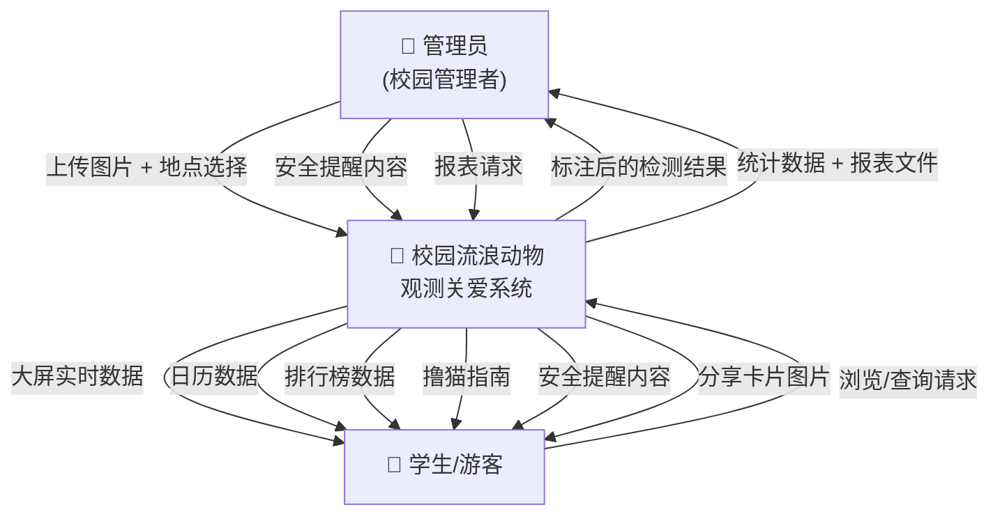
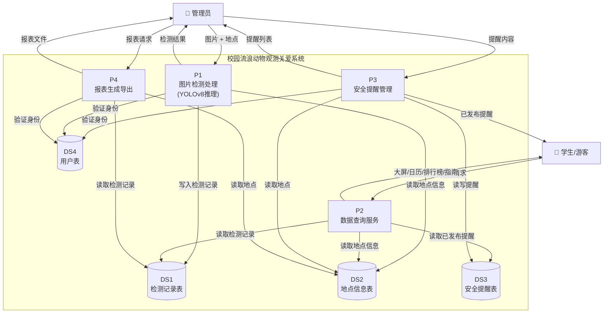
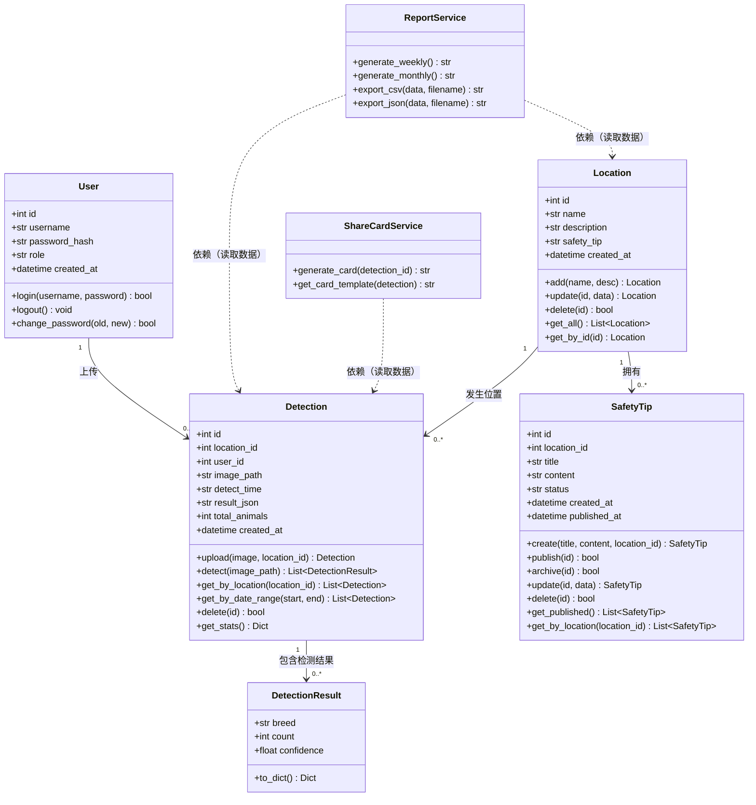
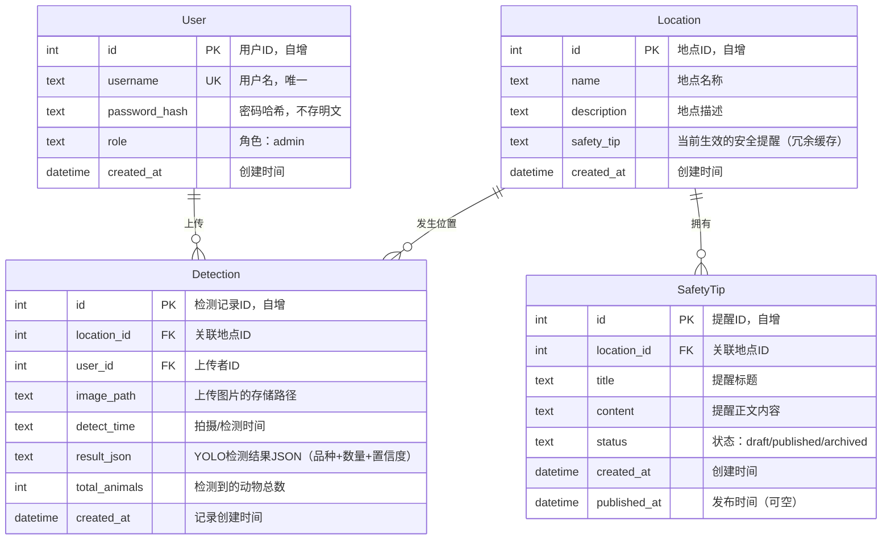

# 需求规格说明书 · 宋鑫旺负责部分

---

## 1.1 项目背景与目标

**项目背景：**

高校校园内普遍存在一定数量的流浪猫狗，它们既是校园生态的一部分，也带来管理上的挑战。校园内已部署的安防监控摄像头每天产生大量画面数据，但这些数据缺乏自动化的动物识别与汇总能力，动物的出没区域、品种分布、数量变化等关键信息无法被有效收集和查询。学生和教职工往往通过社交平台零散地分享信息，难以获取准确、及时的校园动物动态。校园管理者也缺少一个统一的数据平台来支撑安全提醒发布和动物情况统计。

**项目目标：**

本项目旨在开发一个"校园流浪动物观测关爱系统"，利用 YOLOv8 深度学习模型实现以下核心目标：

1. **自动化检测：** 理想场景下接入校园监控视频流，系统自动识别画面中的猫狗品种和数量。当前版本以管理员手动上传照片作为数据入口，验证 AI 检测流程的可行性，为后续接入监控流提供原型基础
2. **数据化呈现：** 将检测结果以实时大屏、出没日历、排行榜等形式展示，让学生和游客直观了解校园动物分布
3. **规范化管理：** 为管理员提供安全提醒管理和周报/月报导出功能，形成可追溯的数据记录

系统的核心价值在于：用 AI 替代人工辨识，用数据平台替代零散信息传播，让校园流浪动物从"看不见、管不了"变为"看得见、管得住"。

---

## 1.2 用户角色定义

| 角色 | 描述 | 典型用户 |
|:----|:-----|:--------|
| 管理员（校园管理者） | 负责校园流浪动物管理的相关人员。需要登录系统，具有上传图片、管理地点、管理安全提醒、导出报表等全部操作权限。核心目标是掌握校园流浪动物的出没情况并及时发布安全信息。 | 保卫处工作人员、后勤管理人员、学生动物保护社团负责人 |
| 学生/游客 | 系统的主要浏览用户，无需登录即可访问。通过实时大屏、出没日历、排行榜等功能了解校园动物动态，获取撸猫指南和安全提醒。核心目标是便捷地获取校园动物资讯并参与互动。 | 在校学生、教职工、来访游客 |

---

## 2.2 数据流图 (DFD)

### DFD 建模方法

**是什么：** DFD（Data Flow Diagram）描述"数据在系统里怎么流转"——数据从哪进入、经过哪些加工处理、最终流向哪里、中间存在什么地方。DFD 不关心控制流（谁先点哪个按钮），只关心数据流。

**怎么画（分层画法）：**
- **顶层图（上下文图）：** 整个系统画成一个黑盒圆圈。只标注外部实体（人/外部系统）和它们与系统之间的数据流。用于快速确认系统边界。
- **0层图：** 把黑盒打开，拆成 3-5 个核心处理过程（Process）。每个过程是一个动词短语，标注它们之间的数据流向和数据存储（Data Store）。

**和业务流程图的区别：** 业务流程图关注"先做什么后做什么"（时序），DFD 关注"什么数据从哪里流到哪里"（流向）。一个是行动线，一个是数据线。

**对本项目的价值：** DFD 是后端 API 设计的前置思考——每个数据流入 = 一个 POST/PUT 接口，每个数据流出 = 一个 GET 接口，每个 Data Store = 一张数据库表。

---

### 顶层图（上下文图）

**外部实体：**
- **E1：管理员** — 校园管理者，负责上传图片、管理安全提醒、查看报表
- **E2：学生/游客** — 系统的主要浏览用户

**系统：** 校园流浪动物观测关爱系统

**数据流：**

| 方向 | 数据流 | 说明 |
|:----|:------|:-----|
| 管理员 → 系统 | 图片数据 + 地点选择 | 上传拍摄的照片用于检测 |
| 管理员 → 系统 | 安全提醒内容 | 创建/编辑/发布/下架安全提醒 |
| 管理员 → 系统 | 报表请求（周/月） | 请求导出统计数据 |
| 系统 → 管理员 | 标注后的检测结果 | 图片上叠加检测框和品种标签 |
| 系统 → 管理员 | 统计数据 + 报表文件 | 汇总统计，支持 CSV/JSON 导出 |
| 学生/游客 → 系统 | 浏览/查询请求 | 打开大屏、日历、排行榜等页面 |
| 系统 → 学生/游客 | 大屏实时数据 | 各地点动物活跃状态 |
| 系统 → 学生/游客 | 日历数据 | 按月汇总的出没记录 |
| 系统 → 学生/游客 | 排行榜数据 | 地点/品种排名统计 |
| 系统 → 学生/游客 | 撸猫指南内容 | 各地点最佳观测建议 |
| 系统 → 学生/游客 | 安全提醒内容 | 已发布的提醒信息 |
| 系统 → 学生/游客 | 分享卡片图片 | 检测结果生成的可分享卡片 |



---

### 0层图（系统内部数据流）

将系统分解为 **4 个核心处理过程 + 4 个数据存储**：

**处理过程：**

| 编号 | 处理过程 | 职责 |
|:----|:--------|:-----|
| P1 | 图片检测处理 | 接收上传图片 → 调用YOLOv8 → 返回检测结果 |
| P2 | 数据查询服务 | 处理各种查询请求（日历/排行榜/大屏/指南） |
| P3 | 安全提醒管理 | 创建/编辑/发布/下架安全提醒 |
| P4 | 报表生成导出 | 聚合统计数据 → 导出 CSV/JSON |

**数据存储：**

| 编号 | 数据存储 | 内容 |
|:----|:--------|:-----|
| DS1 | 检测记录表 | 每次检测的结果（图片路径、品种、数量、时间、地点） |
| DS2 | 地点信息表 | 校园各区域的基本信息 |
| DS3 | 安全提醒表 | 提醒的标题、内容、状态（草稿/已发布/已下架） |
| DS4 | 用户表 | 管理员账号信息 |



> **解读：** 从 0 层图可以看出来，DS1（检测记录表）是最核心的数据存储——P1 写入它，P2、P4 读取它。DS2（地点信息表）作为维度表被多个过程引用。DS4（用户表）仅用于 P1、P3、P4 的身份验证——P2（学生查询）不需要登录。

---

## 2.3 类图

### 类图建模方法

**是什么：** 类图（Class Diagram）从面向对象的角度描述系统的静态结构——有哪些类（Class），每个类有什么属性（Attribute）和方法（Method），类之间有什么关系（关联、继承、组合）。

**和 ER 图的区别：**

| | ER 图 | 类图 |
|:---|:---|:---|
| 视角 | 数据视角——数据怎么存 | 代码视角——对象怎么组织 |
| 产出 | 建表 SQL | Python/Java 类代码 |
| 核心元素 | 实体 + 属性 + FK | 类 + 属性 + **方法** + 关系 |
| 关系类型 | 1:1 / 1:N / N:M | 关联 / 聚合 / 组合 / 继承 / 依赖 |
| 设计阶段 | 数据库设计 | 面向对象设计 |

**对本项目的价值：** 类图直接指导后端代码结构——每个类就是一个 `.py` 文件（FastAPI 的 model 或 service），方法就是类的函数。

---

### 系统类图



---

### 类关系说明

| 关系 | 类 A → 类 B | 类型 | 含义 |
|:----|:-----------|:----|:-----|
| User → Detection | 1 : 0..\* | 关联（Association） | 一个管理员可以上传 0 条或多条检测记录 |
| Location → Detection | 1 : 0..\* | 关联（Association） | 一个地点可以有 0 条或多条检测记录 |
| Location → SafetyTip | 1 : 0..\* | 关联（Association） | 一个地点可以有 0 条或多条安全提醒 |
| Detection → DetectionResult | 1 : 0..\* | 组合（Composition） | 一次检测包含 0 到多个品种的检测结果，结果随检测记录一起生命周期 |
| ReportService → Detection | — | 依赖（Dependency） | 报表服务读取检测数据来生成报表，但不持有数据 |
| ShareCardService → Detection | — | 依赖（Dependency） | 分享卡片服务读取检测数据来生成卡片 |

> **补充：为什么加了 DetectionResult、ReportService、ShareCardService？**
>
> - **DetectionResult** 是 value object——一次 YOLO 检测可能识别出多个品种（一只波斯猫 + 一只金毛），每个品种单独记录品种名+数量+置信度。它不独立存储，嵌套在 Detection 的 `result_json` 中。
> - **ReportService** 和 **ShareCardService** 是 service 层类——它们不持有数据，而是对已有数据做加工。类图中加入 service 类可以直观看出"哪些逻辑不属于单个实体"。

---

## 2.4 ER图 + 数据字典

### ER 建模方法

**是什么：** ER 图（Entity-Relationship Diagram）描述系统中的"实体"（Entity）以及它们之间的"关系"（Relationship）。每个实体最终对应数据库中的一张表，每个属性对应一个字段。

**怎么画（三步法）：**
1. **找实体**——系统中独立的"东西"（用户、地点、检测记录、安全提醒）
2. **标属性**——每个实体有哪些字段，标注主键（PK）和外键（FK）
3. **连关系**——实体之间的数量关系（1:1、1:N、N:M）

**和 DFD 的关系：** DFD 里的 Data Store（DS1-DS4）直接对应 ER 实体——DS1 检测记录表 → Detection 实体，DS2 地点信息表 → Location 实体……画完 DFD 再画 ER，实体清单已经是现成的。

**对本项目的价值：** ER 图是建表 SQL 的唯一依据。ER 图画清楚了，`CREATE TABLE` 语句就是机械翻译。

---

### ER 图



**关系说明：**

| 关系 | 类型 | 说明 |
|:----|:----|:-----|
| User → Detection | 1:N | 一个管理员可以上传多条检测记录 |
| Location → Detection | 1:N | 一个地点可以有多条检测记录 |
| Location → SafetyTip | 1:N | 一个地点可以有多个安全提醒（历史记录） |

---

### 数据字典

#### 表1：user（用户表）

| 字段名 | 类型 | 约束 | 默认值 | 说明 |
|:------|:----|:----|:------|:-----|
| id | INTEGER | PK, AUTOINCREMENT | 自增 | 用户唯一标识 |
| username | TEXT | NOT NULL, UNIQUE | — | 登录用户名 |
| password_hash | TEXT | NOT NULL | — | SHA-256 哈希后的密码（不存明文） |
| role | TEXT | NOT NULL | 'admin' | 角色标识（当前仅 admin） |
| created_at | DATETIME | NOT NULL | CURRENT_TIMESTAMP | 账号创建时间 |

#### 表2：location（地点表）

| 字段名 | 类型 | 约束 | 默认值 | 说明 |
|:------|:----|:----|:------|:-----|
| id | INTEGER | PK, AUTOINCREMENT | 自增 | 地点唯一标识 |
| name | TEXT | NOT NULL | — | 地点名称（如"食堂""宿舍""图书馆"） |
| description | TEXT | — | NULL | 地点的文字描述 |
| safety_tip | TEXT | — | NULL | 当前位置生效的安全提醒（冗余缓存，提升查询速度） |
| created_at | DATETIME | NOT NULL | CURRENT_TIMESTAMP | 地点创建时间 |

#### 表3：detection（检测记录表）

| 字段名 | 类型 | 约束 | 默认值 | 说明 |
|:------|:----|:----|:------|:-----|
| id | INTEGER | PK, AUTOINCREMENT | 自增 | 检测记录唯一标识 |
| location_id | INTEGER | FK → location.id, NOT NULL | — | 拍摄地点 |
| user_id | INTEGER | FK → user.id, NOT NULL | — | 上传该图片的管理员 |
| image_path | TEXT | NOT NULL | — | 上传图片的文件路径 |
| detect_time | TEXT | NOT NULL | — | 拍摄/检测时间（ISO 8601 格式） |
| result_json | TEXT | NOT NULL | — | YOLO 检测结果的 JSON 字符串，含品种、数量、置信度 |
| total_animals | INTEGER | NOT NULL | 0 | 该图片中检测到的动物总数（冗余字段，便于统计） |
| created_at | DATETIME | NOT NULL | CURRENT_TIMESTAMP | 记录创建时间 |

> **result_json 格式示例：**
> ```json
> [
>   {"breed": "Persian_cat", "count": 2, "confidence": 0.93},
>   {"breed": "Golden_Retriever", "count": 1, "confidence": 0.87}
> ]
> ```

#### 表4：safety_tip（安全提醒表）

| 字段名 | 类型 | 约束 | 默认值 | 说明 |
|:------|:----|:----|:------|:-----|
| id | INTEGER | PK, AUTOINCREMENT | 自增 | 提醒唯一标识 |
| location_id | INTEGER | FK → location.id, NOT NULL | — | 关联的地点 |
| title | TEXT | NOT NULL | — | 提醒标题（如"图书馆区域有流浪狗出没注意"） |
| content | TEXT | NOT NULL | — | 提醒正文内容 |
| status | TEXT | NOT NULL | 'draft' | 状态：`draft`（草稿）/ `published`（已发布）/ `archived`（已下架） |
| created_at | DATETIME | NOT NULL | CURRENT_TIMESTAMP | 创建时间 |
| published_at | DATETIME | — | NULL | 发布时间（草稿状态下为 NULL） |

---

### SQL 建表语句（参考）

```sql
CREATE TABLE user (
    id INTEGER PRIMARY KEY AUTOINCREMENT,
    username TEXT NOT NULL UNIQUE,
    password_hash TEXT NOT NULL,
    role TEXT NOT NULL DEFAULT 'admin',
    created_at DATETIME NOT NULL DEFAULT CURRENT_TIMESTAMP
);

CREATE TABLE location (
    id INTEGER PRIMARY KEY AUTOINCREMENT,
    name TEXT NOT NULL,
    description TEXT,
    safety_tip TEXT,
    created_at DATETIME NOT NULL DEFAULT CURRENT_TIMESTAMP
);

CREATE TABLE detection (
    id INTEGER PRIMARY KEY AUTOINCREMENT,
    location_id INTEGER NOT NULL,
    user_id INTEGER NOT NULL,
    image_path TEXT NOT NULL,
    detect_time TEXT NOT NULL,
    result_json TEXT NOT NULL,
    total_animals INTEGER NOT NULL DEFAULT 0,
    created_at DATETIME NOT NULL DEFAULT CURRENT_TIMESTAMP,
    FOREIGN KEY (location_id) REFERENCES location(id),
    FOREIGN KEY (user_id) REFERENCES user(id)
);

CREATE TABLE safety_tip (
    id INTEGER PRIMARY KEY AUTOINCREMENT,
    location_id INTEGER NOT NULL,
    title TEXT NOT NULL,
    content TEXT NOT NULL,
    status TEXT NOT NULL DEFAULT 'draft',
    created_at DATETIME NOT NULL DEFAULT CURRENT_TIMESTAMP,
    published_at DATETIME,
    FOREIGN KEY (location_id) REFERENCES location(id)
);
```

---

## 3. 非功能性需求

非功能性需求描述系统"怎么跑"而不是"做什么"——它约束系统的运行条件、性能底线和技术选型。

---

### 3.1 开发环境

| 项目 | 内容 |
|:----|:-----|
| 操作系统 | Windows 11 / Linux |
| 编程语言 | Python 3.12+ |
| 后端框架 | FastAPI |
| 前端框架 | Vue 3 |
| 数据库 | SQLite 3 |
| 版本控制 | Git + GitHub |
| 包管理 | pip / npm |
| AI模型 | YOLOv8n（Ultralytics） |
| IDE | VS Code |

---

### 3.2 运行环境

**服务器端：**

| 项目 | 最低配置 | 推荐配置 |
|:----|:--------|:--------|
| CPU | 4核 | 8核 |
| 内存 | 8 GB | 16 GB |
| GPU | 可选（非必须） | NVIDIA GTX 1060+（6GB 显存） |
| 磁盘 | 10 GB | 20 GB |
| Python版本 | 3.12+ | 3.12+ |
| 操作系统 | Linux (Ubuntu 20.04+) / Windows Server | Linux (Ubuntu 22.04) |

**客户端（浏览器）：**

| 项目 | 要求 |
|:----|:-----|
| 浏览器 | Chrome 90+ / Edge 90+ / Safari 15+ |
| 屏幕分辨率 | ≥ 1920×1080（管理端），≥ 375×812（学生端移动适配） |
| 网络 | 可访问服务器即可，无特殊要求 |

---

### 3.3 系统依赖项

**Python 依赖（后端）：**

| 包名 | 版本 | 用途 |
|:----|:----|:-----|
| ultralytics | ≥ 8.0 | YOLOv8 模型加载与推理 |
| fastapi | ≥ 0.100 | RESTful API 框架 |
| uvicorn | ≥ 0.23 | ASGI 服务器 |
| opencv-python | ≥ 4.8 | 图像预处理（读取、缩放、绘制检测框） |
| Pillow | ≥ 10.0 | 图片格式处理 |
| jinja2 | ≥ 3.1 | 模板渲染（报表 HTML → 导出） |
| python-multipart | ≥ 0.0.6 | 文件上传支持 |

> SQLite3 为 Python 内置模块，无需额外安装。

**Node.js 依赖（前端）：**

| 包名 | 版本 | 用途 |
|:----|:----|:-----|
| vue | ≥ 3.3 | 前端框架 |
| echarts | ≥ 5.4 | 图表库（大屏/排行榜可视化） |
| naive-ui | ≥ 2.34 | UI 组件库（按钮/表格/日历/消息提示） |
| axios | ≥ 1.5 | HTTP 请求（前后端通信） |
| vue-router | ≥ 4.2 | 前端路由管理 |

---

### 3.4 性能需求

| 指标 | 要求 | 备注 |
|:----|:----|:-----|
| 单张图片检测时间 | < 3 秒（GPU）/ < 10 秒（CPU） | YOLOv8n 模型推理 + 后处理 |
| 页面首屏加载时间 | < 2 秒 | 含大屏图表初始化 |
| 并发用户数 | ≥ 10 人同时访问 | 小学期演示规模，不做高并发要求 |
| 数据库记录容量 | ≥ 10,000 条检测记录 | SQLite 单表百万级无压力，下限保守估计 |
| 系统可用性 | 工作日 8:00-18:00 可运行 | 非生产系统，仅教学演示时段 |

---

### 3.5 安全性需求

| 安全措施 | 说明 |
|:--------|:-----|
| 管理员登录验证 | 用户名 + 密码登录，管理端所有操作需登录后才能执行 |
| 密码哈希存储 | 密码使用 SHA-256 哈希后存储，数据库不存明文 |
| 文件类型校验 | 上传文件仅允许常见图片格式（JPG/PNG/WebP），拒绝可执行文件等 |
| API 鉴权 | 管理端 API（上传/编辑/删除/导出）需要验证登录状态；学生端 API（查询/浏览）无需鉴权 |
| 文件大小限制 | 单张上传图片不超过 10 MB |

---

### 3.6 约束与假设

| 项目 | 说明 |
|:----|:-----|
| **模型约束** | YOLOv8n 基于 Oxford-IIIT Pet Dataset 训练，仅能识别 37 种猫狗品种。无法检测猫狗以外的动物，也无法区分未被训练过的品种 |
| **数据约束** | 检测结果受图片质量影响——模糊、遮挡、光线不足会降低准确率 |
| **部署约束** | 小学期项目以本地演示为主，不考虑容器化部署（Docker）、CI/CD、云服务器等生产环境配置 |
| **语言约束** | 系统界面为中文，代码注释及变量命名为英文 |
| **维护假设** | 系统交付后由管理员自行维护地点信息和安全提醒内容，模型不需要持续训练更新 |

---

写完 push 到 GitHub 即可。
