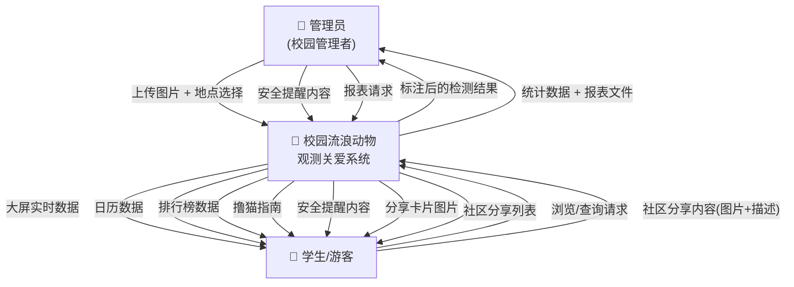
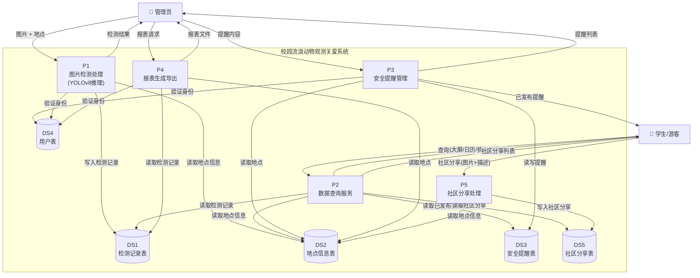
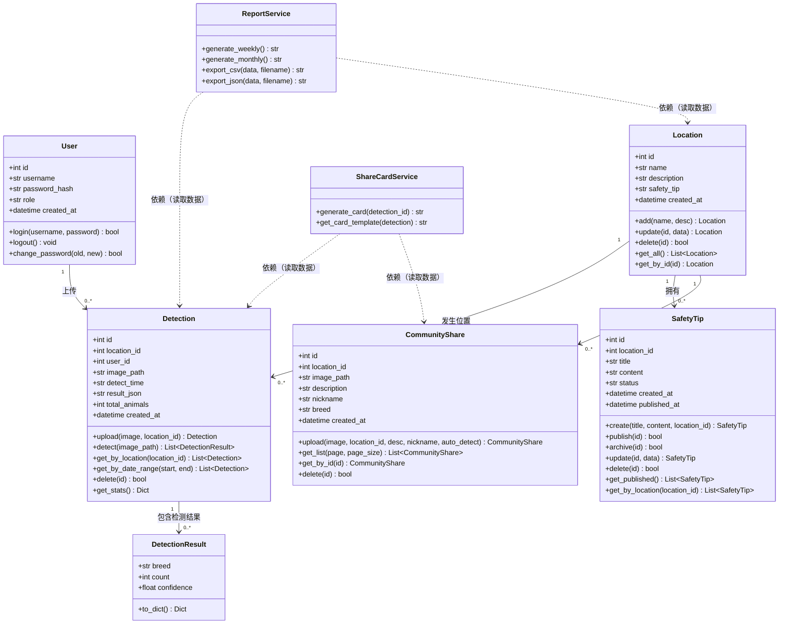
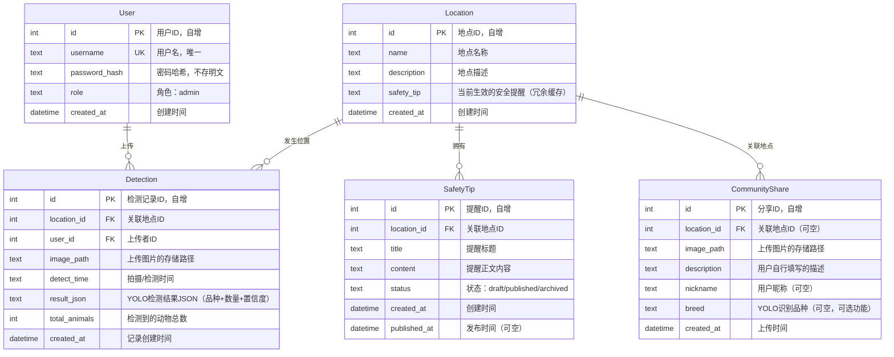

# 校园流浪动物观测关爱系统 · 需求规格说明书

> **版本：** v1.0
> **日期：** 2026-07-07
> **作者：** 宋鑫旺（1.1/1.2/2.2/2.4/2.5/3）、胡淦斌（1.3/1.4/2.1/2.3）

---

## 目录

- [1. 引言](#1-引言)
  - [1.1 项目背景与目标](#11-项目背景与目标)
  - [1.2 用户角色定义](#12-用户角色定义)
  - [1.3 用户故事](#13-用户故事)
  - [1.4 业务流程图](#14-业务流程图)
- [2. 系统分析模型](#2-系统分析模型)
  - [2.1 用例图](#21-用例图)
  - [2.2 数据流图 DFD](#22-数据流图-dfd)
  - [2.3 时序图](#23-时序图)
  - [2.4 类图](#24-类图)
  - [2.5 ER图与数据字典](#25-er图与数据字典)
- [3. 非功能性需求](#3-非功能性需求)

---

## 1. 引言

### 1.1 项目背景与目标

**项目背景：**

高校校园内普遍存在一定数量的流浪猫狗，它们既是校园生态的一部分，也带来管理上的挑战。校园内已部署的安防监控摄像头每天产生大量画面数据，但这些数据缺乏自动化的动物识别与汇总能力，动物的出没区域、品种分布、数量变化等关键信息无法被有效收集和查询。学生和教职工往往通过社交平台零散地分享信息，难以获取准确、及时的校园动物动态。校园管理者也缺少一个统一的数据平台来支撑安全提醒发布和动物情况统计。

**项目目标：**

本项目旨在开发一个"校园流浪动物观测关爱系统"，利用 YOLOv8 深度学习模型实现以下核心目标：

1. **自动化检测：** 理想场景下接入校园监控视频流，系统自动识别画面中的猫狗品种和数量。当前版本以管理员手动上传照片作为数据入口，验证 AI 检测流程的可行性，为后续接入监控流提供原型基础
2. **数据化呈现：** 将检测结果以实时大屏、出没日历、排行榜等形式展示，让学生和游客直观了解校园动物分布
3. **规范化管理：** 为管理员提供安全提醒管理和周报/月报导出功能，形成可追溯的数据记录

系统的核心价值在于：用 AI 替代人工辨识，用数据平台替代零散信息传播，让校园流浪动物从"看不见、管不了"变为"看得见、管得住"。

核心数据流：

```
摄像头/照片 → YOLOv8 品种检测 → 数据库 → 管理员管理端
                                        → 公共展示端（大屏/日历/排行榜等）
```

---

### 1.2 用户角色定义

| 角色 | 描述 | 典型用户 | 是否需要登录 |
|:----|:-----|:--------|:----------:|
| **管理员（校园管理者）** | 负责校园流浪动物管理的相关人员。需要登录系统，具有上传图片、管理地点、管理安全提醒、导出报表等全部操作权限。核心目标是掌握校园流浪动物的出没情况并及时发布安全信息。 | 保卫处工作人员、后勤管理人员、学生动物保护社团负责人 | ✅ 是 |
| **学生/游客** | 系统的主要浏览用户，无需登录即可访问。通过实时大屏、出没日历、排行榜等功能了解校园动物动态，获取撸猫指南和安全提醒。核心目标是便捷地获取校园动物资讯并参与互动。 | 在校学生、教职工、来访游客 | ❌ 否 |

**角色权限矩阵：**

| 功能 | 管理员 | 学生/游客 |
|:----|:-----:|:--------:|
| 上传图片检测 | ✅ | ❌ |
| 查看检测记录 | ✅ | ❌ |
| 管理地点信息 | ✅ | ❌ |
| 管理安全提醒 | ✅ | ❌ |
| 导出周报月报 | ✅ | ❌ |
| 管理端总览看板 | ✅ | ❌ |
| 实时动态大屏 | ✅ | ✅ |
| 动物出没日历 | ✅ | ✅ |
| 趣味排行榜 | ✅ | ✅ |
| 撸猫指南 | ✅ | ✅ |
| 安全提醒公示 | ✅ | ✅ |
| 生成分享卡片 | ✅ | ✅ |
| 上传社区分享（美好记录） | ❌ | ✅ |

---

### 1.3 用户故事

#### 管理员（校园管理者）

| 编号 | 用户故事 | 对应功能 | 验收标准 |
|:---:|:---------|:---------|:---------|
| US-01 | 作为管理员，我希望上传各个摄像头拍摄的画面，以便系统检测其中的动物 | 图片上传 | ① 支持 JPG/PNG 拖拽或点击上传 ② 图片大小限制 10MB ③ 上传后自动触发 YOLO 检测 ④ 显示上传进度 |
| US-02 | 作为管理员，我希望系统自动检测出画面中的猫狗品种和数量，以便我了解各区域情况 | YOLO自动检测 | ① 返回每只动物的品种名（中英文均可）、置信度（0-1）、边界框坐标(x,y,w,h) ② 单张检测耗时 < 10s（CPU）③ 支持一张图检出多只不同品种动物 |
| US-03 | 作为管理员，我希望按地点查看所有历史检测记录，以便了解各区域的动物活动情况 | 地点记录查询 | ① 支持按地点、品种、日期范围筛选 ② 分页展示，每页约15条 ③ 点击记录可查看详情：原图 + YOLO标注框 + 完整检测JSON |
| US-04 | 作为管理员，我希望系统自动生成安全提醒建议，以便我发布到各区域 | 安全提醒生成 | ① 基于各地点近7天检测量自动生成建议文案 ② ≥20次→"频繁出没，请注意避让"，≥10次→"请留意周围"，≥5次→"偶有出没，请保持关注" ③ 每条建议标注数据来源 |
| US-05 | 作为管理员，我希望手动编辑和发布安全提醒，以便灵活管理 | 安全提醒管理 | ① 可新建/编辑/删除提醒 ② 支持 published/draft/archived 三种状态 ③ 发布时同步更新 location.safety_tip 字段 ④ 支持下架（改为 archived） |
| US-06 | 作为管理员，我希望导出周报月报，以便向上汇报 | 报告导出 | ① 支持选择周/月时间范围 ② 导出格式：CSV + JSON ③ 报表含：总检测数、有动物记录数、覆盖地点数、最常见品种TOP5、最活跃地点排行 |
| US-07 | 作为管理员，我希望在一个总览看板上看到所有数据，以便快速掌握全局 | 管理端总览 | ① 4个统计卡片：总检测数 / 有动物记录数 / 覆盖地点数 / 已发布提醒数 ② 各地点动物出现次数排行（横向柱状图）③ 品种TOP5 ④ 近14天检测趋势折线图 |

#### 学生/游客

| 编号 | 用户故事 | 对应功能 | 验收标准 |
|:---:|:---------|:---------|:---------|
| US-08 | 作为学生，我希望看到校园各区域动物的实时活跃状态 | 实时动态大屏 | ① 无需登录即可访问 ② 各地点卡片显示活跃状态（🟢活跃中/🟡休息中/⚪无记录）③ 活跃判定规则：最近2小时内有检测记录即为"活跃中" ④ 页面自动刷新，间隔30秒 |
| US-09 | 作为学生，我希望按日期查看动物的出没记录 | 动物出没日历 | ① 按月渲染日历网格 ② 每天显示当天出现过的品种图标（🐱/🐕）和涉及地点名 ③ 点击某天可展开当天所有检测详情 ④ 支持上下月切换 |
| US-10 | 作为学生，我希望看到有趣的统计数据 | 趣味排行榜 | ① 出镜之王：出现频率最高的品种 + 占比 ② 最佳宅猫：最固定单一地点的品种 + 该地点占比 ③ 独行侠：出现次数最少的品种 ④ 最热闹地点：检测量占比最高的地点 ⑤ 最佳观测时间：动物出现最密集的时段 ⑥ 所有数据基于数据库聚合查询，非人工编造 |
| US-11 | 作为学生，我希望知道什么时候去什么地方能看到猫狗 | 撸猫指南 | ① 每个地点一张卡片，显示：星级（★1-5，基于出没率）、主要住户品种、最佳观测时段、出现规律描述、实用小贴士 ② 数据驱动：出没率 = 该地点有动物的记录数/总检测数 |
| US-12 | 作为学生，我希望看到各区域的安全提醒 | 安全提醒公示 | ① 仅展示 status='published' 的提醒 ② 每条显示：地点名、标题、正文、发布时间 ③ 附带数据依据（如"近7天检测23次"） |
| US-13 | 作为学生，我希望把有趣的发现分享给朋友 | 分享卡片 | ① 在检测记录中点击"生成分享卡片" ② 卡片含：品种名、地点、时间、置信度、动物emoji装饰 ③ 渲染为一张可视化卡片图片 |
| US-14 | 作为学生，我希望上传自己在校园拍到的动物照片，记录美好的发现瞬间，供其他学生浏览 | 社区分享上传 | ① 无需登录即可上传（或可选填写昵称） ② 支持 JPG/PNG，≤10MB ③ 上传后可选调用 YOLO 检测标注品种，也允许用户自行描述 ④ 检测到品种后自动展示品种小资料卡片（中文名、emoji、体型、性格、趣味小知识） ⑤ 上传内容存入 community_share 表，不影响管理员统计报表 ⑥ 支持浏览他人的社区分享

---

### 1.4 业务流程图

#### 管理员业务流程图

```
┌──────────────────────────────────────────────────────────────────────┐
│  管理员业务流程                                                        │
├──────────────────────────────────────────────────────────────────────┤
│                                                                        │
│  [登录系统] ──► [选择拍摄地点] ──► [上传照片]                            │
│        │             │                 │                                │
│        │             │ 地点列表来自     │ 支持JPG/PNG，                 │
│        │             │ GET /api/       │ POST /api/upload              │
│        │             │ locations       │ (multipart/form-data)          │
│        │                              │                                │
│        │                              ▼                                │
│        │                       [YOLO 自动检测]                          │
│        │                              │                                │
│        │                              │ 返回 [{breed, confidence,       │
│        │                              │        box_x, box_y,            │
│        │                              │        box_w, box_h}, ...]      │
│        │                              ▼                                │
│        │  ◄──────────── [查看检测结果]                                  │
│        │                        │                                       │
│        │           ┌────────────┼────────────┐                          │
│        │           ▼            ▼            ▼                          │
│        │     [保存记录]   [生成分享卡片]   [管理安全提醒]                 │
│        │     INSERT →    调用 GET          系统自动建议 +                │
│        │     detection    /api/public/     POST/PUT                     │
│        │     表           share-card      /api/safety-tips              │
│        │                                     │                         │
│        │                              ┌──────┴──────┐                  │
│        │                              ▼             ▼                  │
│        │                        [发布提醒]    [编辑/下架]               │
│        │                        status→        status→                 │
│        │                        published      archived                │
│        │                                                               │
│        ▼                                                               │
│  [管理端总览看板]  ←── 首页，登录后默认进入                               │
│  GET /api/dashboard                                                     │
│                                                                        │
│  ┌─────────────────────────────────────────────────────────────┐      │
│  │ 其他辅助操作（随时可用，不占主线流程）:                        │      │
│  │ · 检测记录管理：GET /api/detections?location_id=&date_from=&  │      │
│  │                  date_to=&page=&page_size=                    │      │
│  │ · 数据导出：GET /api/reports/weekly | /api/reports/monthly   │      │
│  └─────────────────────────────────────────────────────────────┘      │
│                                                                        │
└──────────────────────────────────────────────────────────────────────┘
```

#### 学生/游客业务流程图

```
┌──────────────────────────────────────────────────────────────────────┐
│  学生/游客业务流程                                                     │
├──────────────────────────────────────────────────────────────────────┤
│                                                                        │
│  [打开系统首页]  无需登录                                               │
│        │                                                               │
│        ▼                                                               │
│  [实时动态大屏]  GET /api/public/dashboard  ◄─────────────────┐       │
│        │         · 各地点状态卡片（活跃/休息/无记录）            │       │
│        │         · 近14天检测趋势图 (ECharts 折线图)            │       │
│        │         · 底部安全提醒滚动条                           │       │
│        │                                                       │       │
│        ├────► [动物出没日历]                                    │       │
│        │      GET /api/public/calendar?month=2026-07            │       │
│        │      按月渲染日历网格，每天显示品种图标+地点名           │       │
│        │      点击日期 → GET /api/public/detections?date=X      │       │
│        │      展开当天所有检测详情                                │       │
│        │                                                       │       │
│        ├────► [趣味排行榜]                                      │       │
│        │      GET /api/public/rankings                         │       │
│        │      出镜之王 / 最佳宅猫 / 独行侠 / 最热闹地点 /        │       │
│        │      最佳观测时间 —— 全部基于 DB 聚合查询               │       │
│        │                                                       │       │
│        ├────► [撸猫指南]                                       │       │
│        │      GET /api/public/guide                            │       │
│        │      每个地点一张卡片：★星级 / 主要住户 /              │       │
│        │      最佳时间 / 出现规律 / 💡小贴士                    │       │
│        │                                                       │       │
│        └────► [安全提醒公示]                                    │       │
│               GET /api/public/safety-tips                      │       │
│               仅展示 status='published' 的提醒                  │       │
│                                                           │       │
│        ┌──── 看到有趣的结果 ────┐                          │       │
│        ▼                       │                          │       │
│  [生成分享卡片]                  │                          │       │
│  GET /api/public/              │                          │       │
│  share-card/:detection_id      │                          │       │
│        │                       │                          │       │
│        ▼                       │                          │       │
│  渲染可视化卡片                  │                          │       │
│  ──► [分享给朋友/保存图片]  ─────┘                          │       │
│                                                           │       │
│        再次浏览 ──────────────────────────────────────────┘       │
│                                                                        │
└──────────────────────────────────────────────────────────────────────┘
```

#### 学生/游客上传社区分享流程

```
┌──────────────────────────────────────────────────────────────────────┐
│  学生上传社区分享流程（独立于管理员数据线）                               │
├──────────────────────────────────────────────────────────────────────┤
│                                                                        │
│  [学生/游客]  无需登录                                                  │
│        │                                                               │
│        ▼                                                               │
│  [打开社区分享页]  GET /api/public/community                            │
│        │                                                               │
│        ├────► 浏览他人分享（瀑布流/卡片列表）                            │
│        │      每张卡片：图片 + 品种/描述 + 地点 + 时间 + 昵称           │
│        │                                                               │
│        └────► [点击"上传我的发现"]                                      │
│                    │                                                   │
│                    ▼                                                   │
│            [填写分享信息]                                               │
│            · 上传照片（JPG/PNG，≤10MB）                                 │
│            · 选择地点（可选）                                           │
│            · 填写描述 / 昵称（可选）                                     │
│            · ☑ 是否调用 YOLO 识别品种？                                 │
│                    │                                                   │
│                    ▼                                                   │
│              POST /api/public/community                                 │
│              (multipart/form-data)                                      │
│                    │                                                   │
│              ┌─────┴─────┐                                             │
│              ▼           ▼                                             │
│        [YOLO识别]   [跳过识别]                                          │
│        自动标注      用户自行                                            │
│        品种名称      描述内容                                            │
│         + 品种小资料卡                                                  │
│         (中文名/emoji/                                                 │
│          习性/趣味知识)                                                 │
│              │           │                                             │
│              └─────┬─────┘                                             │
│                    ▼                                                   │
│            INSERT INTO community_share                                  │
│            （不入 detection 表）                                        │
│                    │                                                   │
│                    ▼                                                   │
│            返回分享卡片 → 展示在社区页面                                 │
│                                                                        │
│   【与管理员数据的隔离】                                                 │
│   · community_share 表独立存储，不参与管理员报表统计                      │
│   · 学生端可浏览社区分享内容，管理员也可查看但不混入正式检测数据            │
└──────────────────────────────────────────────────────────────────────┘
```

---

## 2. 系统分析模型

### 2.1 用例图

#### 管理员用例

```
┌─────────────────────────────────────────────────────────────────┐
│                   校园流浪动物观测关爱系统                         │
│                                                                 │
│  ┌──────────┐            ┌────────────────────────────────────┐ │
│  │          │   ● 上传图片检测  POST /api/upload              │ │
│  │          │   ● 查看检测记录  GET /api/detections           │ │
│  │  管理员  │   ● 管理地点      GET/POST /api/locations       │ │
│  │          │   ● 管理安全提醒  GET/POST /api/safety-tips     │ │
│  │          │                 PUT /api/safety-tips/:id/status │ │
│  │          │   ● 生成周报月报  GET /api/reports/weekly       │ │
│  │          │                 GET /api/reports/monthly        │ │
│  │          │   ● 管理端总览    GET /api/dashboard            │ │
│  └──────────┘            └────────────────────────────────────┘ │
│                                                                 │
│   【前置条件】已登录（所有管理员用例）                              │
└─────────────────────────────────────────────────────────────────┘
```

**用例说明：**

| 用例名称 | 描述 | 前置条件 | 基本流程 | 输入 | 输出 |
|:--------|:-----|:--------|:--------|:-----|:-----|
| 上传图片检测 | 选择地点并上传图片，系统调用 YOLOv8 检测动物品种 | 已登录 | ① 选择拍摄地点 → ② 拖拽或点击上传 JPG/PNG（≤10MB）→ ③ 后端保存图片到 uploads/ 目录，调用 `model(image_path)` 推理 → ④ 返回 `[{breed, confidence, box_x, box_y, box_w, box_h}, ...]` → ⑤ 前端并排展示原图 + 标注框 + 结果列表 → ⑥ 管理员确认后 POST 保存到 detection 表 → ⑦ 可选：跳转生成分享卡片 | `{image: File, location_id: int}` (multipart/form-data) | `{id, location_id, image_path, detect_time, result_json, total_animals}` |
| 查看检测记录 | 按条件筛选查看历史检测记录 | 已登录 | ① 进入记录管理页，默认按时间倒序分页展示 → ② 筛选条件：地点下拉框（GET /api/locations）、品种、日期范围 → ③ 列表展示：ID、地点名、检测时间、动物数量、品种摘要 → ④ 点击某条：展开详情面板，显示原图 + 标注框覆盖图 + 完整 JSON → ⑤ 支持删除（DELETE /api/detections/:id） | `?location_id=&breed=&date_from=&date_to=&page=&page_size=` | 分页列表 `{items: [...], total, page, page_size}` |
| 管理地点 | 对拍摄点位进行增删改查 | 已登录 | ① 查看地点列表（名称、描述、当前安全提醒文案）→ ② 新增：填写 name + description → POST /api/locations → ③ 编辑：修改已有信息 → ④ 删除：确认后移除（如有关联检测记录则提示） | `{name: str, description: str?}` | `{id, name, description, safety_tip, created_at}` |
| 管理安全提醒 | 基于数据自动生成建议，人工审核后发布/下架 | 已登录 | ① 页面加载时后端遍历所有地点，统计近7天检测量 → ② 按规则生成建议：`total≥20→"频繁出没，请注意避让"`、`10≤total<20→"请留意周围"`、`5≤total<10→"偶有出没，请保持关注"`、`<5→不生成` → ③ 每条建议附数据依据和[采纳]/[忽略]按钮 → ④ 采纳或手动新建：填写 title + content → POST /api/safety-tips → ⑤ 发布后同步更新 location.safety_tip → ⑥ 可下架（PUT /api/safety-tips/:id/status, body: {status: "archived"}） | `{location_id, title, content, status}` | `{id, location_id, title, content, status, created_at}` |
| 生成周报月报 | 按周/月维度聚合统计并导出 | 已登录 | ① 选择周报或月报 → ② 选择时间范围（周选择器/月选择器）→ ③ 预览统计摘要 → ④ 选择导出格式（CSV 用逗号分隔含表头，JSON 为对象数组）→ ⑤ 下载文件 | `?type=weekly&start=&end=` 或 `?type=monthly&year=&month=` | CSV 文本 或 JSON `[{指标, 数值}, ...]` |
| 管理端总览 | 一个页面展示全局核心数据 | 已登录 | ① 登录后默认进入 → ② 4个统计卡片：总检测数、有动物记录数、覆盖地点数、已发布提醒数 → ③ 地点排行 → ④ 品种 TOP5 → ⑤ 近14天趋势折线图 | 无（GET /api/dashboard） | `{stats: {total, with_animals, locations, published_tips}, location_ranking: [{name, count}], breed_top5: [{breed, count}], trend_14d: [{date, count}]}` |

#### 学生/游客用例

```
┌─────────────────────────────────────────────────────────────────┐
│                   校园流浪动物观测关爱系统                         │
│                                                                 │
│  ┌──────────┐            ┌────────────────────────────────────┐ │
│  │          │   ● 查看实时动态大屏  GET /api/public/dashboard │ │
│  │ 学生/    │   ● 查看动物出没日历  GET /api/public/calendar  │ │
│  │ 游客     │   ● 查看趣味排行榜    GET /api/public/rankings  │ │
│  │          │   ● 查看撸猫指南      GET /api/public/guide     │ │
│  │          │   ● 查看安全提醒公示  GET /api/public/safety-tips│ │
│  │          │   ● 生成分享卡片     GET /api/public/share-card │ │
│  │          │   ● 上传社区分享     POST /api/public/community │ │
│  └──────────┘            └────────────────────────────────────┘ │
│                                                                 │
│   【前置条件】无（所有学生/游客用例）                               │
└─────────────────────────────────────────────────────────────────┘
```

**用例说明：**

| 用例名称 | 描述 | 前置条件 | 基本流程 | 输入 | 输出 |
|:--------|:-----|:--------|:--------|:-----|:-----|
| 查看实时大屏 | 打开系统首页即见，类似机场航班大屏，展示各区域动物活跃状态 | 无 | ① 打开首页，无需登录 → ② 顶部 4 个统计卡片 → ③ 中间各地点状态卡片：每张显示地点名+emoji、活跃状态标记（最近2h有检测→🟢活跃中、2-24h→🟡休息中、>24h→⚪无记录）、最近检测品种名、最近检测时间 → ④ 下方 ECharts 折线图，近14天每日检测数 → ⑤ 底部滚动安全提醒条 → ⑥ 页面每30秒自动 GET 刷新数据 | 无 | `{stats, location_status: [{name, status, recent_breeds, last_detect_time}], trend_14d, safety_tips}` |
| 查看出没日历 | 按月查看每天各地点出现过的动物品种 | 无 | ① 从大屏导航进入日历页 → ② 默认当前月，API 传 `month=2026-07` → ③ 后端返回该月每天包含的地点+品种列表 → ④ 前端渲染日历网格：有动物的格子显示品种图标（🐱/🐕）+ 涉及地点名缩写 → ⑤ 可切换上月/下月 → ⑥ 点击某天 → 弹出当天所有检测记录详情 | `?month=YYYY-MM` / `?date=YYYY-MM-DD` | 日历页：`{days: [{date, locations: [{name, breeds}]}]}` / 详情：`{detections: [...]}` |
| 查看排行榜 | 查看基于真实数据生成的趣味排行 | 无 | ① 从大屏导航进入 → ② 5 个榜单依次展示：出镜之王、最佳宅猫、独行侠、最热闹地点、最佳观测时间 → ③ 数据全部来自 detection 表聚合查询 | 无 | `{most_seen: {breed, count, percentage}, homebody: {breed, location, percentage}, rare: {breed, count}, busiest_place: {name, count, percentage}, best_time: {hour_range, avg_count}}` |
| 查看撸猫指南 | 每个地点一张卡片，基于数据给出观测建议 | 无 | ① 从大屏导航进入 → ② 每个地点一张卡片，按出没率排序列出 → ③ 每张卡片含：地点名 + emoji、星级（出没率≥80%→★★★★★、≥60%→★★★★、≥40%→★★★、≥20%→★★、<20%→★）、主要住户品种列表、最佳观测时段、出现规律文字描述、💡实用小贴士 → ④ 数据来源均为 detection 表聚合 | 无 | `{locations: [{name, rating, main_breeds: [...], best_time: {start, end}, pattern_desc, tip}]}` |
| 查看安全提醒 | 浏览管理员已发布的安全提醒 | 无 | ① 从大屏或底部滚动条进入 → ② 逐条展示每则提醒的卡片：地点名+emoji、标题、正文、数据依据、发布时间 → ③ 仅展示 status='published' 的提醒，按发布时间倒序 | 无 | `[{id, location_name, title, content, data_basis, published_at}]` |
| 生成分享卡片 | 将某条检测结果渲染为可视化分享卡片 | 无 | ① 在检测详情中点击"生成分享卡片"→ ② GET /api/public/share-card/:detection_id → ③ 后端返回渲染好的 HTML/图片 → ④ 用户保存或复制分享 | `detection_id` (路径参数) | HTML 页面或图片 URL |
| 上传社区分享 | 学生上传自己在校园拍到的动物照片，记录美好发现，供社区浏览 | 无 | ① 打开社区页面 → ② 点击"上传我的发现"→ ③ 选择照片（JPG/PNG，≤10MB）+ 选择地点 + 填写描述/昵称 → ④ 可选：勾选"AI识别品种"则调用 YOLO 识别 → ⑤ POST /api/public/community → ⑥ 存入 community_share 表 → ⑦ 刷新社区页面，新分享出现在列表中 | `{image: File, location_id?: int, description?: str, nickname?: str, auto_detect?: bool}` | `{id, image_url, location_name, description, breed?, nickname, created_at}` |

---

### 2.2 数据流图 DFD

#### DFD 建模方法

**是什么：** DFD（Data Flow Diagram）描述"数据在系统里怎么流转"——数据从哪进入、经过哪些加工处理、最终流向哪里、中间存在什么地方。DFD 不关心控制流（谁先点哪个按钮），只关心数据流。

**怎么画（分层画法）：**
- **顶层图（上下文图）：** 整个系统画成一个黑盒圆圈。只标注外部实体（人/外部系统）和它们与系统之间的数据流。用于快速确认系统边界。
- **0层图：** 把黑盒打开，拆成 3-5 个核心处理过程（Process）。每个过程是一个动词短语，标注它们之间的数据流向和数据存储（Data Store）。

**和业务流程图的区别：** 业务流程图关注"先做什么后做什么"（时序），DFD 关注"什么数据从哪里流到哪里"（流向）。一个是行动线，一个是数据线。

**对本项目的价值：** DFD 是后端 API 设计的前置思考——每个数据流入 = 一个 POST/PUT 接口，每个数据流出 = 一个 GET 接口，每个 Data Store = 一张数据库表。

---

#### 顶层图（上下文图）

**外部实体：**
- **E1：管理员** — 校园管理者，负责上传图片、管理安全提醒、查看报表
- **E2：学生/游客** — 系统的主要浏览用户

**系统：** 校园流浪动物观测关爱系统

**数据流：**

| 方向 | 数据流 | 说明 |
|:----|:------|:-----|
| 管理员 → 系统 | 图片数据 + 地点选择 | 上传拍摄的照片用于检测 |
| 管理员 → 系统 | 安全提醒内容 | 创建/编辑/发布/下架安全提醒 |
| 管理员 → 系统 | 报表请求（周/月） | 请求导出统计数据 |
| 系统 → 管理员 | 标注后的检测结果 | 图片上叠加检测框和品种标签 |
| 系统 → 管理员 | 统计数据 + 报表文件 | 汇总统计，支持 CSV/JSON 导出 |
| 学生/游客 → 系统 | 浏览/查询请求 | 打开大屏、日历、排行榜等页面 |
| 系统 → 学生/游客 | 大屏实时数据 | 各地点动物活跃状态 |
| 系统 → 学生/游客 | 日历数据 | 按月汇总的出没记录 |
| 系统 → 学生/游客 | 排行榜数据 | 地点/品种排名统计 |
| 系统 → 学生/游客 | 撸猫指南内容 | 各地点最佳观测建议 |
| 系统 → 学生/游客 | 安全提醒内容 | 已发布的提醒信息 |
| 学生/游客 → 系统 | 社区分享内容（图片+描述） | 上传校园动物照片作为社区分享 |
| 系统 → 学生/游客 | 社区分享列表 | 浏览他人分享的美好记录 |
| 系统 → 学生/游客 | 分享卡片图片 | 检测结果生成的可分享卡片 |



---

#### 0层图（系统内部数据流）

将系统分解为 **4 个核心处理过程 + 4 个数据存储**：

**处理过程：**

| 编号 | 处理过程 | 职责 |
|:----|:--------|:-----|
| P1 | 图片检测处理 | 接收上传图片 → 调用YOLOv8 → 返回检测结果 |
| P2 | 数据查询服务 | 处理各种查询请求（日历/排行榜/大屏/指南） |
| P3 | 安全提醒管理 | 创建/编辑/发布/下架安全提醒 |
| P4 | 报表生成导出 | 聚合统计数据 → 导出 CSV/JSON |
| P5 | 社区分享处理 | 接收学生上传照片 → 可选YOLO识别 → 存入社区分享表 |

**数据存储：**

| 编号 | 数据存储 | 内容 |
|:----|:--------|:-----|
| DS1 | 检测记录表 | 每次检测的结果（图片路径、品种、数量、时间、地点）——管理员数据线 |
| DS2 | 地点信息表 | 校园各区域的基本信息 |
| DS3 | 安全提醒表 | 提醒的标题、内容、状态（草稿/已发布/已下架） |
| DS4 | 用户表 | 管理员账号信息 |
| DS5 | 社区分享表 | 学生上传的美好记录（图片、描述、昵称、可选YOLO结果）——独立于管理员数据线 |



> **解读：** DS1（检测记录表）和 DS5（社区分享表）是两条独立的数据线——DS1 支撑管理员报表和统计数据，DS5 支撑学生社区浏览。两者共用 DS2（地点信息表）作为维度表但互不干扰。P5（社区分享处理）不经过 DS4 身份验证——学生无需登录即可上传分享。

---

### 2.3 时序图

#### 时序图建模方法

**是什么：** 时序图描述"几个对象之间的一次交互过程"，按时间顺序展示消息传递。一个时序图 = 一个具体场景的一次完整执行。

**对本项目的价值：** 时序图是 API 接口设计的直接依据——每一条箭头就是一次 HTTP 请求或函数调用。前端看时序图知道调哪个接口、传什么参数；后端看时序图知道收到请求后做什么。

---

#### 时序图1：上传图片检测流程

```
管理员              前端页面(Vue3)          FastAPI后端            YOLOv8模型           SQLite数据库
 │                     │                     │                     │                    │
 │ ① 选择地点+上传     │                     │                     │                    │
 │   图片文件           │                     │                     │                    │
 │───────────────────►│                     │                     │                    │
 │                     │ ② POST /api/upload  │                     │                    │
 │                     │   multipart/form-data│                    │                    │
 │                     │   {file,location_id}│                     │                    │
 │                     │───────────────────►│                     │                    │
 │                     │                     │ ③ 保存图片到        │                    │
 │                     │                     │   uploads/{uuid}.jpg│                    │
 │                     │                     │                     │                    │
 │                     │                     │ ④ model(img_path)   │                    │
 │                     │                     │   加载 best.pt (~10MB)│                  │
 │                     │                     │───────────────────►│                    │
 │                     │                     │                     │                    │
 │                     │                     │ ⑤ 返回检测结果列表    │                    │
 │                     │                     │   [{                 │                    │
 │                     │                     │     "breed":"Bengal",│                    │
 │                     │                     │     "confidence":0.96,│                  │
 │                     │                     │     "box_x":120,      │                    │
 │                     │                     │     "box_y":340,      │                    │
 │                     │                     │     "box_w":180,      │                    │
 │                     │                     │     "box_h":220       │                    │
 │                     │                     │   }, ...]             │                    │
 │                     │                     │◄───────────────────│                    │
 │                     │                     │                     │                    │
 │                     │                     │ ⑥ 可选：在图片上绘制   │                    │
 │                     │                     │   标注框(OpenCV)，     │                    │
 │                     │                     │   保存 annotated_{uuid}│                   │
 │                     │                     │                     │                    │
 │                     │ ⑦ 返回检测结果      │                     │                    │
 │                     │   {                 │                     │                    │
 │                     │     image_url,       │                     │                    │
 │                     │     annotated_url,   │                     │                    │
 │                     │     animals: [...],  │                     │                    │
 │                     │     total: N         │                     │                    │
 │                     │   }                 │                     │                    │
 │                     │◄───────────────────│                     │                    │
 │                     │                     │                     │                    │
 │ ⑧ 前端并排展示:      │                     │                     │                    │
 │   原图 | 标注图      │                     │                     │                    │
 │   + 结果列表         │                     │                     │                    │
 │◄───────────────────│                     │                     │                    │
 │                     │                     │                     │                    │
 │ ⑨ 点击"保存记录"    │                     │                     │                    │
 │───────────────────►│                     │                     │                    │
 │                     │ ⑩ POST 保存(隐式)   │                     │                    │
 │                     │   {                 │                     │                    │
 │                     │     location_id,     │                     │                    │
 │                     │     image_path,      │                     │                    │
 │                     │     result_json,     │                     │                    │
 │                     │     total_animals    │                     │                    │
 │                     │   }                 │                     │                    │
 │                     │───────────────────►│                     │                    │
 │                     │                     │ ⑪ INSERT INTO       │                    │
 │                     │                     │   detection(...)   │                    │
 │                     │                     │──────────────────────────────────────►│
 │                     │                     │◄──────────────────────────────────────│
 │                     │                     │                     │                    │
 │                     │ ⑫ {id, created_at}  │                     │                    │
 │                     │◄───────────────────│                     │                    │
 │                     │                     │                     │                    │
 │ ⑬ 显示"保存成功"，   │                     │                     │                    │
 │    记录ID, 可分享    │                     │                     │                    │
 │◄───────────────────│                     │                     │                    │
```

---

#### 时序图2：查询出没日历

```
学生/游客           前端页面(Vue3)          FastAPI后端          SQLite数据库
 │                     │                     │                     │
 │ ① 点击"出没日历"    │                     │                     │
 │───────────────────►│                     │                     │
 │                     │ ② GET /api/public/  │                     │
 │                     │   calendar?         │                     │
 │                     │   month=2026-07     │                     │
 │                     │───────────────────►│                     │
 │                     │                     │ ③ 两条SQL:          │
 │                     │                     │                     │
 │                     │                     │ a. 按天聚合地点       │
 │                     │                     │ SELECT               │
 │                     │                     │   date(detect_time), │
 │                     │                     │   d.location_id,     │
 │                     │                     │   l.name,            │
 │                     │                     │   d.result_json      │
 │                     │                     │ FROM detection d     │
 │                     │                     │ JOIN location l      │
 │                     │                     │   ON d.location_id=  │
 │                     │                     │      l.id            │
 │                     │                     │ WHERE strftime(      │
 │                     │                     │  '%Y-%m',detect_time)│
 │                     │                     │  = '2026-07'        │
 │                     │                     │─────────────────────►│
 │                     │                     │◄─────────────────────│
 │                     │                     │                     │
 │                     │                     │ ④ 后端构建结构:       │
 │                     │                     │   31天 × [{location, │
 │                     │                     │   breeds[]}]         │
 │                     │                     │                     │
 │                     │ ⑤ {                │                     │
 │                     │     month,           │                     │
 │                     │     days: [{         │                     │
 │                     │       date,          │                     │
 │                     │       has_animals,   │                     │
 │                     │       locations: [{  │                     │
 │                     │         name,        │                     │
 │                     │         breeds: [    │                     │
 │                     │           "橘猫",    │                     │
 │                     │           "三花"     │                     │
 │                     │         ]            │                     │
 │                     │       }]             │                     │
 │                     │     }]               │                     │
 │                     │   }                 │                     │
 │                     │◄───────────────────│                     │
 │                     │                     │                     │
 │ ⑥ 渲染日历网格       │                     │                     │
 │   31个格子，每个     │                     │                     │
 │   显示品种图标+地点名 │                     │                     │
 │◄───────────────────│                     │                     │
 │                     │                     │                     │
 │ ⑦ 点击某一天(7/11)  │                     │                     │
 │───────────────────►│                     │                     │
 │                     │ ⑧ GET /api/public/  │                     │
 │                     │   detections?        │                     │
 │                     │   date=2026-07-11    │                     │
 │                     │───────────────────►│                     │
 │                     │                     │ ⑨ WHERE             │
 │                     │                     │   date(detect_time) │
 │                     │                     │   = '2026-07-11'   │
 │                     │                     │─────────────────────►│
 │                     │                     │◄─────────────────────│
 │                     │ ⑩ [{id, location,   │                     │
 │                     │     detect_time,     │                     │
 │                     │     result_json,     │                     │
 │                     │     total_animals,   │                     │
 │                     │     image_url}, ...] │                     │
 │                     │◄───────────────────│                     │
 │                     │                     │                     │
 │ ⑪ 弹出详情面板       │                     │                     │
 │   展示当天所有        │                     │                     │
 │   检测记录(图+列表)   │                     │                     │
 │◄───────────────────│                     │                     │
```

---

#### 时序图3：管理端总览看板加载

```
管理员              前端页面(Vue3)          FastAPI后端          SQLite数据库
 │                     │                     │                     │
 │ ① 登录成功，跳转首页  │                     │                     │
 │───────────────────►│                     │                     │
 │                     │ ② GET /api/dashboard│                     │
 │                     │───────────────────►│                     │
 │                     │                     │                     │
 │                     │                     │ ③ 并行执行5个查询:    │
 │                     │                     │                     │
 │                     │                     │ Q1: 总检测数          │
 │                     │                     │ SELECT COUNT(*)       │
 │                     │                     │ FROM detection       │
 │                     │                     │─────────────────────►│
 │                     │                     │◄ {count: 156} ──────│
 │                     │                     │                     │
 │                     │                     │ Q2: 有动物记录数       │
 │                     │                     │ WHERE total_animals>0│
 │                     │                     │─────────────────────►│
 │                     │                     │◄ {count: 89} ───────│
 │                     │                     │                     │
 │                     │                     │ Q3: 覆盖地点数         │
 │                     │                     │ COUNT(DISTINCT       │
 │                     │                     │   location_id)       │
 │                     │                     │─────────────────────►│
 │                     │                     │◄ {count: 5} ────────│
 │                     │                     │                     │
 │                     │                     │ Q4: 已发布提醒数       │
 │                     │                     │ WHERE status=        │
 │                     │                     │   'published'        │
 │                     │                     │─────────────────────►│
 │                     │                     │◄ {count: 3} ────────│
 │                     │                     │                     │
 │                     │                     │ Q5: 近14天趋势        │
 │                     │                     │ SELECT date(...) as  │
 │                     │                     │   day, COUNT(*)      │
 │                     │                     │ GROUP BY day          │
 │                     │                     │ ORDER BY day          │
 │                     │                     │─────────────────────►│
 │                     │                     │◄ [{day,count},...]──│
 │                     │                     │                     │
 │                     │                     │ ④ 聚合查询: 地点排行   │
 │                     │                     │ SELECT l.name,       │
 │                     │                     │   COUNT(*) as cnt    │
 │                     │                     │ FROM detection d     │
 │                     │                     │ JOIN location l      │
 │                     │                     │ GROUP BY d.location_id│
 │                     │                     │ ORDER BY cnt DESC    │
 │                     │                     │─────────────────────►│
 │                     │                     │◄ [{name:"食堂",cnt:47}│
 │                     │                     │  ,{name:"宿舍",cnt:28}│
 │                     │                     │  ,...]──────────────│
 │                     │                     │                     │
 │                     │                     │ ⑤ 品种TOP5: 解析       │
 │                     │                     │   result_json,       │
 │                     │                     │   按 breed 聚合计数    │
 │                     │                     │─────────────────────►│
 │                     │                     │◄ [{breed:"橘猫",      │
 │                     │                     │   count:32},...]────│
 │                     │                     │                     │
 │                     │ ⑥ 返回聚合结果       │                     │
 │                     │   {                 │                     │
 │                     │     stats: {        │                     │
 │                     │       total_detections: 156,              │
 │                     │       with_animals: 89,                   │
 │                     │       locations: 5,                       │
 │                     │       published_tips: 3                   │
 │                     │     },              │                     │
 │                     │     location_ranking:│                     │
 │                     │       [{name, count}],                    │
 │                     │     breed_top5:      │                     │
 │                     │       [{breed, count}],                   │
 │                     │     trend_14d:       │                     │
 │                     │       [{day, count}] │                     │
 │                     │   }                 │                     │
 │                     │◄───────────────────│                     │
 │                     │                     │                     │
 │ ⑦ 渲染页面:          │                     │                     │
 │   · 4个统计卡片      │                     │                     │
 │   · 横向柱状图(地点)  │                     │                     │
 │     → ECharts bar   │                     │                     │
 │   · 品种TOP5列表     │                     │                     │
 │     → 🥇🥈🥉        │                     │                     │
 │   · 近14天折线图     │                     │                     │
 │     → ECharts line  │                     │                     │
 │◄───────────────────│                     │                     │
```

---

#### 时序图4：学生上传社区分享

```
学生/游客           前端页面(Vue3)          FastAPI后端          YOLOv8模型        SQLite数据库
 │                     │                     │                     │             (community_share表)
 │ ① 点击"上传我的发现"│                     │                     │                    │
 │───────────────────►│                     │                     │                    │
 │                     │ ② POST /api/public/ │                     │                    │
 │                     │   community         │                     │                    │
 │                     │   multipart/form-data│                    │                    │
 │                     │   {image, location_id│                    │                    │
 │                     │    description,      │                     │                    │
 │                     │    nickname,          │                     │                    │
 │                     │    auto_detect}       │                     │                    │
 │                     │───────────────────►│                     │                    │
 │                     │                     │ ③ 保存图片到        │                    │
 │                     │                     │   uploads/community/│                    │
 │                     │                     │   {uuid}.jpg        │                    │
 │                     │                     │                     │                    │
 │                     │                     │ ④ 如果 auto_detect   │                    │
 │                     │                     │   = true:            │                    │
 │                     │                     │   model(img_path)    │                    │
 │                     │                     │───────────────────►│                    │
 │                     │                     │◄── [{breed,conf},..│                    │
 │                     │                     │   如果 auto_detect   │                    │
 │                     │                     │   = false: 跳过      │                    │
 │                     │                     │                     │                    │
 │                     │                     │ ⑤ 查找品种知识库      │                    │
 │                     │                     │   breed_info.json    │                    │
 │                     │                     │   匹配 breed →       │                    │
 │                     │                     │   {name_cn, emoji,   │                    │
 │                     │                     │    size, temperament,│                    │
 │                     │                     │    fun_fact}         │                    │
 │                     │                     │                     │                    │
 │                     │                     │ ⑥ INSERT INTO       │                    │
 │                     │                     │   community_share   │                    │
 │                     │                     │   (image_path,      │                    │
 │                     │                     │    location_id,     │                    │
 │                     │                     │    description,     │                    │
 │                     │                     │    nickname,        │                    │
 │                     │                     │    breed,  ←YOLO结果│                    │
 │                     │                     │    created_at)      │                    │
 │                     │                     │──────────────────────────────────────────►│
 │                     │                     │◄──────────────────────────────────────────│
 │                     │ ⑦ {id, image_url,   │                     │                    │
 │                     │     breed?,          │                     │                    │
 │                     │     breed_card?: {   │  ← 品种小资料卡       │                    │
 │                     │       name_cn, emoji,│                     │                    │
 │                     │       size, temperament,                  │                    │
 │                     │       fun_fact},     │                     │                    │
 │                     │     created_at}      │                     │                    │
 │                     │◄───────────────────│                     │                    │
 │                     │                     │                     │                    │
 │ ⑧ 显示"分享成功"，   │                     │                     │                    │
 │   展示品种小资料卡片   │                     │                     │                    │
 │   自动刷新社区页面     │                     │                     │                    │
 │◄───────────────────│                     │                     │                    │
 │                     │                     │                     │                    │
 │ ⑧ 浏览社区分享       │                     │                     │                    │
 │───────────────────►│                     │                     │                    │
 │                     │ ⑨ GET /api/public/  │                     │                    │
 │                     │   community         │                     │                    │
 │                     │   ?page=&page_size= │                     │                    │
 │                     │───────────────────►│                     │                    │
 │                     │                     │ ⑩ SELECT * FROM    │                    │
 │                     │                     │   community_share   │                    │
 │                     │                     │   ORDER BY          │                    │
 │                     │                     │   created_at DESC   │                    │
 │                     │                     │   分页               │                    │
 │                     │                     │──────────────────────────────────────────►│
 │                     │                     │◄── [{id, image_url, │                    │
 │                     │                     │    location_name,    │                    │
 │                     │                     │    description,      │                    │
 │                     │                     │    breed, nickname,  │                    │
 │                     │                     │    created_at},...]─│                    │
 │                     │ ⑪ 返回分页列表      │                     │                    │
 │                     │◄───────────────────│                     │                    │
 │                     │                     │                     │                    │
 │ ⑫ 渲染社区瀑布流     │                     │                     │                    │
 │   每张卡片展示:       │                     │                     │                    │
 │   图片 + breed/desc  │                     │                     │                    │
 │   + 地点 + 时间      │                     │                     │                    │
 │   + 昵称             │                     │                     │                    │
 │◄───────────────────│                     │                     │                    │
```

> **关键设计：** 社区分享数据存入 `community_share` 表而非 `detection` 表，两条数据线完全隔离。YOLO 检测为可选功能，不强制——学生可选择"跳过识别"仅分享照片和文字描述。检测到品种后，后端从 `breed_info.json` 品种知识库中匹配对应的中文名、emoji、体型、性格、趣味小知识，组装成品种小资料卡片随结果一起返回前端。

**品种知识库（breed_info.json）示例：**

```json
{
  "Persian_cat": {
    "name_cn": "波斯猫",
    "emoji": "🐱",
    "size": "中型",
    "temperament": "温顺安静，喜欢被抚摸",
    "fun_fact": "波斯猫的脸是扁的，因为它们的鼻梁天生很短——这虽然可爱，但也让它们容易流眼泪。"
  },
  "Bengal": {
    "name_cn": "孟加拉豹猫",
    "emoji": "🐆",
    "size": "中大型",
    "temperament": "活泼好动，好奇心强",
    "fun_fact": "孟加拉豹猫的花纹像小型猎豹，它们是亚洲豹猫和家猫的杂交后代，擅长跳跃和游泳！"
  }
}
```

> 品种知识库覆盖 Oxford-IIIT Pet Dataset 的 37 个品种，为静态 JSON 文件随项目分发，不需要数据库存储。

---

### 2.4 类图

#### 类图建模方法

**是什么：** 类图（Class Diagram）从面向对象的角度描述系统的静态结构——有哪些类（Class），每个类有什么属性（Attribute）和方法（Method），类之间有什么关系（关联、继承、组合）。

**和 ER 图的区别：**

| | ER 图 | 类图 |
|:---|:---|:---|
| 视角 | 数据视角——数据怎么存 | 代码视角——对象怎么组织 |
| 产出 | 建表 SQL | Python/Java 类代码 |
| 核心元素 | 实体 + 属性 + FK | 类 + 属性 + **方法** + 关系 |
| 关系类型 | 1:1 / 1:N / N:M | 关联 / 聚合 / 组合 / 继承 / 依赖 |
| 设计阶段 | 数据库设计 | 面向对象设计 |

**对本项目的价值：** 类图直接指导后端代码结构——每个类就是一个 `.py` 文件（FastAPI 的 model 或 service），方法就是类的函数。

---

#### 系统类图



---

#### 类关系说明

| 关系 | 类 A → 类 B | 类型 | 含义 |
|:----|:-----------|:----|:-----|
| User → Detection | 1 : 0..\* | 关联（Association） | 一个管理员可以上传 0 条或多条检测记录 |
| Location → Detection | 1 : 0..\* | 关联（Association） | 一个地点可以有 0 条或多条检测记录 |
| Location → SafetyTip | 1 : 0..\* | 关联（Association） | 一个地点可以有 0 条或多条安全提醒 |
| Location → CommunityShare | 1 : 0..\* | 关联（Association） | 一个地点可以有 0 条或多条社区分享 |
| Detection → DetectionResult | 1 : 0..\* | 组合（Composition） | 一次检测包含 0 到多个品种的检测结果，结果随检测记录一起生命周期 |
| ReportService → Detection | — | 依赖（Dependency） | 报表服务读取检测数据来生成报表，但不持有数据 |
| ShareCardService → Detection | — | 依赖（Dependency） | 分享卡片服务读取检测数据来生成卡片 |
| ShareCardService → CommunityShare | — | 依赖（Dependency） | 分享卡片服务也可基于社区分享生成卡片 |

> **补充说明：**
>
> - **DetectionResult** 是 value object——一次 YOLO 检测可能识别出多个品种，每个品种单独记录品种名+数量+置信度。它不独立存储，嵌套在 Detection 的 `result_json` 中。
> - **ReportService** 和 **ShareCardService** 是 service 层类——不持有数据，而是对已有数据做加工。
> - **CommunityShare** 是独立于 Detection 的实体——学生上传的社区分享单独存储，不混入管理员的数据报表。其 `breed` 字段可选（YOLO 识别结果或为空）。

---

### 2.5 ER图与数据字典

#### ER 建模方法

**是什么：** ER 图（Entity-Relationship Diagram）描述系统中的"实体"（Entity）以及它们之间的"关系"（Relationship）。每个实体最终对应数据库中的一张表，每个属性对应一个字段。

**怎么画（三步法）：**
1. **找实体**——系统中独立的"东西"（用户、地点、检测记录、安全提醒）
2. **标属性**——每个实体有哪些字段，标注主键（PK）和外键（FK）
3. **连关系**——实体之间的数量关系（1:1、1:N、N:M）

**和 DFD 的关系：** DFD 里的 Data Store（DS1-DS4）直接对应 ER 实体——DS1 检测记录表 → Detection 实体，DS2 地点信息表 → Location 实体……画完 DFD 再画 ER，实体清单已经是现成的。

**对本项目的价值：** ER 图是建表 SQL 的唯一依据。ER 图画清楚了，`CREATE TABLE` 语句就是机械翻译。

---

#### ER 图



**关系说明：**

| 关系 | 类型 | 说明 |
|:----|:----|:-----|
| User → Detection | 1:N | 一个管理员可以上传多条检测记录 |
| Location → Detection | 1:N | 一个地点可以有多条检测记录 |
| Location → SafetyTip | 1:N | 一个地点可以有多个安全提醒（历史记录） |
| Location → CommunityShare | 1:N | 一个地点可以有多条社区分享 |

---

#### 数据字典

##### 表1：user（用户表）

| 字段名 | 类型 | 约束 | 默认值 | 说明 |
|:------|:----|:----|:------|:-----|
| id | INTEGER | PK, AUTOINCREMENT | 自增 | 用户唯一标识 |
| username | TEXT | NOT NULL, UNIQUE | — | 登录用户名 |
| password_hash | TEXT | NOT NULL | — | SHA-256 哈希后的密码（不存明文） |
| role | TEXT | NOT NULL | 'admin' | 角色标识（当前仅 admin） |
| created_at | DATETIME | NOT NULL | CURRENT_TIMESTAMP | 账号创建时间 |

##### 表2：location（地点表）

| 字段名 | 类型 | 约束 | 默认值 | 说明 |
|:------|:----|:----|:------|:-----|
| id | INTEGER | PK, AUTOINCREMENT | 自增 | 地点唯一标识 |
| name | TEXT | NOT NULL | — | 地点名称（如"食堂""宿舍""图书馆"） |
| description | TEXT | — | NULL | 地点的文字描述 |
| safety_tip | TEXT | — | NULL | 当前位置生效的安全提醒（冗余缓存，提升查询速度） |
| created_at | DATETIME | NOT NULL | CURRENT_TIMESTAMP | 地点创建时间 |

##### 表3：detection（检测记录表）

| 字段名 | 类型 | 约束 | 默认值 | 说明 |
|:------|:----|:----|:------|:-----|
| id | INTEGER | PK, AUTOINCREMENT | 自增 | 检测记录唯一标识 |
| location_id | INTEGER | FK → location.id, NOT NULL | — | 拍摄地点 |
| user_id | INTEGER | FK → user.id, NOT NULL | — | 上传该图片的管理员 |
| image_path | TEXT | NOT NULL | — | 上传图片的文件路径 |
| detect_time | TEXT | NOT NULL | — | 拍摄/检测时间（ISO 8601 格式） |
| result_json | TEXT | NOT NULL | — | YOLO 检测结果的 JSON 字符串，含品种、数量、置信度 |
| total_animals | INTEGER | NOT NULL | 0 | 该图片中检测到的动物总数（冗余字段，便于统计） |
| created_at | DATETIME | NOT NULL | CURRENT_TIMESTAMP | 记录创建时间 |

> **result_json 格式示例：**
> ```json
> [
>   {"breed": "Persian_cat", "count": 2, "confidence": 0.93},
>   {"breed": "Golden_Retriever", "count": 1, "confidence": 0.87}
> ]
> ```

##### 表4：safety_tip（安全提醒表）

| 字段名 | 类型 | 约束 | 默认值 | 说明 |
|:------|:----|:----|:------|:-----|
| id | INTEGER | PK, AUTOINCREMENT | 自增 | 提醒唯一标识 |
| location_id | INTEGER | FK → location.id, NOT NULL | — | 关联的地点 |
| title | TEXT | NOT NULL | — | 提醒标题（如"图书馆区域有流浪狗出没注意"） |
| content | TEXT | NOT NULL | — | 提醒正文内容 |
| status | TEXT | NOT NULL | 'draft' | 状态：`draft`（草稿）/ `published`（已发布）/ `archived`（已下架） |
| created_at | DATETIME | NOT NULL | CURRENT_TIMESTAMP | 创建时间 |
| published_at | DATETIME | — | NULL | 发布时间（草稿状态下为 NULL） |

##### 表5：community_share（社区分享表）

| 字段名 | 类型 | 约束 | 默认值 | 说明 |
|:------|:----|:----|:------|:-----|
| id | INTEGER | PK, AUTOINCREMENT | 自增 | 分享唯一标识 |
| location_id | INTEGER | FK → location.id | NULL | 关联地点（可选，允许不选地点） |
| image_path | TEXT | NOT NULL | — | 上传图片的文件路径 |
| description | TEXT | — | NULL | 用户自行填写的文字描述 |
| nickname | TEXT | — | NULL | 用户昵称（匿名也可以） |
| breed | TEXT | — | NULL | YOLO 自动识别的品种名（未启用识别则为 NULL） |
| created_at | DATETIME | NOT NULL | CURRENT_TIMESTAMP | 上传时间 |

> **设计说明：** `community_share` 表与 `detection` 表完全独立。管理员报表（周报/月报/排行榜）只读 `detection` 表，不受社区分享内容影响。学生端社区页面只读 `community_share` 表，展示美好的校园动物记录。

---

#### SQL 建表语句（参考）

```sql
CREATE TABLE user (
    id INTEGER PRIMARY KEY AUTOINCREMENT,
    username TEXT NOT NULL UNIQUE,
    password_hash TEXT NOT NULL,
    role TEXT NOT NULL DEFAULT 'admin',
    created_at DATETIME NOT NULL DEFAULT CURRENT_TIMESTAMP
);

CREATE TABLE location (
    id INTEGER PRIMARY KEY AUTOINCREMENT,
    name TEXT NOT NULL,
    description TEXT,
    safety_tip TEXT,
    created_at DATETIME NOT NULL DEFAULT CURRENT_TIMESTAMP
);

CREATE TABLE detection (
    id INTEGER PRIMARY KEY AUTOINCREMENT,
    location_id INTEGER NOT NULL,
    user_id INTEGER NOT NULL,
    image_path TEXT NOT NULL,
    detect_time TEXT NOT NULL,
    result_json TEXT NOT NULL,
    total_animals INTEGER NOT NULL DEFAULT 0,
    created_at DATETIME NOT NULL DEFAULT CURRENT_TIMESTAMP,
    FOREIGN KEY (location_id) REFERENCES location(id),
    FOREIGN KEY (user_id) REFERENCES user(id)
);

CREATE TABLE safety_tip (
    id INTEGER PRIMARY KEY AUTOINCREMENT,
    location_id INTEGER NOT NULL,
    title TEXT NOT NULL,
    content TEXT NOT NULL,
    status TEXT NOT NULL DEFAULT 'draft',
    created_at DATETIME NOT NULL DEFAULT CURRENT_TIMESTAMP,
    published_at DATETIME,
    FOREIGN KEY (location_id) REFERENCES location(id)
);

CREATE TABLE community_share (
    id INTEGER PRIMARY KEY AUTOINCREMENT,
    location_id INTEGER,
    image_path TEXT NOT NULL,
    description TEXT,
    nickname TEXT,
    breed TEXT,
    created_at DATETIME NOT NULL DEFAULT CURRENT_TIMESTAMP,
    FOREIGN KEY (location_id) REFERENCES location(id)
);
```

---

## 3. 非功能性需求

非功能性需求描述系统"怎么跑"而不是"做什么"——它约束系统的运行条件、性能底线和技术选型。

---

### 3.1 开发环境

| 项目 | 内容 |
|:----|:-----|
| 操作系统 | Windows 11 / Linux |
| 编程语言 | Python 3.12+ |
| 后端框架 | FastAPI |
| 前端框架 | Vue 3 |
| 数据库 | SQLite 3 |
| 版本控制 | Git + GitHub |
| 包管理 | pip / npm |
| AI模型 | YOLOv8n（Ultralytics） |
| IDE | VS Code |

---

### 3.2 运行环境

**服务器端：**

| 项目 | 最低配置 | 推荐配置 |
|:----|:--------|:--------|
| CPU | 4核 | 8核 |
| 内存 | 8 GB | 16 GB |
| GPU | 可选（非必须） | NVIDIA GTX 1060+（6GB 显存） |
| 磁盘 | 10 GB | 20 GB |
| Python版本 | 3.12+ | 3.12+ |
| 操作系统 | Linux (Ubuntu 20.04+) / Windows Server | Linux (Ubuntu 22.04) |

**客户端（浏览器）：**

| 项目 | 要求 |
|:----|:-----|
| 浏览器 | Chrome 90+ / Edge 90+ / Safari 15+ |
| 屏幕分辨率 | ≥ 1920×1080（管理端），≥ 375×812（学生端移动适配） |
| 网络 | 可访问服务器即可，无特殊要求 |

---

### 3.3 系统依赖项

**Python 依赖（后端）：**

| 包名 | 版本 | 用途 |
|:----|:----|:-----|
| ultralytics | ≥ 8.0 | YOLOv8 模型加载与推理 |
| fastapi | ≥ 0.100 | RESTful API 框架 |
| uvicorn | ≥ 0.23 | ASGI 服务器 |
| opencv-python | ≥ 4.8 | 图像预处理（读取、缩放、绘制检测框） |
| Pillow | ≥ 10.0 | 图片格式处理 |
| jinja2 | ≥ 3.1 | 模板渲染（报表 HTML → 导出） |
| python-multipart | ≥ 0.0.6 | 文件上传支持 |

> SQLite3 为 Python 内置模块，无需额外安装。

**Node.js 依赖（前端）：**

| 包名 | 版本 | 用途 |
|:----|:----|:-----|
| vue | ≥ 3.3 | 前端框架 |
| echarts | ≥ 5.4 | 图表库（大屏/排行榜可视化） |
| naive-ui | ≥ 2.34 | UI 组件库（按钮/表格/日历/消息提示） |
| axios | ≥ 1.5 | HTTP 请求（前后端通信） |
| vue-router | ≥ 4.2 | 前端路由管理 |

---

### 3.4 性能需求

| 指标 | 要求 | 备注 |
|:----|:----|:-----|
| 单张图片检测时间 | < 3 秒（GPU）/ < 10 秒（CPU） | YOLOv8n 模型推理 + 后处理 |
| 页面首屏加载时间 | < 2 秒 | 含大屏图表初始化 |
| 并发用户数 | ≥ 10 人同时访问 | 小学期演示规模，不做高并发要求 |
| 数据库记录容量 | ≥ 10,000 条检测记录 | SQLite 单表百万级无压力，下限保守估计 |
| 系统可用性 | 工作日 8:00-18:00 可运行 | 非生产系统，仅教学演示时段 |

---

### 3.5 安全性需求

| 安全措施 | 说明 |
|:--------|:-----|
| 管理员登录验证 | 用户名 + 密码登录，管理端所有操作需登录后才能执行 |
| 密码哈希存储 | 密码使用 SHA-256 哈希后存储，数据库不存明文 |
| 文件类型校验 | 上传文件仅允许常见图片格式（JPG/PNG/WebP），拒绝可执行文件等 |
| API 鉴权 | 管理端 API（上传/编辑/删除/导出）需要验证登录状态；学生端 API（查询/浏览）无需鉴权 |
| 文件大小限制 | 单张上传图片不超过 10 MB |

---

### 3.6 约束与假设

| 项目 | 说明 |
|:----|:-----|
| **模型约束** | YOLOv8n 基于 Oxford-IIIT Pet Dataset 训练，仅能识别 37 种猫狗品种。无法检测猫狗以外的动物，也无法区分未被训练过的品种。社区分享的 YOLO 识别为可选功能，学生可选择跳过 AI 识别直接发布 |
| **数据约束** | 检测结果受图片质量影响——模糊、遮挡、光线不足会降低准确率 |
| **部署约束** | 小学期项目以本地演示为主，不考虑容器化部署（Docker）、CI/CD、云服务器等生产环境配置 |
| **语言约束** | 系统界面为中文，代码注释及变量命名为英文 |
| **维护假设** | 系统交付后由管理员自行维护地点信息和安全提醒内容，模型不需要持续训练更新 |
